--- 
title: "Project Biglife Planning Tool Guide"
author: "Project Big Life"
date: "`r Sys.Date()`"
site: bookdown::bookdown_site
output: bookdown::gitbook
documentclass: book
bibliography: [./bibliography/book.bib, ./packages.bib]
biblio-style: apalike
link-citations: yes
always_allow_html: yes
github-repo: Big-Life-Lab/BATCH-Guidance
description: "Guidance on how to use the Project Big Life Planning Tool."
---

# Introduction

```{r eval=FALSE, echo=FALSE}
library(bookdown)
library(knitr)
library(kableExtra)
install.packages("ggplot2")
#install.packages('tinytex')
#tinytex::install_tinytex()
tinytex:::is_tinytex()
```

```{r include=FALSE}
# automatically create a bib database for R packages
knitr::write_bib(c(
  .packages(), 'bookdown', 'knitr', 'rmarkdown'
), 'packages.bib')
```

The Project Big Life Planning Tool ([PBL Planning Tool](http://planning.projectbiglife.ca/)) is a web-based application to assess the burden of health behaviours (smoking, diet, physical activity) and the potential health impact of public health preventive strategies in Canada. 

The tool was developed in response to requests from public health departments to create, replicate, and update health status reports such as Public Health Ontario's [Seven More Years](https://www.ices.on.ca/Publications/Atlases-and-Reports/2012/Seven-More-Years) report which examined the impact of health behaviours on health outcomes: mortality and life expectancy.

We hope you find the tool helpful for your research and policy planning, including the development and evaluation of population-based health interventions.

**The tool can help you to:**

- Determine who in the Canadian population is at risk of dying
- Predict the number of new deaths in different Canadian populations
- Determine how much a risk factor contributes to a health outcome
- Assess the health benefits of potential interventions

**Examples questions the tool can answer**

The Project Big Life Planning Tool can answer the following types of questions:

- What is the life expectancy of people in British Columbia across different levels of educational attainment?
- How many deaths would be prevented if people in Ottawa biked as much as people in Copenhagen?
- What is the burden of smoking on life expectancy in Canada?
- How many deaths would be prevented if everyone in Winnipeg increased their daily exercise by 10%?

The tool, which is well-suited to calculate health burdens for a range of social and demographic groups, provides a resource to examine inequities associated with health behaviours.[@manuel2018] The ability to examine the impact of different types of preventive scenarios is also supported &mdash including population strategies that have a small incremental change in health behaviours for a broad target population or high-risk strategies with a larger change in health behaviours that target a smaller number of high-risk people.[@PoRTover]

**How it works**

The wide range of enhanced surveillance applications is made possible through the tool’s use of multivariable predictive algorithms. All algorithms used by the planning tool were developed and validated using data routinely collected by Statistics Canada and provincial health agencies, and the algorithms have been published in various journals. More information about the algorithms can be found in the [Background](#background), [Key concepts](#keyconcepts) and [Appendices](#mport).

**Why should I use the tool?**

- It is **easy** and **flexible** to use. 

    - The user only needs to upload their data and choose which calculation to run.
    - It can be used to assess the future risk of a health outcome.
    - It can be used to assess the effectiveness of different intervention scenarios (e.g., policy) on a health outcome.

- It is **robust** and **flexible**.

    - It can be used to examine health outcomes in a range of social and demographic groups. 
    - It generates **accurate** predictions.
    - The tool's algorithms have been published in peer-review journals, validated in the Canadian population for a wide range of populations, and are publicly available.
    
- It is **private**. 

    - Loaded data remains on your computer and is not uploaded or sent anywhere.

<!--chapter:end:index.Rmd-->

--- 
title: "Project Biglife Planning Tool Guide"
author: "Project Big Life"
date: "`r Sys.Date()`"
site: bookdown::bookdown_site
output: bookdown::gitbook
documentclass: book
bibliography: [./bibliography/book.bib, ./packages.bib]
biblio-style: apalike
link-citations: yes
always_allow_html: yes
github-repo: Big-Life-Lab/BATCH-Guidance
description: "Guidance on how to use the Project Big Life Planning Tool."
---

# Introduction

```{r eval=FALSE, echo=FALSE}
library(bookdown)
library(knitr)
library(kableExtra)
install.packages("ggplot2")
#install.packages('tinytex')
#tinytex::install_tinytex()
tinytex:::is_tinytex()
```

```{r include=FALSE}
# automatically create a bib database for R packages
knitr::write_bib(c(
  .packages(), 'bookdown', 'knitr', 'rmarkdown'
), 'packages.bib')
```

The Project Big Life Planning Tool ([PBL Planning Tool](http://planning.projectbiglife.ca/)) is a web-based application to assess the burden of health behaviours (smoking, diet, physical activity) and the potential health impact of public health preventive strategies in Canada. 

The tool was developed in response to requests from public health departments to create, replicate, and update health status reports such as Public Health Ontario's [Seven More Years](https://www.ices.on.ca/Publications/Atlases-and-Reports/2012/Seven-More-Years) report which examined the impact of health behaviours on health outcomes: mortality and life expectancy.

We hope you find the tool helpful for your research and policy planning, including the development and evaluation of population-based health interventions.

**The tool can help you to:**

- Determine who in the Canadian population is at risk of dying
- Predict the number of new deaths in different Canadian populations
- Determine how much a risk factor contributes to a health outcome
- Assess the health benefits of potential interventions

**Examples questions the tool can answer**

The Project Big Life Planning Tool can answer the following types of questions:

- What is the life expectancy of people in British Columbia across different levels of educational attainment?
- How many deaths would be prevented if people in Ottawa biked as much as people in Copenhagen?
- What is the burden of smoking on life expectancy in Canada?
- How many deaths would be prevented if everyone in Winnipeg increased their daily exercise by 10%?

The tool, which is well-suited to calculate health burdens for a range of social and demographic groups, provides a resource to examine inequities associated with health behaviours.[@manuel2018] The ability to examine the impact of different types of preventive scenarios is also supported &mdash including population strategies that have a small incremental change in health behaviours for a broad target population or high-risk strategies with a larger change in health behaviours that target a smaller number of high-risk people.[@PoRTover]

**How it works**

The wide range of enhanced surveillance applications is made possible through the tool’s use of multivariable predictive algorithms. All algorithms used by the planning tool were developed and validated using data routinely collected by Statistics Canada and provincial health agencies, and the algorithms have been published in various journals. More information about the algorithms can be found in the [Background](#background), [Key concepts](#keyconcepts) and [Appendices](#mport).

**Why should I use the tool?**

- It is **easy** and **flexible** to use. 

    - The user only needs to upload their data and choose which calculation to run.
    - It can be used to assess the future risk of a health outcome.
    - It can be used to assess the effectiveness of different intervention scenarios (e.g., policy) on a health outcome.

- It is **robust** and **flexible**.

    - It can be used to examine health outcomes in a range of social and demographic groups. 
    - It generates **accurate** predictions.
    - The tool's algorithms have been published in peer-review journals, validated in the Canadian population for a wide range of populations, and are publicly available.
    
- It is **private**. 

    - Loaded data remains on your computer and is not uploaded or sent anywhere.

<!--chapter:end:index.Rmd-->

# Background {#background}

The wide range of enhanced surveillance applications is made possible through the tool's multivariable predictive approach. Compared to traditional approaches, the statistical and machine learning algorithms used by the PBL Planning Tool are a more complex approach to measure the burden from health behaviours.[@manuel2018] However, the planning tool carries out those complex calculators for you, without the need for statistical software.

Calculations are performed on a population sample of individuals rather than the traditional approach of using aggregated data. The predictive algorithms use the distinct characteristics of each respondent in the database, rather than assuming a person's risk of a health outcome (e.g., death) is the saame for all respondents with the same age and sex. 

The algorithms available on the planning tool have been developed and validated using data routinely-collected by Statistics Canada and provincial health agencies. All algorithms have been published in peer-review journals and are [publicly available](https://github.com/Big-Life-Lab/predictive-algorithms). More information about multivariable predictive risk algorithms can be found in the [key concepts](#keyconcepts) and [appendices](#mport).

**Features and contributing**  
The PBL Planning Tool is currently a pilot project. You can view changes and new features in the website's [Change Log](http://planning.projectbiglife.ca/).

We welcome suggestions and issues. Please follow this [guide](https://github.com/Big-Life-Lab/PBL-Planning-Tool-Guidance/blob/master/contributing/CONTRIBUTING.md).

Please tell us if you have scenarios or uses of the planning tool that you want to share with others by commenting on this GitHub [issue](https://github.com/Big-Life-Lab/PBL-Planning-Tool-Guidance/issues/9).

**Acknowledgements**

The PBL Planning Tool was developed by the [Project Big Life](https://www.projectbiglife.ca) Team based at the [Ottawa Hospital](http://www.ohri.ca/home.asp) and the [Bruyère Research Institute](https://www.bruyere.org/en/bruyere-research-institute).

The tool was made in collaboration with [Public Health Ontario](https://www.publichealthontario.ca/), the [Population Health Analytics Lab](https://pophealthanalytics.com/) at the University of Toronto and [Ottawa Public Health](http://www.ottawapublichealth.ca/en/index.aspx). 

Tool development was supported by the Ontario Ministry of Health and Long-term Care through the Applied Health Research Question program, administered through [ICES](https://www.ICES.on.ca).

Algorithms used in the planning tool were developed using linked population data housed at [ICES](https://www.ices.on.ca/) and validated at Statistics Canada. All algorithms have been published in peer-review journals. To learn more about the specific algorithms used in the Project Big Life Planning Tool see our [appendices](#mport) to the specific algorithms or [Project Big Life](https://www.projectbiglife.ca/science) website.

<!--chapter:end:Rmd//02-Background.Rmd-->

# Getting Started

To help you get started quickly with Project Big Life's Planning Tool, we built a Tutorial directly onto the web application.

The tutorial takes you through step-by-step how to use Project Big Life's Planning Tool. The tutorial will not explain the [steps in detail](#howto) nor will it provide terminology [glossary](#glossary) or how the [tool operates](#mport), but it will give you an understanding of how easy it is to use the Planning Tool! 

**To access the tutorial**, go onto [Project Big Life's Planning Tool](http://planning.projectbiglife.ca/) and click on the Tutorial button in the top right corner!

```{r, echo=FALSE, fig.align='center'}
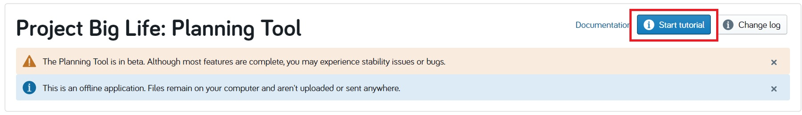
```


**Web browser support**
The PBL Planning Tool is a web application with all calculations performed on your desktop within the web browswer. Once loaded on your desktop, no connection to the Internet is required. 

Please contact the development team if work within a secure research environment without Internet access. We may be able to assist you in creating a broswer-based package that you can transfer onto your internal systems.

[projectbiflife@toh.ca](mailto:projectbiglife.ca) or file an [issue](https://github.com/Big-Life-Lab/PBL-Planning-Tool-Guidance/issues).

Modern web browsers are supported (Google Chrome, Safari, Firefox, Edge). Internet Explorer is not supported.

<!--chapter:end:Rmd//03-Tutorials.Rmd-->

# How To {#howto}

These guides will cover the topics covered in the tutorial but in greater detail.

- Customize data
- Load data
- Select calculation
- Filter data
- Stratify data
- Scenarios: intervention and health behaviour attribution
- Calculate results
- Download results (To be developed)
- Resolve error messages (To be developed)


## Customize Data

<div class="FOO">
**Note:** The Project Big Life Planning Tool can only be used with the 2013/2014 Canadian Community Health Survey (CCHS) Public Use Microdata File (PUMF) in '.csv' format. 

Other years of CCHS can be used but only if the required variables are transformed to the 2013/2014 CCHS format. 
</div>


Prior to using the Project Big Life Planning Tool you may want to transform your data set. Reasons include: customized filter(s) and/or customized stratification(s), or transforming variables from other population health surveys to the 2013/2014 Canadian Community Health Survey (CCHS) format. Any variable that you create can be selected within the planning tool in the filter and/or stratify options.

Data manipulation can occur on any programming software: R, SAS, STATA, etc, as long as you output your data set as a '.csv' file. 

### Customize filter and/or stratification

An example of customizing your data set is converting the variable: Body Mass Index (CCHS 2013/2014 variable HWTGBMI) from a continuous variable into four distinct categories:
    
- Underweight: BMI less then 18.5
- Normal or Healthy Weight: BMI of 18.5 to 24.9
- Overweight: BMI of 25.0 to 29.9
- Obese: BMI greater or equal to 30.0

**Steps**

The following steps show the R code that would be used to create these strata:

1. Convert observations "Not stated" from 999.99 to NA
```    
    data[data == 999.99] <- NA
```      
2. Load the R package dpylr. This package is used for data manipulation.
```
    library(dpylr)
```       
3. Create a new column that contains four categories for BMI
``` 
    data$newcolumn <- cut(data$HWTGBMI, breaks = c(0,18.5,25,30,Inf),  labels=c("Underweight", "Healthy", "Overweight", "Obese")
``` 
4. The output will be your data set + a new column with the corresponding category ("Underweight", "Healthy", "Overweight", "Obese") for that individual.

```
    HWTGBMI   newcolumn
  1   22.68     Healthy
  2   26.99  Overweight
  3      NA        <NA>
  4   34.44       Obese
  5   23.77     Healthy
  6   17.23 Underweight
```

This new column can be now be used with the Project Big Life Planning Tool for the purpose of filtering or stratification.

###Transforming variables to 2013/2014 CCHS format

Population health surveys other then the 2013/2014 CCHS PUMF can be used if the variables: sex, age and survey weight (required variables) are transformed to the 2013/2014 CCHS format. 

For example the 2005/2006 CCHS data can be used if the 2005/2006 CCHS variable for age is renamed from DHH**E**GAGE to and DHHGAGE (2013/2014 format). Although the name for the variable name for age is different between the 2005/2006 and 2013/2014 surveys, they capture identical information.  


```{}
library(dpylr)

CCHSdata.2005.2006 <- CCHSdata.2005.2006 %>% 
  rename(DHHGAGE = DHHEGAGE)
```

All required variables **must** be transformed to the 2013/2014 CCHS format. It is also recommended that you transform the recommend variables as well to increase the accuracy of the prediction(s).

When transforming required or recommended variables pay attention to how the data was captured. There may be differences limit the ability to use the data set or differences that will affect your results. For instance from the 2001-2004 CCHS survey age is captured in 15 categories but from 2005-2013 age is captured in 16 categories. 


## Load data 

<div class="FOO">
**Note:** The Project Big Life Planning Tool can only be used with the 2013/2014 Canadian Community Health Survey (CCHS) Public Use Microdata File (PUMF) in '.csv' format. 

Other years of CCHS can be used but only if the required variables are transformed to the 2013/2014 CCHS variable format. 
</div>

Only **one data file** can be used on the planning tool at a time; the planning tool cannot preform a calculation across multiple data files. If you wish to use data from different data sets, you first merge the data sets together and use the 2013/2014 CCHS format (e.g. variable names). Once data sets are merged into one data file you can load your data on to the Planning Tool. 

There are two options of data files: a sample file or your own file.


### Load sample files

If you don't have your own data or want to explore the platform's capabilities before using your data, you can use the sample file on the Project Big Life Planning Tool. There are three sample files included on the planning tool:

There are three sample files:

- CCHS-2013-1-percent
- CCHS-2013-10-percent
- CCHS-2013-100-percent

Each sample file is from the 2013/2014 CCHS PUMF datafile and contains: 1%, 10% or 100% of the respondents. Each sample file contains all the variables (survey questions) from the 2013/2014 CCHS survey.

**Steps**

1. Click 'Select' beside the "Sample file" to select it. 

```{r, echo=FALSE, fig.align='center'}
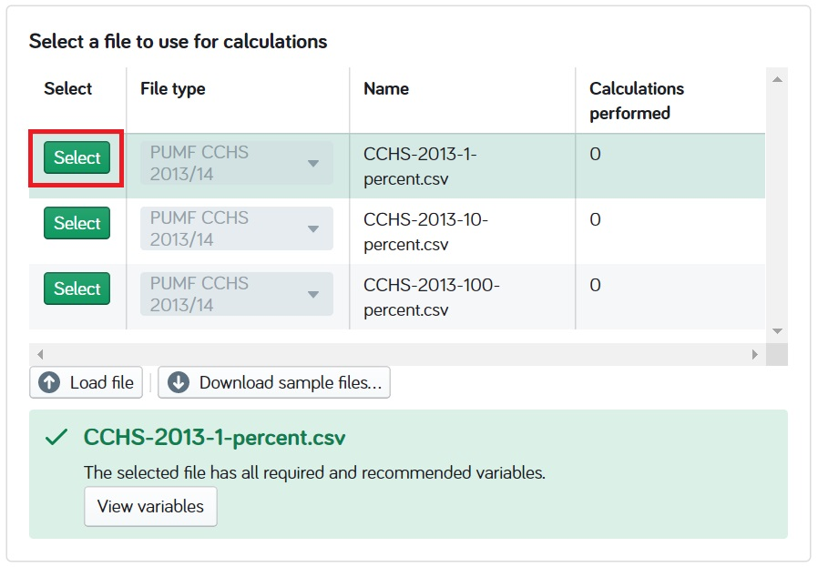
```

### Load your own file

<div class="FOO">
**Note:** Data you load to the Project Big Life Planning Tool remains on your computer and is not uploaded or sent anywhere.
</div>

If you want to use your own file, that file must use the 2013/2014 CCHS variable names and:

- **Must include all** the **required** variables: DDH_SEX (sex), DHHGAGE (age), and WTS_M (survey weight).

- **Should include** some or all of the **recommended** variables. Recommended variables aren't required for calculations but will increase the accuracy of the predicted health outcome. 

More information on the required and recommended variables can be found [Appendix](#mport).


**Steps**

1. Click the **Load file** button under "Select a file to use in calculations".

```{r, echo=FALSE, fig.align='center'}
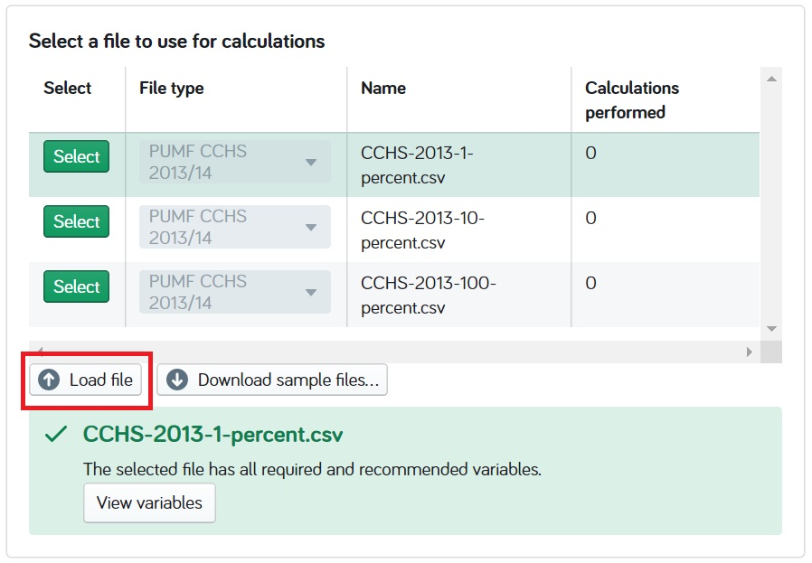
```

2. Locate the file on your computer, select, and open. 

3. Choose the file type: PUMF CCHS 2013/2014 PUMF for your uploaded file, in the table that showcases all of the files.

```{r, echo=FALSE, fig.align='center'}
knitr::include_graphics("Images/Datafiles-Load-Filetype.jpg")
```


Note:

- If the loaded file has all of the variables required and recommended for calculation, you will be able to 'Select' the file and continue with the planning tool. 
  
- If the loaded file does **not** have all the variables **required** for the calculation you will not be able to continue with the planning tool.

```{r, echo=FALSE, fig.align='center'}
knitr::include_graphics("Images/Datafiles-Load-Error.jpg")
```
  
- If the loaded file does **not** have all the variables **recommended** for calculation you will be able to 'Select' the file and continue with the planning tool, however the calculations may be less accurate. 

```{r, echo=FALSE, fig.align='center'}
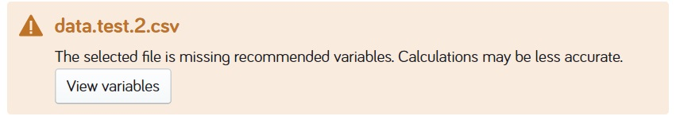
```

## Select calculation

There are two general types of calculations: summary measures and by row measures.

- **Summary measures:** (ref:Summarycalc)

- **By row measures:** (ref:byrowcalc)

Summary measures must be selected for calculations that have stratifications or scenarios (both intervention and  health behaviour attribution).

More details of what the calculations are and how they are preformed can be found in [key concepts](#keyconcepts) - "Calculations".

**Steps**

1. Click '+ Create'

```{r, echo=FALSE, fig.align='center'}
knitr::include_graphics("Images/Create.jpg")
```

2. Name your calculation.

```{r, echo=FALSE, fig.align='center'}
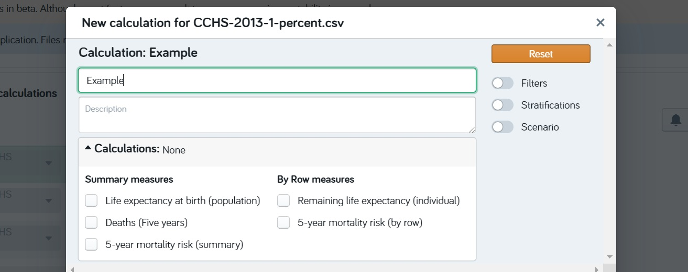
```

3. Check the box beside the calculation's name under "Calculations" to select it. A single calculation or multiple calculations may be selected.

- Once selected, the types(s) of the calculations will appear to the right of "Calculations".

```{r, echo=FALSE, fig.align='center'}
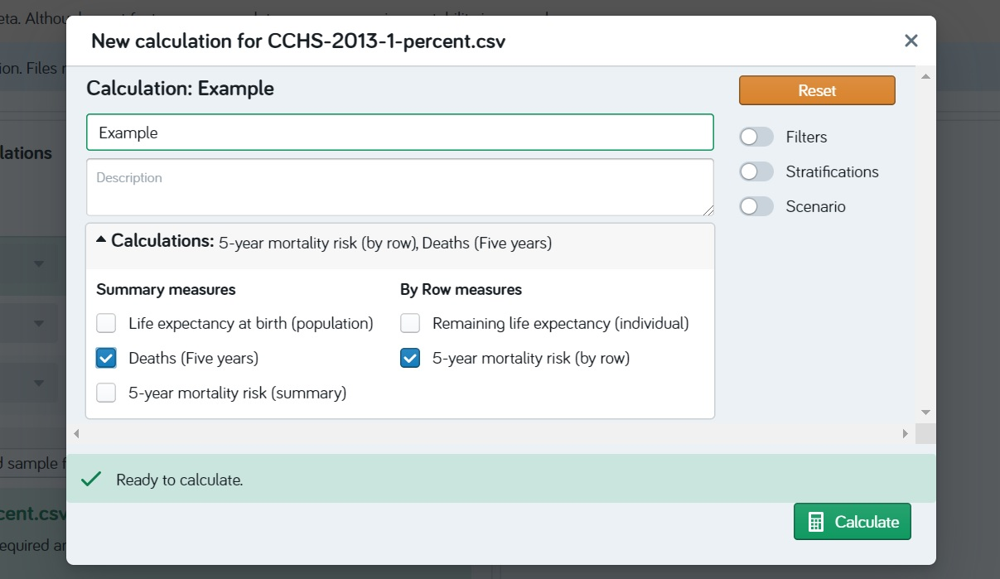
```


## Filter data

Use filters when you want to analyze only a subset of your data.

**Steps**

1. Click on the toggle button beside "Filters".

```{r, echo=FALSE, fig.align='center'}
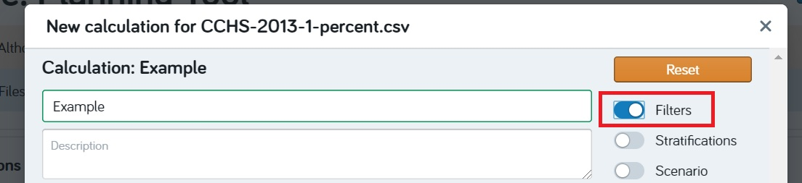
```

2. Click **+ New** under the Filter bar.

```{r, echo=FALSE, fig.align='center'}
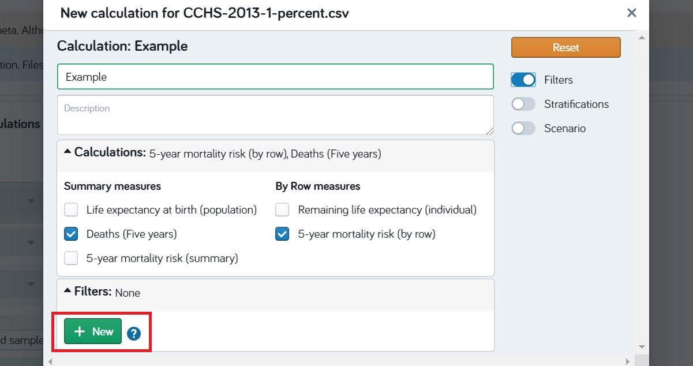
```

3. Select the variable that you want to filter on by typing its variable name into the "search variables" text bar.

```{r, echo=FALSE, fig.align='center'}
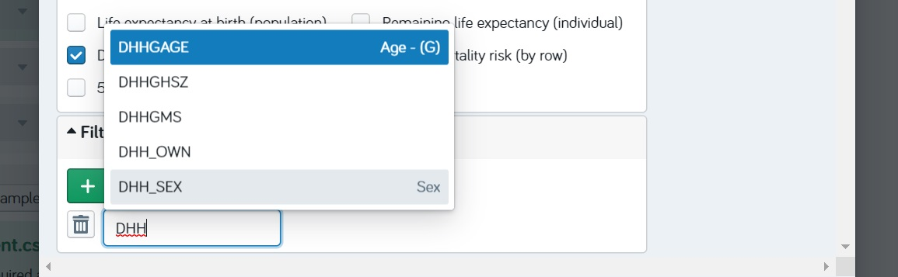
```


4. Filter **in** the categories/levels within the variable by:

  - **Categorical:** Clicking on the "Search categories"" text bar. Scroll and select the category you want to **keep** in your data. Repeat this step to add additional categories.
  
```{r, echo=FALSE, fig.align='center'}
knitr::include_graphics("Images/FilterCat.jpg")
```

  - **Continous:** Click the "cycle button" found under the variable you have selected. Two new boxes will appear. 
    - Select the minimum value for your subset data in the box on the left by typin the value. 
    - Select the maximum value for your subset data in the box on your right by typing the value.
    
```{r, echo=FALSE, fig.align='center'}
knitr::include_graphics("Images/FilterCont.jpg")
```    

    
4. To add another filter repeat the steps above. A maximum of three filters are recommended to maintain statistical power (added filters reduce sample sizes and reduces statistical power). 

  - Once selected, the name(s) of the filtered variable(s) will appear to the right of "Filters".

You are able to filter on all types of variables: required for calculation, recommended for calculation, and all other variables.


### Remove a filter

- To remove a filter entirely, click on the trash can beside the variable you want to delete.

```{r, echo=FALSE, fig.align='center'}
knitr::include_graphics("Images/FilterRemove1.jpg")
```  

- To remove a level within a filtered variable - categorical, click on the 'x' beside the variable level.

```{r, echo=FALSE, fig.align='center'}
knitr::include_graphics("Images/FilterRemove2.jpg")
```  

## Stratify data

Use stratifications when you want to get a result for multiple strata (levels or classes). 

A summary measure must be selected for stratifications, as only a summary measure will be outputted for each strata. By row measurements may also be selected but they will not be stratified.

**Steps**

1. Click the toggle button beside "Stratifications".

```{r, echo=FALSE, fig.align='center'}
knitr::include_graphics("Images/Strat.jpg")
```

2. Select the variables you want to stratify on under the "Stratifications'. You are only able to stratify on categorical variables.

```{r, echo=FALSE, fig.align='center'}
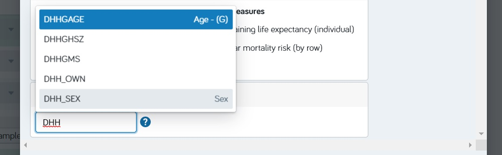
```

3. To add another variable for stratification repeat the steps above. A maximum of 3 stratifications are recommended to maintain statistical power (added strata reduce strata sample size and reduces statistical power).

- Once selected, the name(s) of the stratified variable(s) will appear to the right of "Stratifications".

You are able to stratify on all types of categorical variables: required for calculation, recommended for calculation, and other variables (includes customized variables).

### Remove a stratification

- To remove a stratification variable click on the 'x' beside the variable level.

```{r, echo=FALSE, fig.align='center'}
knitr::include_graphics("Images/StratRemove.jpg")
```


## Run scenarios

Scenarios can be used to predict the health outcomes when unhealthy behaviours:

- are modified in the population: **Intervention**, or
- were never present in the population: **health behaviour attribution**

Scenarios can be used to inform potential health policies or programs. Scenarios 
can be run on health behaviours (smoking, physical activity, diet, alcohol).

### Intervention scenarios

Interventions provide you with the ability to customize the scenarios. For example you can answer the questions:

- what if we only had 15% of the population smoked rather then the current 20%?
- what if everyone increased their physical activity by 10%?
- what if everyone ate 4 fruit and vegetable servings each day?
- what if everyone drank 2 fewer drinks per week?

These intervention scenarios allow you to predict and compare the effectiveness of policies.

There are 3 types of intervention scenarios that you can select:

- **Absolute:** each individual in the population **changes** their health behaviour **by a value of x**. 
- **Relative:** each individual in the population **changes** their health behaviour **by a ratio of y**.
- **Target:** each individual in the population **has a set value of z.**

More information on the specifics of each type of intervention scenario and how they are calculated can be found in [key concepts](#keyconcepts) - "Scenarios: Interventions".

**Steps**

1. Click the toggle button beside "Scenario"

```{r, echo=FALSE, fig.align='center'}
knitr::include_graphics("Images/Scenario.jpg")
```

2. Select "Intervention" from the "Scenario Type" menu.

```{r, echo=FALSE, fig.align='center'}
knitr::include_graphics("Images/Scenario-Intervention.jpg")
```

3. Select the "Type" of intervention you want beside your target health behaviour. 

- A description of each intervention scenario and how they are calculated can be found in [key concepts](#keyconcepts) - "Scenarios: Interventions"

```{r, echo=FALSE, fig.align='center'}
knitr::include_graphics("Images/Scenario-Intervention-Abs.jpg")
```

4. Type or use the arrow keys to get the value you want. 

```{r, echo=FALSE, fig.align='center'}
knitr::include_graphics("Images/Scenario-Intervention-Abs2.jpg")
```

Multiple health behaviour interventions can be selected for a single calculation.


###Health behaviour attribution scenarios

Health behaviour attribution scenarios provide you with the best case scenario for the population. For example:

- what if no one in the population ever smoked? (also known as smoking attributable mortality)
- what if everyone in the population met their recommended physical activity levels (3.00 METs/week)?

More information on health behaviour attribution calculations and how they are calculated can be found in [key concepts](#keyconcepts) - "Scenarios: Health behaviour attribution".

**Steps**

1. Click the toggle button beside "Scenario"

```{r, echo=FALSE, fig.align='center'}
knitr::include_graphics("Images/Scenario.jpg")
```

2. Select "Intervention" from the "Scenario Type" menu.

```{r, echo=FALSE, fig.align='center'}
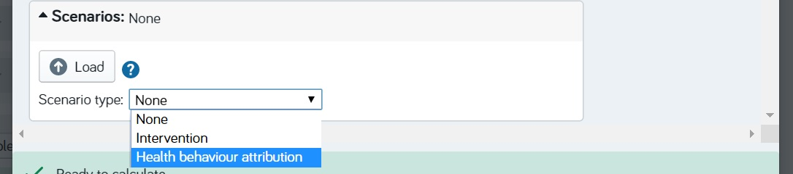
```

3. Check the box beside the intervention you want to do.

```{r, echo=FALSE, fig.align='center'}
knitr::include_graphics("Images/Scenario-HBattribution2.jpg")
```

Multiple health behaviours can be selected for a single calculation. 


##Run calculation

**Steps**

Click "Calculate" in the bottom right corner once you have selected your conditions. 

```{r, echo=FALSE, fig.align='center'}
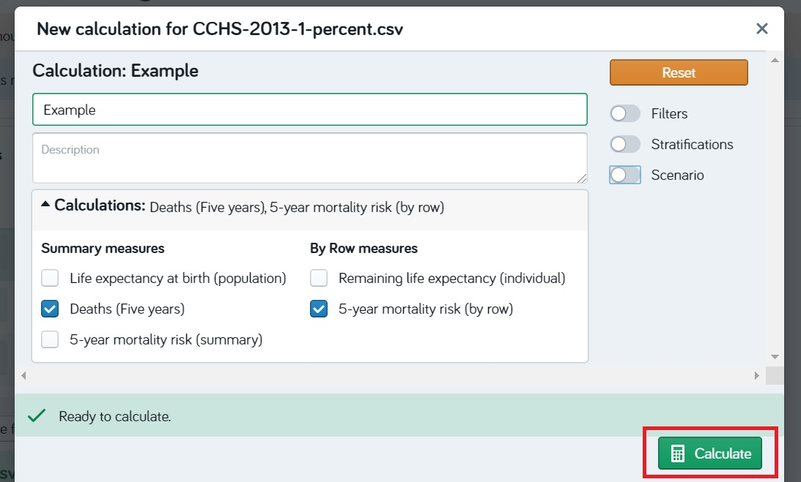
```

<div class="FOO">
**Note:** the larger the data set is the longer the calculations will take. Depending on the size of the data set and the type of calculation being preformed it could take an hour or more. 
</div>

2. A new table will appear under the calculations box. The table includes the status of the calculation, calculation name and the selected conditions: measures, filters, stratifications, and scenarios. 

```{r, echo=FALSE, fig.align='center'}
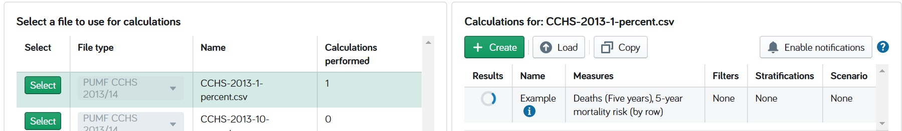
```

3. A "View" button will appear next to your calculation once it is complete.
```{r, echo=FALSE, fig.align='center'}
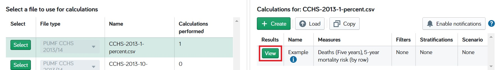
```


##View results

1. Click the "View" button beside the calculation you want to see. 
```{r, echo=FALSE, fig.align='center'}

```

2. The Results Box appears at the bottom of the web page.

The following tabs will **always** appear:

- **Overview:** gives a summary of the calculation(s). 

```{r, echo=FALSE, fig.align='center'}
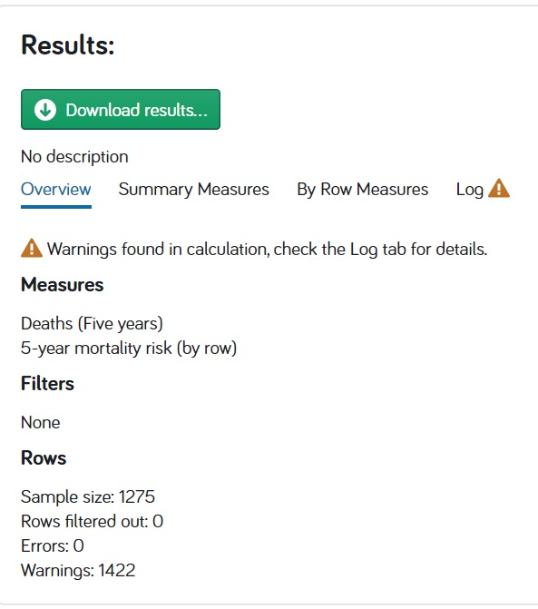
```

- **Log:** gives a summary of the warnings and errors that happened during the calculation.

The following tabs will appear based on your calculation:

- **By Row Measures** will give you a table with the 'by row measure' average.

```{r, echo=FALSE, fig.align='center'}
knitr::include_graphics("Images/Results-ByRow.jpg")
```

- **Summary Measures** will give you a table with summary measures. This tab will only appear when **no** stratifications are selected.

```{r, echo=FALSE, fig.align='center'}
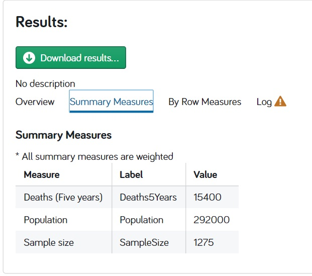
```

- **Stratifications** will give you a graph with the summary measures, when stratifications are selected.

###Graph

The graph is interactive. Hover over the graph to see the results for each strata, exclude strata, download a .png of the graph, and much more.

## Download results

1. Click on the **Download results** button under the **Results** section.

```{r, echo=FALSE, fig.align='center'}
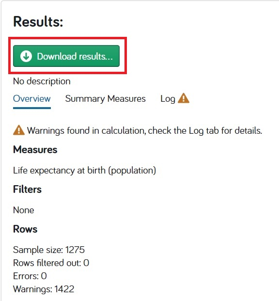
```

A pop-up will appear. 

2. Select which file you would like to download. 

- **Input file with calculation results** gives you a .csv file with all observations and calculation per row
- **Population summary** gives you a .csv file with only summary results

```{r, echo=FALSE, fig.align='center'}
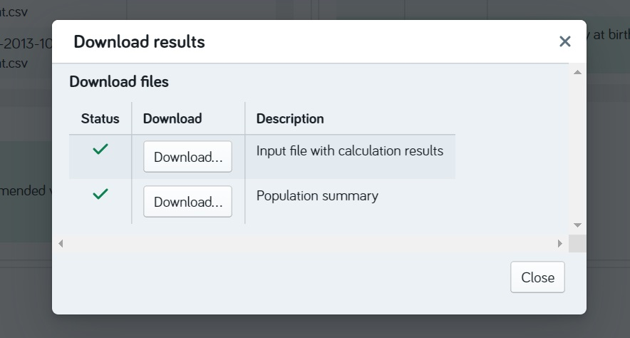
```

3. Select which calculations do not want to download.

```{r, echo=FALSE, fig.align='center'}
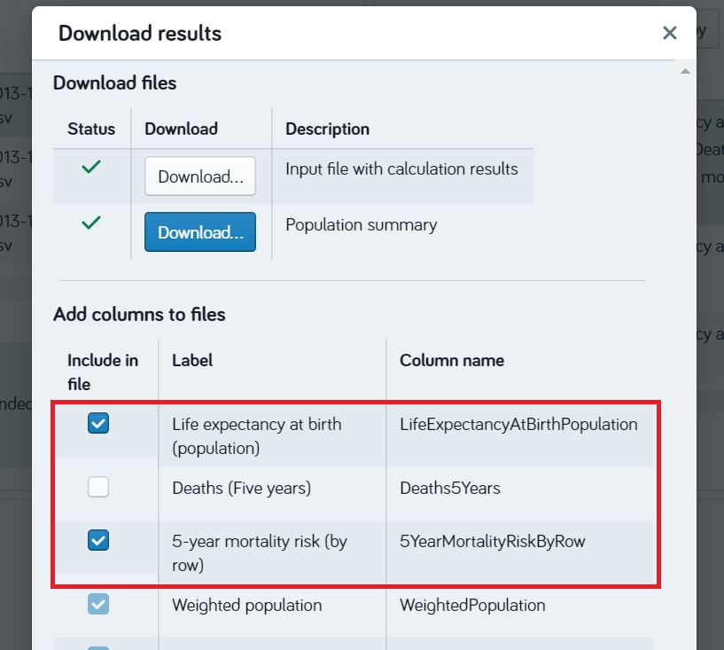
```

4. Scroll down and click "Download file"
```{r, echo=FALSE, fig.align='center'}
knitr::include_graphics("Images/Results-Download4.jpg")
```

5. The a .zip file will automatically download

## Resolve warning or error messages (To be developed)

There are different types of warning and error messages that may appear.

Below describes some of the messages that are likely to occur and steps to resolve them.

### Invalid category

### Out of range

### Not a number

### Sample size is too small

<!--chapter:end:Rmd//04-How-To.Rmd-->

# Case examples {#caseexamples}

This chapter provides you with examples of how Project Big Life's Planning Tool can be used in your day-to-day operations. The case examples will cover:

```{r, echo=FALSE, results='hide', message=FALSE}
library(knitr)
library(kableExtra)

(caseExamples <- data.frame(
    Description = c("Statistics for health status reports", "Deaths prevented from increasing cycling infrastructure", "Impact on life expectancy by modifying all health behaviours", "Impact on life expectancy by increasing cycling rates", "Prevented deaths from enacting a 2004 smoking by-law"), 
    Name = c("Health status report", "Adjusting gears", "Healthy cities", "Canada bikes like the Dutch", "Smoking by-law, Ottawa 2004: retrospective"),
    Type = c("Filter,\nStratification,\nScenario - Health behaviour attributable (smoking and diet)", "Filter,\nScenario - Intervention: Absolute (Physical activity)", "Filter,\nStratification,\nScenario - Intervention: Target (All)", "Filter,\nScenario,\nIntervention: Absolute (Physical activity)", "Transform variables,\nFilter,\nScenario - Intervention: Target (Smoking)")) 
    )#closingbracket 

```
```{r, echo=FALSE}
kable(caseExamples) %>%
  kable_styling(full_width = T)  %>%
  scroll_box(height = "400px")
```


## Health Status Report

Health status reports are a way to report the health state for a population and the factors that influence a population’s health. Information from health status reports are used to inform policy, planning, and resource allocation.

Using the Project Big Life Planning Tool you can replicate or update existing health status reports e.g. Public Health Ontario's: [Seven More Years Report](https://www.ices.on.ca/Publications/Atlases-and-Reports/2012/Seven-More-Years) or generate a new health status report. 

In this example we will show you how to create some health statistics to include in your health report. We will calculate:

- The predicted number of deaths by strata (e.g. by sex [males and females])
- The impact of eliminating unhealthy behaviours on life expectancy

For this example we will focus on the population of Alberta.

### Predicted number of deaths stratified by sex and level of education

By showing the number of deaths by strata, the reader can see the distribution of deaths across specific population characteristics.  Any categorical variable can be used for stratification but in this example we will use sex and level of education.

**Steps**

1. Select the sample file data.sample.csv under "Sample files". 

<div class="FOO">
**Note:** Although the data.sample.csv is based on the 2013/2014 Canadian Community Health Survey Public Use Microdata File, data.sample.csv is a completely synthetic data set and can only be used for exemplary purposes.
</div>

2. Select the calculation: Summary Measure – Deaths (Five years)

3. Add filter: GEOGPRV – 48, which is the corresponding code for Alberta.

4. Add two stratification: DDH_SEX and EDUDR04

5. Title the calculation: Deaths by sex and education level

6. Click the calculate button

*7. To do: Results – walk through the results*


### Impact of eliminating unhealthy behaviours: smoking and poor diet, on life expectancy

To show how much an unhealthy behaviour impacts life expectancy we use the scenario: health behaviour attributable. Health behaviour attributable scenarios can be used for the health behaviours: alcohol consumption, diet, physical activity, and smoking, individually or in any combination. In this example we will evaluate the impact of smoking and poor diet, in combination, on life expectancy.

**Steps**

1. Select the sample file data.sample.csv under "Sample files". 

<div class="FOO">
**Note:** Although the data.sample.csv is based on the 2013/2014 Canadian Community Health Survey Public Use Microdata File, data.sample.csv is a completely synthetic data set and can only be used for exemplary purposes.
</div>

2. Select initial calculation: Summary Measure – Life Expectancy (Summary)

3. Add filter: GEOGPRV – 48, which is the corresponding code for Alberta.

4. Click the text: Scenario.

5. Select health behaviour attribution. 

6. Select the health behaviours: smoking and diet

7. Title the calculation: Alberta: smoking and diet attributable life expectancy

8. Click the calculate button

*9. To Do:	Walk through results*

<div class="FOO">
**Note:** $\text{Physical inactivity and poor diet attributable life expectancy lost} \neq$
$\text{Physical inactivity-deleted life expectacny} + \text{Poor diet-deleted life expectancy}$

as individuals in the population may be both physically inactive and have a poor diet. 
</div>


## Adjusting gears

The City of Hamilton has decided to implement a new initiative *Adjusting Gears* which will increase cycling infrastructure in Hamilton. As part of the plan they have decide to develop 100 km of new cycling infrastructure in the next 3 years (2019-2021). 

The city has asked you to evaluate the health impact of this initiative.

As part of the analysis you want to determine how the 100km of new cycling infrastructure will impact the health of the Hamilton area, and how many deaths will be prevented.

### Part A: Determine the how much a Hamiltonian will increase their physical activity by using these new cycling tracks

<div class="AOO">
Assumption #1: After having done your research, you assume that with the new tracks the average person in Hamilton will cycle an additional 10 minutes/day (duration).
</div>

1. Convert the increased duration of cycling into daily energy expenditure (MET-hours): 

$\text{MET-hours} = \text{Duration}*\text{MET value for cycling}$ 

- The MET value for cycling in Canada is 4.0


### Part B: Determine the impact on life expectancy

Use the Project Big Life Planning Tool for the following steps:

1. Load your data file: data.sample.csv to the Project Big Life Planning Tool. 

2. Select initial calculation: Summary Measure – Deaths (5-years)

3. Add Filter: GEODPMF - 35937

4. Click: Scenarios, and select Intervention

5. Click Physical Activity then Select “Average daily leisure time energy expenditure in METs”

<div class="AOO">
Assumption #2: Although the scenario for physical activity is for leisure energy expenditure, we assume 1) individuals that are active in their leisure time also use active transportation, and 2) cycling as a form of active transportation is minor part of their energy expenditure. Therefore we will adjust the average daily leisure time energy expenditure in METs.
</div>

6. Select Absolute

7. Type in the absolute change calculated in Part 1, into the text box.

8. Name your calculation: Adjusting gears - Deaths in Hamilton

9. Click Calculate


## Healthy Cities

What would be Ottawa's life expectancy, if the region had the same health behaviours as the healthiest region in Canada?

In this example, we will determine:

A. who is the healthiest region in Canada, 

B. what are the health behaviours of Ottawa vs the healthiest region, and

C. what would be the mortality outcomes be if Ottawa's health behaviours were the same as the healthiest region. 

Here we will use the average life expectancy to determine the health of regions: the higher the life expectancy for the region the healthier that region is.

For this example we will use the sample data set **data.sample.csv**, which can be downloaded at https://github.com/Big-Life-Lab/PBL-Planning-Tool-Case-Examples. This link also contains all of the R code for this case example. Although we have included the R code any other statistics software (SAS, STATA, etc) can be used to complete this case example.

The following steps include the R coding for each of the steps but you can preform the steps in any other software program.

### Part A: Find the healthiest region in Canada

Using the Project Bid Life Planning Tool, we will find the healthiest region in Canada: the region with the highest life expectancy. 

1. Load the data file: data.sample.csv. 

<div class="FOO">
**Note:** Although the data.sample.csv is based on the 2013/2014 Canadian Community Health Survey Public Use Microdata File, data.sample.csv is a completely fabricated data set and can only be used for exemplary purposes.
</div>

2. Select calculation: Summary Measure – Life Expectancy (Summary)

3. Add Stratification: GEODPMF. This variable represents the health regions in Canada

4. Title the calculation: Life expectancy by health region

5. Click the calculate button

6. Download the results - _TO DO_

Using your preferred statistic software (Excel, SAS, STATA, R Studio, etc) identify the healthiest region and the health of the Ottawa health region. 

The healthiest region is XXX.


### Part B: Determine the health behaviours of the healthiest region and the Ottawa region. 

Calculate the average of each health behaviour in the healthiest region: XXX and the Ottawa region.

- **Smoking**: Calculate the prevalence of current smokers in the XXX and Ottawa region.
- **Physical Activity**: Calculate the average of physical activity (variable PACDEE) in the XXX and Ottawa region.
- **Alcohol**: Calculate the average of weekly alcohol consumption (variable ALWDWKY) in the XXX and Ottawa region.
- **Diet**: Calculate the average daily consumption of each diet component (variables: FVCDCAR, FVCDFRU, FVCDJUI, FVCDPOT, FVCDSAL, and FVCDVEG) in the XXX and Ottawa region. 

  - The more daily servings an individual has of:

    - carrots, fruits, salad, and vegetables =  the more healthy the individual, 
    - juice = the less healthy the individual,
    - potato < 1 = the more healthy the individual,  and
    - potato > 1 = the less healthy the individual. 


**Comparing health behaviours**

Compare the averages of all health behaviours in the Ottawa region to the XXX. When the health behaviour for Ottawa is unhealthier then XXX, record the avg/prevalence of that health behaviour for XXX.


### Part C: What if Ottawa acted like XXX?

We’ll now run a scenario where the Ottawa region acts like XXX. Ottawa will now have the health behaviours of XXX, when the health behaviour of XXX is healthier then Ottawa's. 

1.	Load your data file: data.sample.csv 

2.	Select initial calculation: Summary Measure – Life Expectancy (Summary)

3.	Add Filter: GEODPMF – 35951 (the code for the Ottawa Health region)

4.	Click: Scenarios

5.	Click on each health behaviour where Ottawa is unhealthier then XXX and input XXX’s value in the target scenario for that health behaviour

- _TO DO: _ Examples of where that is

6. Title the Calculation: Ottawa - Intervention - HB1, .....

7. Click calculate.

8. _TO DO:_ results


## Canada bikes like the Dutch

Cycling as a form of transportation, is an effective way of increasing individuals' daily physical activity levels and can lead to a decrease in the risk of disease and death.

In this example we will determine the impact on life expectancy if Canadians were to cycle like the cycling enthusiasts the Dutch! 

In this example we determine:

A. How much Canadians cycle per day for transportation purposes on average?

B. How much Dutch cycle per day for transportation purposes on average?

C. What is the average difference in daily cycling transportation for Canadians and the Dutch?

D. Predict how Canadian life expectancy would change if Canadians biked like the Dutch.

For this example we will use the sample data set **data.sample.csv**, which can be downloaded at https://github.com/Big-Life-Lab/PBL-Planning-Tool-Case-Examples. This link also contains all of the R code for this case example. Although we have included the Rcode other statistics software (SAS, STATA, etc) can be used to complete this case example.

<div class="FOO">
**Note:** Although the data.sample.csv is based on the 2013/2014 Canadian Community Health Survey Public Use Microdata File, data.sample.csv is a completely synthetic data set and can only be used for exemplary purposes.
</div>


### Part A: How much do Canadians cycle per day for transportation purposes on average?

We will determine how much Canadians cycle per day by calculating the average daily energy expenditure from cycling in the current Canadian population.

We will use 3 variables in our sample data set which are based off of the 2013/2014 CCHS PUMF and measure cycling as a form of active transportation:

- PAC_8: In the past 3 months did you cycle to and from work or school?
- PAC_8A: How many times did you cycle to and from work or school, in the past 3 months?
- PAC_8B:	How much time did you spend on each occasion?

<div class="AOO">
**Assumption #1:** we assume individuals 65 or older are retired and therefore not cycling to/from work/school. Therefore, we will only evaluate individuals that are < 65 years old.
</div>

In order to calculate the average Canadian daily energy expenditure from cycling for transportation, you will need to: 

- Find the average number of times, that an individual cycled to/from work/school in the past 3 months (mean PAC_8A)

- Find the average number of hours spent cycling to/from work/school, in the past 3 month (mean of PAC_8B)

- Calculate the average duration of cycling: $\text{Duration} = [\text{(Frequency/3 months)}*\text{(Time/trip)}] / \text{(Days/3 months)}$

- Calculate the average daily energy expenditure (MET-hours) for cycling to/from work/school: $\text{MET-hours} = \text{Duration}*\text{MET value for cycling}$

<div class="FOO">
**Note:** For Canadians to cycle like the Dutch, we need to use the Dutch MET cycling value of 5.8 and not the Canadian MET cycling value of 4.0. The Dutch MET value accounts for the speed of cycling of the Dutch. 
</div>

- Calculation the average daily expenditure from cycling for transportation for all individuals in the population not only those that cycled to/from work/school

On average a Canadian only gets 0.024 MET-hours/day from cycling to/from work/school.


### Part B: How much do the Dutch cycle/day for transportation purposes on average?

Using data collected as part of the Dutch National Travel Survey (2010 – 2012), Fisherman, 2015 (doi:10.1371/journal.pone.0121871 - Table S1) reported the average additional daily energy expenditure from cycling as a form of transportation for the Dutch: males: 1.3 MET-hours, and females: 1.4 MET-hours. 

The average Dutch daily energy expenditure from cycling as a form of transportation for both sexes is then 1.35 MET-hours.


### Part C: What is the average difference in daily cycling transporation for Canadians and the Dutch?

Canadians need to increase their average daily energy expenditure from cycling from 0.07 MET-hours to 1.35 MET-hours, in order to be like the Dutch.

<div class="FOO">
**Note:** Since the physical activity intervention scenario on the Project Big Life Planning Tool is for daily leisure energy expenditure and not daily active transportation, we will use the 'absolute' scenario for this example. We will increase each individual's daily leisure energy expenditure by 1.28 MET-hours (1.35 MET-hours - 0.07 MET-hours).
</div>

### Part D: Predict how Canadian life expectancy would change if Canadians biked like the Dutch.

Use the Project Big Life Planning Tool for the following steps:

1. Load your data file: data.sample.csv to the Project Big Life Planning Tool. 

2. Select initial calculation: Summary Measure – Life Expectancy (Summary)

3. Add Filter: DDHGAGE – 1,2,3,4,5,6,7,8,9,10,11,12

4. Click: Scenarios, and select Intervention

5. Click Physical Activity then Select “Average daily leisure time energy expenditure in METs”

<div class="AOO">
Assumption #2: Although the scenario for physical activity is for leisure energy expenditure, we assume 1) individuals that are active in their leisure time also use active transportation, and 2) cycling as a form of active transportation is minor part of their energy expenditure. Therefore we will adjust the average daily leisure time energy expenditure in METs.
</div>

6. Select Absolute

7. Type in the absolute change calculated in Part 3, into the text box.

8. Name your calculation: Canada bikes like the Dutch

9. Click Calculate

10. Interpret results


## Smoking by-law, 2004 Ottawa: retrospective

The City of Ottawa has historically been a leader in municipal policy to reduce tobacco smoking at the population level. A key milestone was the introduction of a 2004 by-law that limited smoking in bars/restaurants.

We want to know how many smoking attributable deaths were prevented due to this by-law.

<div class="AOO">
Assumption: We assume that the by-law lead to decrease in current smokers either through individuals quitting smoking or individuals not starting to smoke.
</div>

For this example we will:

A. Transform 2003 CCHS PUMF variables to 2013 CCHS PUMF variables

B. Determine the prevalence of current smokers in 2003

C. Determine the prevalence of current smokers in 2013

D. Estimate how many smoking attributable deaths were prevented due to enacting the by-law


For this example we will use the sample data set **data.sample2003.csv** and **data.sample2013.csv**, which can be downloaded at https://github.com/Big-Life-Lab/PBL-Planning-Tool-Case-Examples. This link also contains all of the R code for this case example. Although we have included the R code any other statistics software (SAS, STATA, etc) can be used to complete this case example.


### Part A: Transform 2003 CCHS PUMF variables to 2013 CCHS PUMF variables

The Project Big Life Planning Tool only works on 2013-2014 CCHS variable names only. Therefore if you are using a CCHS data set from previous years you will have to transform the variables to the 2013-2014 format.

1. Use **data.sample2003.csv**

<div class="FOO">
**Note:** Although the data.sample2003.csv is based on the 2003/2004 Canadian Community Health Survey Public Use Microdata File, data.sample2003.csv is a completely fabricated data set and can only be used for exemplary purposes.
</div>

With the data.sample2003 data set you will need to: 

 - Rename 2003 CCHS PUMF variables to their corresponding 2013 CCHS PUMF variables, 
 
 - Create variable CCC_091 from variables CCCC_91A and CCCC_91B, and
 
 - Recode DHHGAGE variable

<div class="FOO">
Note: The Project Big Life team is developing a R package that will make this step easier for you! The package transforms CCHS variables from 2001 to 2014. 

We'll update the guidance as soon as the package is ready!
</div>


### Part B:  Determine the prevalence of current smokers in 2003

Current smokers are defined by variable SMKDSTY: 1 – Daily, 2 – Occasional, 3 – Always Occasional. 

In 2003, current smokers accounted for 26% of the Ottawa population.


###Part C: Determine the prevalence of current smokers in 2013. 

The prevalence of smokers in 2013 will be the scenario target in Part D. 

1. Use **data.sample.csv**

<div class="FOO">
**Note:** Although the data.sample.csv is based on the 2013/2014 Canadian Community Health Survey Public Use Microdata File, data.sample.csv is a completely fabricated data set and can only be used for exemplary purposes.
</div>

In 2013, current smokers accounted for 21% of the Ottawa population.


### Part D: Estimate how many smoking attributable deaths were prevented due to enacting the by-law

Use the Project Big Life Planning Tool for the following steps:

1.	Load your data file: data.sample2003.csv to the Project Big Life Planning Tool.

2.	Select initial calculation: Summary Measure – Deaths (5 years)

3.	Add Filter: GEODPMF - 35951

4.	Click: Scenarios, and select Intervention

5.	Click Smoking then Select “Prevalence of current smokers”

6.	Select Target

7.	Type in 21 (prevalence of smokers from 2013) into the text box.

8.	Name your calculation: Smoking attributable deaths 2003

9.	Click Calculate


<!--chapter:end:Rmd//05-Case-Examples.Rmd-->

# Key Concepts {#keyconcepts}

This section explains some key concepts in Project Big Life’s Planning Tool. This section will explain how it works rather then how to do things.

- Data and sample files
- Multivariable predictive risk algorithms
- Calculations: general

    - Summary vs. By Row
    - Weighted vs. unweighted

- Calculations: specific health outcomes

    - Risk of health outcome
    - Number of health outcomes
    - Life expectancy

- Scenario: Intervention
- Scenario: Health behaviour attribution
- Results

    - Why are there more deaths for the healthy behaviour?
    
- Assumptions and limitations

## Data and sample files

<div class="FOO">
The Project Big Life Planning Tool currently accepts **2013/2014 Public Use Microdata File of the Canadian Community Health Survey (CCHS) in '.csv' format.**
</div>

### What is the Canadian Community Health Survey?

The Canadian Community Health Survey (CCHS) is an annual cross-sectional survey preformed by Statistics Canada. The CCHS is Canada's main population health survey. It collects information related to health status, health care utilization, and health determinants for the Canadian population. Data is shared at the the sub-provincial geographic level (health region or combination of health regions).

- Details about the survey and its design can be found on Statistic Canada website  (http://www23.statcan.gc.ca/imdb/p2SV.pl?Function=getSurvey&Id=144170). 
- Details and access to all CCHS year and thier Public Use Microdata files (PUMF) can be found through the Odesi website (https://search2.odesi.ca/#/details?uri=%2Fodesi%2Fcchs-82M0013-E-2013-2014-Annual-component.xml)

### Why can the Project Big Life Planning Tool only accept the 2013/2014 Canadian Community Health Survey data?

Each year the CCHS changes a few variables it captures. This makes CCHS data sets from every year other then 2013/2014 partly incompatible with the algorithms used by the Project Big Life Planning Tool.


### Can I use other population health survey data sets?

Yes you can use other population health survey data sets but you have to transform these data set to the 2013/2014 CCHS format.

To transform CCHS cycles the Project Big Life Team developed an R-package CCHS-flow. This package transforms CCHS variables from cycles 2001 to 2014 into harmonized and consistent versions. To access or learn more about the CCHS flow visit CRAN packages (https://cran.r-project.org/web/packages/cchsflow/index.html).

### Sample Files

There are three sample files:

- CCHS-2013-1-percent
- CCHS-2013-10-percent
- CCHS-2013-100-percent

Each sample file is from the 2013/2014 CCHS PUMF datafile and contains: 1%, 10% or 100% of the respondents. Each sample file contains all the variables (survey questions).


## Multivariable predictive risk algorithms

Multivariable predictive risk algorithms predict the future risk of health outcomes (e.g. Life Expectancy) for a population using routinely collected health data.

Multivariable predictive risk algorithms can be used to:

- Project the number of new cases of the health outcome
- Estimate the contribution of specific risk factors of the health outcome
- Evaluate effectiveness of health interventions
- Describe the distribution of risk in the population (diffused or concentrated)

Multivariable predictive risk algorithms are able to assess equity issues compared to competing population risk methods (e.g. World Health Organization Global Burden of Disease).

More information on what multivariable predictive risk algorithms are and how they can be used can be found the journal article: *Predictive risk algorithms in a population setting: an overview* [@PoRTover]

### Development of multivariable predictive risk algorithms

Data:

-	Multivariable predictive risk algorithms are created using routinely collected data that includes information about risk factors (exposure) and health events (outcomes).
-	Data is collected at an individual level through population health surveys (e.g. Canadian Community Health Survey) and administrative databases (e.g. Vital Statistics). Data sources are linked together when the individual has given permission too.
- Individuals are followed overtime until the health event (e.g. death or disease) occurs.
- Separate data is collected to create a derivation cohort and validation cohort(s). 

    - Note: The risk factors that are collected are from population health surveys and are self-reported; no clinical data (e.g. blood pressure) is collected. Risk factors focus on health behaviours (e.g. smoking) and sociodemographic factors, commonly associated with health outcome.

**Algorithm generation:**

- Multivariable predictive risk algorithms are cox proportional hazard models that analyze time to health outcome (e.g. death) *Question for Carol - The models are not cox-porportional hazard models but they are similar?*

- Multivariable predictive risk algorithms are developed and validated in 4 stages:

    - Algorithm derivation: the predictive risk algorithm is created using data from the derivation cohort
    - Algorithm validation: the predictive risk algorithm is applied to the validation cohort
    - Final algorithm generation: validation and derivation cohorts are combined to estimate the final application of the predictive risk algorithm 
    - Derivation of the application algorithm: creation of a parsimonous (fewer predictors) algorithm that maintained discrimination, calibration, and overall algorithm performance
    
- In each stage of the algorithm development and validation, algorithm performance is assessed using measures of discrimination and calibration.

### Multivariable predictive risk algorithms built in Project Big Life Planning Tool

- There is currently 1 multivariable predictive risk algorithm is built into to Project Big Life planning tool.
```{r, echo=FALSE, results='hide', message=FALSE}
library(knitr)
library(kableExtra)

(PoRTs <- data.frame(
    Title = c("Mortality Population Risk Tool"),
    Outcomes = c("5 year risk of death, Life Expectancy, Cause deleted"),
    Information =c("Appendix A"))
    )#closingbracket 
```
```{r, echo=FALSE}
#Creating the table
kable(PoRTs) %>%
  kable_styling(full_width = T)
```


## Calculations

### Summary vs By Row

There are two general types of calculations Summary Measures and By Row Measures.

Summary measures: (ref:Summarycalc)

By row measures: (ref:byrowcalc)

<div class="FOO">
**Note:** Summary Measures are not the same as taking the average of By Row Measures. Summary measures account for the survey weights in their calculations. Only averaging the By Row Measures does not account for the survey weights and will result in an incorrect outcome. 
</div>

### Weighted vs unweighted

Weights are used in complex surveys like the Canadian Community Healthy Survey (CCHS). A weight is given to each respondent in the survey and the weight corresponds to the number of individuals in the population the respondent represents. 

When a data set has weights, like the CCHS PUMF data set, the weights are used to calculate the population's outcome e.g. number of deaths. 

When a survey does not have weights, the the population's outcome is not calculated with weights. 

In either case, weights are not used in the calculation of an individual's outcome (e.g. an individual's 5 year risk of mortality). 


## Calculations: specific health outcomes

### Risk of health outcome

Risk of the health outcome (e.g. risk of dying) is the outcome of a multivariable predictive risk algorithm. An example of the mutlivariable risk algorithm is:

$$ \text{Risk} = \sum_t h_0(t) * e^{\beta_{pred.smoking}*x_{smoking}+\beta_{pred.cancer}*x_{cancer} + \beta_{pred.age}*x_{age} +...}  $$
Where:

- $t$ = survival time
- $h_0(t)$ = the baseline hazard
- $\beta_{pred}$ = predictive hazard ratios for the exposures
- $x$ = the exposure. The exposure can be continuous (e.g. age) or categorical (e.g. smoking status). 

Categorical exposures are represented by dummy/factor variables. Each category has its own beta and the exposure is binary. For example smoking status is categorical variable with categories: current, former <= 5 years, former >5 years, or never smoked. For $\beta_{pred.current.smoker}$ the exposure: $x_{current.smoker}$ = 1 if the individual currently smokes or 0 if the individual is another type of smoker.


### Number of health outcomes

The number of health outcomes (e.g. summary - deaths) is calculated through the following steps:

1. Risk of the health outcome is calculated for each individual (row) in the data set using the mutlivariable predictive risk algorithm.

2. Each individual's (row) risk is weighted with their corresponding survey weight (CCHS PUMF = WTS_M and CCHS shared file = WTS_S).

3. The weighted mean of the health outcome (e.g. mean risk of death) is calculated.

4. The weighted mean is then multiplied with the total number of individuals in the population to generate the number of health outcomes (e.g. number of deaths in 5 years).


### Life expectancy

Life expectancy is calculated using abridge life tables using a modified Chaing approach [@Chiang] [@Hsieh]. *(link to reference for Chiang and Hsieh and also one of our papers)*. Life expectancy is calculated by two methods: one for summary life expectancy, and a second for by row life expectancy.

#### Summary Life Expectancy

Life expectancy is calculated separately for males and females. 

**Males:**

1. The mortality risk for each male individual is calculated using the male mortality mutlivariable predictive risk algorithm for mortality (MPoRT). Details about the MPoRT can be found in Appendix A.

2. Male individuals are grouped into the 5-year age groups that are used in the 5-year abridge life tables (e.g. 40-44 years old).

3. The weighted average risk of death for each age group is calculated. 

4. A male 5-year abridge life table is created using the weighted average risks of death (q(x)) for each age group and the median age for the age group. 


**Females**

Steps 1-4 used to calculate life expectancy for males, are repeated for females using the female MPoRT and a female 5-year abridge life table. 

**Summary life expectancy**

5. The summary life expectancy, or life expectancy of the entire population, is calculated by adding the male life expectancy with the female life expectancy, and taking its average.

**Summary life expectancy by strata**

Steps (1-4) are repeated for each strata. There will be strata specific weighted risk of death and strata specific life tables. 

Step 5 is repeated with the average life expectancy calculated across all strata.

#### By row life expectancy

An individual's life expectancy is calculated by creating a new life table specific to that individual. 

These life tables are 1-year abridge life tables, and begin at the individual's age (e.g. an individual that is 43 years old, will have the life table start at 43 years). 

1. The probability of death for a person's current age is calculated using the respective MPoRT (male or female), and the individual's health profile (e.g. never smoked, 15 drinks weekly, has hypertension, is a Canadian Citizen, etc) (e.g. $q_x$, where $x=43$). 

2. The probability of death is recalculated for incremental older ages (additional rows of the life table) up to age 90 years ( $q_\text{(x+1)}, q_\text{(x+2)}...q_{90}$). For each life table row, age is the only variable that is changed for MPoRT risk calculation.

<div class="FOO">
**Note:** The result for By Row Life Expectancy are the predicted years of life that the individual still has left to live based on thier age (e.g. 43). To calculate age of death, add the respondent's age to their by row life expectancy estimate.
<div>

<div class="FOO">
**Note:** By row life expectancy does not account for the individual's weight, and therefore can not be used to estimate the summary life expectancy. 
<div>


## Scenario: Intervention

How would life expectancy change if everyone increased their physical activity levels by 10%?

The health intervention scenario allows you to predict how changing the health behaviours: alcohol consumption, diet, physical activity, and smoking, of a population will affect the population health outcome (e.g. life expectancy). This feature can be used to predict the effectiveness of proposed policies or programs.

There are three types of scenarios: **absolute, relative,** and **target**.

- **Absolute:** each individual in the population **changes** their health behaviour **by a value of x**. 
- **Relative:** each individual in the population **changes** their health behaviour **by a ratio of y**.
- **Target:** each individual in the population **has a set value of z.**

For target scenarios if the individual's value is already at the target value or beyond the target value then their value is not changed. E.g. If the target value for physical activity is 2.5 METs/day, then any individual that already has METs/day >= 2.5 METs/week then there value will not be adjusted.

The changes for each type of scenario for **alcohol, physical activity,** and **diet** are described in the following table:
```{r, echo=FALSE, results='hide', message=FALSE}
library(knitr)
library(kableExtra)
scenarios <- data.frame(
    Health.Behaviour = c(" ", "Alcohol Consumption", "Physical Activity", rep("Diet",3)),
    Absolute.change = c("Each individual changes ...", "the number of drinks they have per week by x", "their physical activity level by x METs per day", "the number of servings of fruits and vegetables they eat by x per day", "the number of glasses of juice they drink by x per week", "the number of servings of potatoes the eat by x per week"),
    Relative.change =c("Each individual changes ...", "the number of drinks they have per week by y %", "their physical activity level by y % METs per day", "the number servings of fruits and vegetables they eat by y % per day", "the number of glasses of juice by y % per day", "the number of potatoes they eat by y % per day"), 
    Target = c("Each individual has the value ...", "z drinks per week", "z METs per day", "z fruits and vegetables per day", "z glasses of juice per day", "z potatoes per day")
    )#closingbracket 

```
```{r, echo=FALSE}
#Creating the table
kable(scenarios) %>%
  kable_styling(full_width = T) %>%
  collapse_rows(columns = 1, valign = "top") 
```


The **smoking** health intervention scenario is different then the other types of health intervention scenarios as they adjust the prevalence of the health behaviour. 

```{r, echo=FALSE, results='hide', message=FALSE}
library(knitr)
library(kableExtra)
(scenarios.smoke <- data.frame(
    Health.Behaviour = c("Smoking"),
    Absolute.change = c("The prevalence of smokers decreases by x %"),
    Relative.change =c("The prevalence of smokers decreases by y %"), 
    Target = c("The prevalence of smokers is z %")
    ))#closingbracket 

```
```{r, echo=FALSE}
#Creating the table
kable(scenarios.smoke) %>%
  kable_styling(full_width = T)
```

Although each type of health intervention for smoking: absolute, relative and target, changes the prevalence of current smokers they are different. The following figure shows how each is different from one another. 

```{r, echo=FALSE, fig.align='center', fig.cap= "Comparison of health intervention scenario types"}
knitr::include_graphics("../Images/Scenario-Abs, Rel, Target cropped.jpg")
```

To adjust the prevalence of smokers, the change is applied to every current smoker in the population; individuals are not selected at random.


## Scenario: Health behaviour attribution

What would be the life expectancy of a population if be no one in the population ever smoked? This scenario is a health behaviour attribution scenario.

A health behaviour attribution scenario:

- predicts the health outcome if no one was exposed to the health behaviour = **health behaviour-deleted outcome**, and

- estimates the effect the health behaviour has on the health outcome for the population = **health behaviour attributable outcome**

To understand health behaviour attribution scenarios lets use the example of smoking and deaths for a population. 

The number of deaths for a population is calculated twice: 

- with the population that has all smokers = **baseline deaths**,  and
- with a counterfactual scenario where everyone in the population is non-smokers = **smoking-deleted deaths**

The difference between the number of deaths for of the two populations is the **smoking attributable deaths**.

```{r, echo=FALSE, fig.align='center', fig.cap= "Health behaviour attributable scenario - Deaths"}
knitr::include_graphics("../Images/HB attributable number of deaths.jpg")
```

In this example smoking attributes approximately 15,000 deaths in the population. 

This can also be done with life expectancy. Life expectancy is calculated: 

- with the population that has all smokers = **baseline life expectancy**,  and
- with the counterfactual population where there are no smokers = **smoking-deleted life expectancy**.

The difference between the life expectancy of the two populations is the **life expectancy lost due to smoking**.

```{r, echo=FALSE, fig.align='center', fig.cap= "Health behaviour attributable scenario - Life expectancy"}
knitr::include_graphics("../Images/HB attributable LE.jpg")
```

### Multiple selected health behaviours

If multiple health behaviours are selected the:

 - **health behaviour-deleted outcome** calculated accounts for **both** of these health behaviours, and 
 - **health behaviour attributable outcome** is calculated **seperately** for each health behaviour. 

We will use smoking (SMK) and physical inactivity (inPA) to demonstrate what happens when multiple behaviours are selected for health behaviour attribution scenario:
 
```{r, echo=FALSE, results='hide', message=FALSE}
library(knitr)
library(kableExtra)
HBAO <- data.frame(
    Baseline = c("Deaths", "150,000", "Life expectancy",  "75"),
    Counterfactual = c("SMK and inPA - deleted deaths", "100,000", "SMK and inPA - deleted  life expectancy", "80 "), 
    Difference = c("SMK and inPA attributable deaths", "50,000", "Life expectancy lost due SMK and inPA", "5"),
    HealthBehaviour1 = c("SMK attributable deaths", "40,000", "inPA attributable life expectancy lost", "2"), 
    HealthBehaviour2 = c("SMK attributable deaths", "15,000", "inPA attributable life expectancy lost", "4")
)#closingbracket 

```
```{r, echo=FALSE, fig.align='center', fig.cap= "Outcomes for multiple health behaviours attribution scenario"}
#Creating the table
kable(HBAO[1:4,1:5]) %>%
  kable_styling("striped", full_width = F) %>%
  pack_rows("Number of deaths", 1, 2, label_row_css = "background-color: #888; color: #fff;") %>%
  pack_rows("Life expectancy", 3, 4, label_row_css = "background-color: #888; color: #fff;")
```
 
<div class="FOO">
**Note:** $\text{SMK and inPA - deleted outcome} \neq$
$\text{SMK attributable outcome} + \text{inPA attributable outcome}$

as individuals in the population may be both smokers and physically inactive. 
</div>


### Reference health behaviours

The health behaviours (references) used to calculate the health behaviour deleted outcomes are:

```{r, echo=FALSE, results='hide', message=FALSE}
library(knitr)
library(kableExtra)
(HBAref <- data.frame(
    Health.Behaviour = c("Smoking", "Alcohol Consumption", "Physical Activity", "Diet"),
    Reference = c("Never smoker", "0 drinks/week", "3.0 METs/day", "A total of: 5 fruit and vegetables, 0 juice, and 0 potato, servings/day")
    ))#closingbracket 

```
```{r, echo=FALSE}
#Creating the table
kable(HBAref) %>%
  kable_styling(full_width = T)
```

## Results

### Why are there more deaths for the healthy behaviour?

You may get a result where there are more deaths for the "healthier" exposure rather then an "unhealthier" exposure, for instance:
```{r, echo=FALSE, fig.align='center'}
knitr::include_graphics("../Images/Graph-hypertension-diabetes.jpg")
```

This result occurs as there are more people in the population that do not have diabetes. You can standarized your data set prior to the calculation to get a differnt result.

## Assumptions and Interpretive Cautions

### Data source: Canadian Community Health Survey

#### Included population

The Canadian Community Health Surveys used to both develop the mortality algorithm (MPoRT) employed in the Project Big Life Planning Tool and to assess burden, only included individuals living in the community setting. Excluded from the sampling frame were people living on First Nation Reserves and Crown Land, people living in long-term care facilities, incarcerated individuals, and full-time members of the Canadian Forces. The algorithm also excluded people younger than 20 years of age. 

The exclusion of these individuals may lead to a small under-estimation of the health behaviour attributable burden given the excluded populations often have a higher prevalence of unhealthy behaviours. For example, current smoker prevalence is higher on First Nations reserves and among the incarcerated compared to the general population {@RN9938} {@baybutt2012tobacco}. That stated, this under-estimation is likely small as the excluded population accounts for approxiamtely 2% of the Canadian population {@RN3656}. 

#### Reporting of health behaviours

Self-reported data is used to  health surveys use self-reported data to predict risk and health outcomes. With self-reported surveys there is the possibility of social desirability bias, where respondents tend to over-report what they perceive to be healthy behaviours and under-report what they perceive to be unhealthy behaviours.

This is particularly the case with alcohol, where there is a consistent under-reporting of alcohol consumption in most population health surveys. In Ontario, the sum of self-reported alcohol consumption is about half the volume of alcohol sold {@ONalcohol}.

In addition the full spectrum of the behaviour has not been captured due to limited questions about the health behaviour in surveys. With diet there were few questions on the CCHS survey and these questions only asked about frequency of diet components. Information on diet factors like quantity, sodium intake, trans fat, or other healthy/unhealthy behaviours were not captured. It is likely that the burden of poor diet is under-estimated.

Although more accurate risk factor ascertainment could improve discriminiation and calibration of the algorithms used in the Project Big Life Planning Tool, these algorithms already have high discrimination and calibration. 


### Limitation: Multivariable predictive risk algorithms

#### Hazard ratios and exposures are assumed constant

The hazard ratios in the algorithms of the Project Big Life Planning Tool, and an individual's exposures are assumed to be constant. 

Constant hazard ratios do not account for period effect which could lead to an over-estimation of the burden of a health behaviour e.g. the differential mortality between smokers and non-smokers may have been greater for older periods, Therefore the algorithms do not account for any period effects.


### Limitation: Calculations

#### Uncertainty


#### Attributable risk calculations


### Limitation: Using the Project Big Life Planning Tool


<!--chapter:end:Rmd//06-Key-Concepts.Rmd-->

# Glossary {#glossary}


**5-year mortality risk**

The probability that an individual will die in the next 5 years.


**Body Mass Index (BMI)**

A weight-to-height ratio used as an indicator of obesity and underweight. BMI is calculated by dividing an individual’s body weight in kilograms by the square of height in metres (kg/m2).


**By Row Measures**

(ref:byrowcalc)


**Calibration**

The agreement between predicted risk generated from the model and observed risk generated from the data.


**Canadian Community Health Survey**

An annual survey preformed by Statistics Canada that collects information related to health status, health care utilization and health determinants for the Canadian population. Details about the survey can be found on Statistic Canada website  (http://www23.statcan.gc.ca/imdb/p2SV.pl?Function=getSurvey&Id=144170). 


**Discrimination**

The ability of the model to differentiate between high risk individuals and low risk individuals.


**Error Message**

(ref:error)

**Filter**

(ref:Filter)


**Health Behaviour** 

Actions people do that may affect their health, positively or negatively. Health behaviours are among the determinants of health and are influenced by the social, cultural and physical environments in which people live and work.[@StatsCan2010] They are also shaped by individual choices and external constraints.[@StatsCan2010] The four health behaviours of **smoking, alcohol consumption, diet,** and **physical activity** are specified in Project Big Life's planning tool.

**Health behaviour-deleted outcome**

The health behaviour-deleted outcome is the estimated health outcome in a counterfactual population where a specific health behaviour (e.g. smoking) never existed. For instance, everyone in the counterfactual population were are never smokers.

**Health behaviour attributable outcome**

The health behaviour attributable outcome represents the effect the health behaviour (e.g. smoking) has on the health outcome for a population. For example, smoking attributes to 30,000 deaths in the population or 30,000 deaths in the population are caused by smoking.  


**Ignored Variables**

Are not included in the calculation. It does not matter if your dataset includes these variables or not. Ignored variables can used for filter and stratification.


**Life Expectancy (LE)**

(ref:LE)


**Metabolic Equivalent of Task (MET)**

The metabolic equivalent of task (MET) is a measure of the rate of energy expenditure from an activity; a measure of calories burned by type, duration and frequency of physical activity. The reference value of 1 MET is defined as the energy expediture rate at rest which is equal to 1kcal/kg/day.


**Predictor**

A variable that is used in the algorithm to predict the outcome.


**Recommend for calculation**

Variables that are included in the calculation but not necessary for the calculation to run. Rather these variables increase the accuracy of the results.


**Required for calculation**

Variables that are included in the calculations and are necessary for the calculation to run. If a dataset does not have these variables then the calculation will not run.


**Risk**

The probability ofa health event occuring at some point of time in the future.


**Socioeconomic Position**

People in poorer socioeconomic circumstances generally have poorer health. Deprivation measures identify those who experience material or social disadvantage compared to others in their community. The Deprivation Index for Health in Canada developed by the Institut national desanté publique du Québec (INSPQ)[@INSPQ2000] is used in this plannning tool. The index includes education, employment and income as measures of material deprivation; and single-parent families, living alone, or being divorced, widowed or separated as measures of social deprivation. The deprivation index was used to assign geographical areas into socioeconomic position groups (low, middle and high) based on material and social quintiles. High-deprivation neighbourhoods were those in the top two quintiles for both social and material deprivation. Low-deprivation neighbourhoods were those in the bottom two quintiles.


**Stratification**

(ref:Strat)

Stratification can only occur on categorical variables.


**Summary Measures**

(ref:Summarycalc)

(ref:Summarycalcstrat) 


**Warning Message**

(ref:warning) 


**Weights**

A weight is given to each respondent in the survey and the weight corresponds to the number of individuals in the population the respondent represents. 


(ref:byrowcalc) When selected, the result will be the measurement for each individual (e.g. row) in the dataset.

(ref:error) Error messages will occur when variables that are **"Required for Calculation"** are missing in the data. If the entire column for the variable is missing then the calculation cannot be performed on the data. If there are missing row entries for the variable then the entire row will not be used in the calculation.

(ref:Filter) Chooses part of your dataset for analysis. If you filter on 'Sex' and then 'Male', calculations will only be performed on individuals that are 'Male' and 'Females' will be excluded. For example, when calculating Life Expectancy on the filter variable 'Sex' then 'Male' there will be a Life Expectancy estimate for 'Males' and *no* Life Expectancy estimate for 'Females'.

(ref:LE) Life expectancy is a calculation of how long a person or population would be expected to live, on average, given unchanging risk of death from a specific point in time.

(ref:Strat) The seperation of data into smaller strata (levels or classes which individuals are assigned too). If the variable 'Sex' is stratified it creates two strata: 'Male' and 'Female'. Calculations are performed on each strata (level or class) and the outcome will be specific to that strata. For example, when calculating Life Expectancy on the stratified variable 'Sex' there will be a Life Expectancy estimate for 'Males' and a different Life Expectancy estimate for 'Females'.

(ref:Summarycalc) When selected, the result will be a single measure for the entire dataset. For instance when Summary Measure - Life Expectancy (Summary Measure) is selected the result is a single life expectancy at birth for the given for the population. 

(ref:Summarycalcstrat) When stratifications are selected, the summary measure will be given for each strata. For instance when Summary Measure - Life Expectancy and Stratification - Sex are selected, then two life expectancy measures will be given one for males and one for females. 

(ref:warning) Warning messages will occur when variables that are **"Recommended for Calculation"** are missing in the data. If the entire column for the variable is missing the calculation will still be performed on the data. If there are missing row entries for the variable the row will still be used in the calculation

<!--chapter:end:Rmd//07-Glossary.Rmd-->

# (APPENDIX) Appendix {-} 

# Mortality Population Risk Tool (MPoRT){#mport} 

***Outcomes: Life Expectancy, Number of deaths, 5-year mortality risk**

**Calculations**
 
Using MPoRT you are able to calculate:

- For each individual (By row)

  - 5 year mortality risk
  - Life Expectancy
  
- For the population (Summary)

  - Number of deaths
  - Life Expectancy
  - Health behaviour-deleted life expectancy
  - Health behaviour-deleted number of deaths
  - Health behaviour attributable life expectancy 
  - Health behaviour attributable number of deaths

**Types of Questions**

- What is the burden of smoking on life expectancy?
- How many deaths would be prevented if everyone met their daily exercise requirements?

**Description**

A multivariable predictive risk model that estimates the future risk of all-cause death in Canada. It adjusts for health behaviours: smoking, unhealthy alcohol consumption, poor diet, and physical inactivity, and a wide range of other risk factors. 

## Data requirements for MPoRT

In order to use the MPoRT algorithm on the Project Big Life Tool your data set **must include** the following CCHS 2013/2014 variables:

```{r, echo=FALSE, results='hide', message=FALSE}
library(knitr)
library(kableExtra)

(reqVariableMPoRT <- data.frame(
    PUMF_CCHS_variable = c("DDH_SEX", "DHHGAGE*", "WTS_M*"),
    Shared_CCHS_variable = c("DDH_SEX", "DHH_AGE*", "WTS_S*"),
    Description = c("Sex", "Age", "Survey weight") ) 
    )#closingbracket 
```
```{r, echo=FALSE}
#Creating the table
kable(reqVariableMPoRT) %>%
  kable_styling(full_width = T) %>%
  footnote(symbol = c("Variable names are different between the two files"), footnote_as_chunk = TRUE)
```

In addition the following variables **should** be included to increase the prediction accuracy:

```{r, echo=FALSE, results='hide', message=FALSE}
library(knitr)
library(kableExtra)

(recVariableMPoRT <- data.frame(
    PUMF_CCHS_variable = c("ALWDWKY", "CCC_071", "CCC_091", "CCC_101", "CCC_121", "CCC_131", "CCC_151", "CCC_280", "EDUDR04", "FVCDCAR", "FVCDFRU", "FVCDJUI", "FVCDPOT", "FVCDSAL", "FVCDVEG", "HWTGBMI*", "PACDEE", "SDCFIMM", "SDCGCGT*", "SDCGRES*", "SMK_01A", "SMK_05B", "SMK_05C", "SMK_09A", "SMK_204", "SMK_208", "SMKDSTY", "SMKG01C*", "SMKG09C*", "SMKG203*"),
    Shared_CCHS_variable = c("ALWDWKY", "CCC_071", "CCC_091", "CCC_101", "CCC_121", "CCC_131", "CCC_151", "CCC_280", "EDUDR04", "FVCDCAR", "FVCDFRU", "FVCDJUI", "FVCDPOT", "FVCDSAL", "FVCDVEG", "HWTDBMI*", "PACDEE", "SDCFIMM", "SDCDCGT*", "SDCDRES*", "SMK_01A", "SMK_05B", "SMK_05C", "SMK_09A", "SMK_204", "SMK_208", "SMKDSTY", "SMK_01C*", "SMK_09C*", "SMK_203*"),
    Description = c("Weekly alcohol consumption", "Do you have high blood pressure", "Do you have chronic obstructive pulmonary disease", "Do you have diabetes", "Do you have heart disease", "Do you have active cancer", "Do you suffer from effects of stroke", "Do you have a mood disorder", "Highest level/education of respondent", "Daily consumption - carrot", "Daily consumption - fruit", "Daily consumption - juice", "Daily consumption - potatoes", "Daily consumption - green salad", "Daily consumption - vegetables", "BMI self reported", "Daily energy expenditure", "Immigrant", "Cultural or racial origin", "Length of time in Canada since immigration", "In lifetime, smoked 100 or more cigarettes", "# of cigarettes smoked daily - occasional smoker", "Past month, smoked 1+ cigarettes daily - occasional smoker", "When did you stop smoking daily - occasional smoker", "# of cigarettes smoked daily - daily smoker", "# of cigarettes smoke each day - occasional smoker", "Type of smoker", "Age smoked first whole cigarette", "Years since stopped smoking daily - occasional smoker", "Age started to smoke daily" )) 
    
    )#closingbracket 
```
```{r, echo=FALSE}
#Creating the table
kable(recVariableMPoRT) %>%
  kable_styling(full_width = T)  %>%
  scroll_box(height = "400px")  %>%
  footnote(symbol = c("Variable names are different between the two files"), footnote_as_chunk = TRUE)
```


## Descriptions of MPoRT versions

Versions of MPoRT have been developed since 2012 and used in various studies. Each version of MPoRT (v1.0, v1.2, v2.0) used the Ontario subset of the Canadian Community Health Survey (CCHS) for development and the survey respondents were linked to personal death records. In later versions of MPoRT (v1.2, v2.0) the following changes were made:, (a) algorithm variables were adjusted to improve predictions, and (b) the algorithms were validated using: the Ontario subset of CCHS of the years that were not used in development and the National CCHS data set (excluding Ontario).


**MPoRTv1.0**

Was used in the [Seven More Years](https://www.ices.on.ca/Publications/Atlases-and-Reports/2012/Seven-More-Years) report, a joint report with Public Health Ontario and ICES . 
In summary, the algorithm estimated the risk of death associated with health behaviours: smoking, unhealthy alcohol consumption, poor diet, physical inactivity and stress. There were approximately 550,000 person-years of follow up and over 6000 deaths in the development data set. The algorithm used categorical predictor variables for health behaviours and sociodemographic factors.

**MPoRTv1.2**

Was published in [PLoS](https://journals.plos.org/plosmedicine/article?id=10.1371/journal.pmed.1002082).
In summary, the algorithm estimated the risk of death associated with health behaviours: smoking, unhealthy alcohol consumption, poor diet, and physical inactivity (stress was removed due to its low prediction ability).  There were approximately 1 million person-years of follow up and over 9000 deaths in the development and validation data sets. The algorithm used multiple continuous predictor variables, and added chronic disease predictor variables and interaction terms.

**MPoRTv2.0 - Version in Project Big Life's Planning Tool**

This version of MPoRT has not yet been published.

*Development*: This predictive risk model was developed using Ontario subsets of the 2001 to 2008 CCHS and participants were linked to personal health records. There were approximately 1.3 million person-years of follow-up and over 15,000 deaths in the developmental data set.

*Validation*: This predictive risk model was validated using three different data sets: Ontario subset of the 2009 to 2012 CCHS, National data set (except Ontario) of the 2003 to 2008 CCHS, and the National data set of the 2000 and 2005 National Health Interview Survey in the United States of America. In all validation data sets individuals were linked to personal health records.

*Model*: Two MPoRTs have been created: one for males and one for females. Each model is a cox-proportional hazard model that looks similar to:

$$ \text{Mortality risk} = \sum_t h_0(t) * e^{\beta_{pred.smoking}*x_{smoking}+\beta_{pred.cancer}*x_{cancer} + \beta_{pred.age}*x_{age} +...}  $$

Where:

- $t$ = survival time
- $h_0(t)$ = the baseline hazard
- $\beta_{pred}$ = predictive hazard ratios for the exposures
- $x$ = the exposure. The exposure can be continuous (e.g. age) or categorical (e.g. smoking status). 


*Parameters*: The parameters used in this multivariable predictive risk model are: 
```{r, echo=FALSE, results='hide', message=FALSE}
library(knitr)
library(kableExtra)
#Replicated Table 1 from MPoRTv2 Figures - Predictor variables for the MPoRTv2
(pred.MPoRT2 <- data.frame(
    Category = c(rep("Demographic",2), rep("Health Behaviour",9), rep("Socio-demographic",15), rep("Chronic Conditions",10)),
    Variable = c("Age*", "Sex", "Pack years of smoking", rep("Smoking Status",4),
               "Alcohol (number of drinks per week)", "Former/non-drinker", "Simplified diet score",
               "Leisure physical activity (MET)", rep("Ethnicity",6),"Immigrant",
               "Fraction of lifetime in Canada", rep("Education",4), rep("Neighbourhood social and material
                                                                         deprivation",3), 
               "Diabetes", "High Blood Pressure", "Chronic Respiratory Disease", "Mood Disorder", "Cancer",
               "Dementia", "Heart Disease", "Stroke", "Epilepsy", "BMI"), 
       Scale = c("Continous", "Dichotomous", "Continous", "Categorical", " ", " ", " ", "Continous",
                 "Dichotomous", "Continous", "Continous", "Categorical", " ", " "," "," "," ",
                 "Dichotomous", "Continous", "Categorical"," "," "," ","Ordinal"," "," ", "Dichotomous",
                 "Dichotomous", "Dichotomous","Dichotomous", "Dichotomous", "Dichotomous", "Dichotomous",
                 "Dichotomous", "Dichotomous",
                 "Continous"), 
    Description = c("5 knot spline. Valid range 20 to 102", "Stratified Female/Male", 
                    "3 knot spline. Valid range: 0 to 78 (Female), 0 to 112.5 (Male)", "Non-smoker", 
                   "Current Smoker", "Former Smoker <= 5 years", "Former > 5 years", 
                   "4 knot spline (Females) and 3 knot spline (Males). Valid range: 0 to 25 (Female), 0 to 50 (Male)", 
                   "Yes/No",
                   "3 knot spline. Valid range: -18.9 to 20.7 (Female), -16.8 to 18.4 (Male)", 
                   "3 knot spline. Valid range: 0 to 12.4 (Female), 0 to 16 (Male)",
                   "White", "Black", "Chinese", "Arab; South Asian; West Asian",
                   "Filipino; Japanese; Korean; Southeach Asian",
                   "Other; Indigenous; Latin American; Multiple origin; unknown", "Yes/No", 
                   "3 knot spline^†^. Valid range: 0 to 1", "Less than secondary", 
                   "Secondary School Graduation", "Some Post-Secondary", "Post-Secondary Graduation",
                   "Low (1st or 2nd quantile", "High (4th or 5th quantile)", "Moderate (all others)",
                   "Yes/No", "Yes/No","Yes/No", "Yes/No", "Yes/No", "Yes/No", "Yes/No", "Yes/No",
                   "Yes/No^‡^", "3 knot spline. Valid range: 8.9 to 47.2 (Female), 8.6 to 43.7 (Male)"))   )#closingbracket 

#Adding in symbols for footnotes, *Still unsure how to put a footnote in a cell of the table and not only the column or row name:
#footnote_pred.MPoRT2 <- pred.MPoRT2
#names(footnote_pred.MPoRT2)[2] <- paste0(names(footnote_pred.MPoRT2)[2], footnote_marker_symbol(1, "html"))
```
```{r, echo=FALSE}
#Creating the table
kable(pred.MPoRT2) %>%
  kable_styling(full_width = T) %>%
  collapse_rows(columns = 1:2, valign = "top") %>%
  scroll_box(height = "400px") %>%
#Adding the footnote 
  footnote(symbol = c("Age interaction included for all variables exept immigrant, fraction of time in Canada, and ethnicity", "Excluded in the male model, remains in the female model", "Excluded in the female model, remains in the male model"), footnote_as_chunk = TRUE)
```

### Derived parameters

In MPoRTv2 there are some parameters that are derived from variables within the data set. These include: pack-years of smoking, and the simplified diet score. 

**Pack-years of smoking**

Pack-years of smoking is generated from: the type of smoker, age in which they started smoking daily, how many cigarettes they smoke daily, and if applicable the age in which they stopped smoking daily. Pack-years of smoking also includes: their age, the age of thier first cigarette, and whether throughout thier life they have smoked 100+ cigarettes.

In summary, the more an individual smokes or the longer they smoke, the greater the pack-years of smoking.

**Simplified Diet Score**

The simplified diet score essentially adds the healthy diet variables together (daily servings of carrots, fruit, salad, vegetables) and subtracts the unhealthy diet variables (daily servings of juice and potato). 


# Health behaviour attributable calculations

Here we will explain the details behind Project Big Life Planning Tool health behaviour attributable scenarios including: the calculations and additional considerations. 


## Calculation

<iframe width="560" height="315" src="https://www.youtube.com/embed/ysX3M0cMSXQ" frameborder="0" allow="accelerometer; autoplay; encrypted-media; gyroscope; picture-in-picture" allowfullscreen></iframe>


There are two parts to the calculations preformed in health behaviour attributable scenarios: (A) calculate the risk, and (B) calculate the health outcome: life expectancy or number of deaths.

### Part A: Risk calculations

The original multivariable predictive risk algorithm is: 

$$ \text{Risk} = \sum_t h_0(t) * e^{\beta_{pred.smoking}*x_{smoking}+\beta_{pred.cancer}*x_{cancer} + \beta_{pred.age}*x_{age} +...}  $$


**Step 1.** Modify the original algorithm to include the external coefficient(s). This means replacing all predictive hazard ratios/betas related to the health behaviour to the causal hazard ratios/betas. 

- Remove the original regression coefficient(s) for the health behaviour.
- Add the new external coefficient(s) to the algorithm. External coefficients are generated from either: causal models, or from systematic reviews or meta-analysis.

$$ \text{External coefficient risk} = \sum_t h_0(t) * e^{{\beta_\textbf{causal.smoking}}*x_{smoking} + {{\beta_\textbf{causal.cancer}}}*x_{cancer} + \beta_{pred.age}*x_{age} +...}  $$
    

**Step 2.**	Risk is calculated using the modified algorithm created in Step 1 and the respondent’s original profile (e.g. current smoker). This is the “external coefficient risk”. 

$$ \text{External coefficient risk} = \sum_t h_0(t) * e^{\beta_{causal.smoking}* {(\textbf{current smoker})} + \beta_{causal.cancer}*x_{cancer} + \beta_{pred.age}*x_{age} +...}  $$


**Step 3.**	“Health behaviour-deleted risk' " is calculated by setting an exposure to a reference (non-exposed) value (all other risk exposures remain unchanged).

$$ \text{Health behaviour-deleted risk' } = \sum_t h_0(t) * e^{\beta_{causal.smoking}* {(\textbf{never smoker})} + \beta_{causal.cancer}*x_{cancer} + \beta_{pred.age}*x_{age} +...}  $$


**Step 4.**	The “health behaviour attributable risk external” is calculated as “external coefficient risk” (Step 2) minus the “health behaviour-deleted risk’. ”(Step 3).

$$\text{Health behaviour attributable risk}_{external} = \text{External coefficient risk} - \text{Health behaviour-deleted risk'}$$


**Step 5.**	Original risk is calculated using the original algorithm and the original respondent’s profile.

$$ \text{Original risk} = \sum_t h_0(t) * e^{{\beta_\textbf{pred.smoking}}*{(\textbf{current smoker})}+{\beta_\textbf{pred.cancer}}*x_{cancer} + \beta_{pred.age}*x_{age} +...}  $$


**Step 6.**	The “health behaviour-deleted risk external” is calculated by “original risk” (Step 5) minus the “health behaviour-deleted effect external” (Step 4).

$$\text{Health behaviour-deleted risk}_{ external} = \text{Original risk} - \text{Health behaviour attributable risk}_{external}$$

```{r, echo=FALSE, fig.align='center', fig.cap= "Risk portion of the health behaviour attribution calculations"}
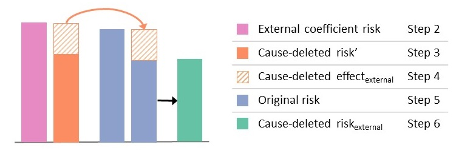
```


### Part B: Health outcome calculations

Using risks generated above you can then calculate:

- Health behaviour-deleted life expectancy or health behaviour attributable life expectancy lost
- Health behaviour-deleted number of deaths or health behaviour attributable number of deaths


**Life expectancy calculations**

Step I: Calculate the original life expectancy by using the original risk (Step 5 above) in the sex-specific 5-year abridge period life tables.

Step II: Calculate the health behaviour-deleted life expectancy by using the health behaviour-deleted risk external (Step 6 above) in the sex-specific 5-year abridge period life tables.

Step III: Calculate the health behaviour attributable life expectancy lost by: original life expectancy (Step I) minus health behaviour-deleted life expectancy (Step II):

$$ \text{Health behaviour attributable life exectancy lost} = \text{Health behaviour-deleted life expectancy} - \text{Original life expectancy}$$


**Number of deaths calculations**

Step I: Calculate the number of deaths that would occur using the original risk (Step 5 above).

Step II: Calculate the number of deaths that would occur using the health behaviour-deleted risk external (Step 6 above).

Step III: Calculate the health behaviour attributable deaths by: original number of deaths (Step I) minus health behaviour-deleted number of deaths (Step II):

$$\text{Health behaviour attributable deaths} = \text{Original number of deaths} - \text{Health behaviour-deleted number of deaths}$$


## Additional considerations

### Health behaviours with non-monotonic relationships

Health behaviours with relationships that are non-monotonic (always increasing or always decreasing) can be used in health behaviour attributable calculations but special consideration may be warranted for both policy and analytic reasons.

An example of a health behaviour with a non-monotonic relationship is alcohol. Some studies suggest that there is a "J" shaped risk relationship for outcomes such as cardiovascular disease. 

_Is this still a consideration if we are using 0 as the reference value?_
_Need to complete the thought at the end of the paragraph_
Alcohol drinking guidelines usually do not recommend people: non-drinkers or former-drinkers, initiate drinking. In this situation, the target population for health behaviour attribution calculations can be restricted to for respondents with moderate or higher drinking, or multiple reference exposures could be created.

### Health behaviours with interactions or multiple coefficients

The health behaviour attributable risk and the health behaviour-deleted risk estimates can be calculated for health behaviours with interaction terms, including complex interactions or multiple coefficients. Examples include:

-	health behaviour parametes  with age interaction; 
-	spline functions with terms for each knot point; or, 
-	composite risks such as smoking which may coefficients for smoking status (current, former, never) and pack-years.

All coefficients that related to a common risk factor should be simultaneously considered.


### Exposures not in the original algorithm


# Licence 

*Attribution-NonCommercial-ShareAlike 4.0 International*

Creative Commons Corporation (“Creative Commons”) is not a law firm and does not provide legal services or legal advice. Distribution of Creative Commons public licenses does not create a lawyer-client or other relationship. Creative Commons makes its licenses and related information available on an “as-is” basis. Creative Commons gives no warranties regarding its licenses, any material licensed under their terms and conditions, or any related information. Creative Commons disclaims all liability for damages resulting from their use to the fullest extent possible.

### Using Creative Commons Public Licenses

Creative Commons public licenses provide a standard set of terms and conditions that creators and other rights holders may use to share original works of authorship and other material subject to copyright and certain other rights specified in the public license below. The following considerations are for informational purposes only, are not exhaustive, and do not form part of our licenses.

* __Considerations for licensors:__ Our public licenses are intended for use by those authorized to give the public permission to use material in ways otherwise restricted by copyright and certain other rights. Our licenses are irrevocable. Licensors should read and understand the terms and conditions of the license they choose before applying it. Licensors should also secure all rights necessary before applying our licenses so that the public can reuse the material as expected. Licensors should clearly mark any material not subject to the license. This includes other CC-licensed material, or material used under an exception or limitation to copyright. [More considerations for licensors](http://wiki.creativecommons.org/Considerations_for_licensors_and_licensees#Considerations_for_licensors).

* __Considerations for the public:__ By using one of our public licenses, a licensor grants the public permission to use the licensed material under specified terms and conditions. If the licensor’s permission is not necessary for any reason–for example, because of any applicable exception or limitation to copyright–then that use is not regulated by the license. Our licenses grant only permissions under copyright and certain other rights that a licensor has authority to grant. Use of the licensed material may still be restricted for other reasons, including because others have copyright or other rights in the material. A licensor may make special requests, such as asking that all changes be marked or described. Although not required by our licenses, you are encouraged to respect those requests where reasonable. [More considerations for the public](http://wiki.creativecommons.org/Considerations_for_licensors_and_licensees#Considerations_for_licensees).

## Creative Commons Attribution-NonCommercial-ShareAlike 4.0 International Public License

By exercising the Licensed Rights (defined below), You accept and agree to be bound by the terms and conditions of this Creative Commons Attribution-NonCommercial-ShareAlike 4.0 International Public License ("Public License"). To the extent this Public License may be interpreted as a contract, You are granted the Licensed Rights in consideration of Your acceptance of these terms and conditions, and the Licensor grants You such rights in consideration of benefits the Licensor receives from making the Licensed Material available under these terms and conditions.

### Section 1 – Definitions.

a. __Adapted Material__ means material subject to Copyright and Similar Rights that is derived from or based upon the Licensed Material and in which the Licensed Material is translated, altered, arranged, transformed, or otherwise modified in a manner requiring permission under the Copyright and Similar Rights held by the Licensor. For purposes of this Public License, where the Licensed Material is a musical work, performance, or sound recording, Adapted Material is always produced where the Licensed Material is synched in timed relation with a moving image.

b. __Adapter's License__ means the license You apply to Your Copyright and Similar Rights in Your contributions to Adapted Material in accordance with the terms and conditions of this Public License.

c. __BY-NC-SA Compatible License__ means a license listed at [creativecommons.org/compatiblelicenses](http://creativecommons.org/compatiblelicenses), approved by Creative Commons as essentially the equivalent of this Public License.

d. __Copyright and Similar Rights__ means copyright and/or similar rights closely related to copyright including, without limitation, performance, broadcast, sound recording, and Sui Generis Database Rights, without regard to how the rights are labeled or categorized. For purposes of this Public License, the rights specified in Section 2(b)(1)-(2) are not Copyright and Similar Rights.

e. __Effective Technological Measures__ means those measures that, in the absence of proper authority, may not be circumvented under laws fulfilling obligations under Article 11 of the WIPO Copyright Treaty adopted on December 20, 1996, and/or similar international agreements.

f. __Exceptions and Limitations__ means fair use, fair dealing, and/or any other exception or limitation to Copyright and Similar Rights that applies to Your use of the Licensed Material.

g. __License Elements__ means the license attributes listed in the name of a Creative Commons Public License. The License Elements of this Public License are Attribution, NonCommercial, and ShareAlike.

h. __Licensed Material__ means the artistic or literary work, database, or other material to which the Licensor applied this Public License.

i. __Licensed Rights__ means the rights granted to You subject to the terms and conditions of this Public License, which are limited to all Copyright and Similar Rights that apply to Your use of the Licensed Material and that the Licensor has authority to license.

j. __Licensor__ means the individual(s) or entity(ies) granting rights under this Public License.

k. __NonCommercial__ means not primarily intended for or directed towards commercial advantage or monetary compensation. For purposes of this Public License, the exchange of the Licensed Material for other material subject to Copyright and Similar Rights by digital file-sharing or similar means is NonCommercial provided there is no payment of monetary compensation in connection with the exchange.

l. __Share__ means to provide material to the public by any means or process that requires permission under the Licensed Rights, such as reproduction, public display, public performance, distribution, dissemination, communication, or importation, and to make material available to the public including in ways that members of the public may access the material from a place and at a time individually chosen by them.

m. __Sui Generis Database Rights__ means rights other than copyright resulting from Directive 96/9/EC of the European Parliament and of the Council of 11 March 1996 on the legal protection of databases, as amended and/or succeeded, as well as other essentially equivalent rights anywhere in the world.

n. __You__ means the individual or entity exercising the Licensed Rights under this Public License. Your has a corresponding meaning.

### Section 2 – Scope.

a. ___License grant.___

   1. Subject to the terms and conditions of this Public License, the Licensor hereby grants You a worldwide, royalty-free, non-sublicensable, non-exclusive, irrevocable license to exercise the Licensed Rights in the Licensed Material to:

        A. reproduce and Share the Licensed Material, in whole or in part, for NonCommercial purposes only; and

        B. produce, reproduce, and Share Adapted Material for NonCommercial purposes only.

   2. __Exceptions and Limitations.__ For the avoidance of doubt, where Exceptions and Limitations apply to Your use, this Public License does not apply, and You do not need to comply with its terms and conditions.

   3. __Term.__ The term of this Public License is specified in Section 6(a).

   4. __Media and formats; technical modifications allowed.__ The Licensor authorizes You to exercise the Licensed Rights in all media and formats whether now known or hereafter created, and to make technical modifications necessary to do so. The Licensor waives and/or agrees not to assert any right or authority to forbid You from making technical modifications necessary to exercise the Licensed Rights, including technical modifications necessary to circumvent Effective Technological Measures. For purposes of this Public License, simply making modifications authorized by this Section 2(a)(4) never produces Adapted Material.

   5. __Downstream recipients.__

        A. __Offer from the Licensor – Licensed Material.__ Every recipient of the Licensed Material automatically receives an offer from the Licensor to exercise the Licensed Rights under the terms and conditions of this Public License.

        B. __Additional offer from the Licensor – Adapted Material.__ Every recipient of Adapted Material from You automatically receives an offer from the Licensor to exercise the Licensed Rights in the Adapted Material under the conditions of the Adapter’s License You apply.

        C. __No downstream restrictions.__ You may not offer or impose any additional or different terms or conditions on, or apply any Effective Technological Measures to, the Licensed Material if doing so restricts exercise of the Licensed Rights by any recipient of the Licensed Material.

   6. __No endorsement.__ Nothing in this Public License constitutes or may be construed as permission to assert or imply that You are, or that Your use of the Licensed Material is, connected with, or sponsored, endorsed, or granted official status by, the Licensor or others designated to receive attribution as provided in Section 3(a)(1)(A)(i).

b. ___Other rights.___

   1. Moral rights, such as the right of integrity, are not licensed under this Public License, nor are publicity, privacy, and/or other similar personality rights; however, to the extent possible, the Licensor waives and/or agrees not to assert any such rights held by the Licensor to the limited extent necessary to allow You to exercise the Licensed Rights, but not otherwise.

   2. Patent and trademark rights are not licensed under this Public License.

   3. To the extent possible, the Licensor waives any right to collect royalties from You for the exercise of the Licensed Rights, whether directly or through a collecting society under any voluntary or waivable statutory or compulsory licensing scheme. In all other cases the Licensor expressly reserves any right to collect such royalties, including when the Licensed Material is used other than for NonCommercial purposes.

### Section 3 – License Conditions.

Your exercise of the Licensed Rights is expressly made subject to the following conditions.

a. ___Attribution.___

   1. If You Share the Licensed Material (including in modified form), You must:

       A. retain the following if it is supplied by the Licensor with the Licensed Material:

         i. identification of the creator(s) of the Licensed Material and any others designated to receive attribution, in any reasonable manner requested by the Licensor (including by pseudonym if designated);

         ii. a copyright notice;

         iii. a notice that refers to this Public License;

         iv. a notice that refers to the disclaimer of warranties;

         v. a URI or hyperlink to the Licensed Material to the extent reasonably practicable;

       B. indicate if You modified the Licensed Material and retain an indication of any previous modifications; and

       C. indicate the Licensed Material is licensed under this Public License, and include the text of, or the URI or hyperlink to, this Public License.

   2. You may satisfy the conditions in Section 3(a)(1) in any reasonable manner based on the medium, means, and context in which You Share the Licensed Material. For example, it may be reasonable to satisfy the conditions by providing a URI or hyperlink to a resource that includes the required information.

   3. If requested by the Licensor, You must remove any of the information required by Section 3(a)(1)(A) to the extent reasonably practicable.

b. ___ShareAlike.___

In addition to the conditions in Section 3(a), if You Share Adapted Material You produce, the following conditions also apply.

1. The Adapter’s License You apply must be a Creative Commons license with the same License Elements, this version or later, or a BY-NC-SA Compatible License.

2. You must include the text of, or the URI or hyperlink to, the Adapter's License You apply. You may satisfy this condition in any reasonable manner based on the medium, means, and context in which You Share Adapted Material.

3. You may not offer or impose any additional or different terms or conditions on, or apply any Effective Technological Measures to, Adapted Material that restrict exercise of the rights granted under the Adapter's License You apply.

### Section 4 – Sui Generis Database Rights.

Where the Licensed Rights include Sui Generis Database Rights that apply to Your use of the Licensed Material:

a. for the avoidance of doubt, Section 2(a)(1) grants You the right to extract, reuse, reproduce, and Share all or a substantial portion of the contents of the database for NonCommercial purposes only;

b. if You include all or a substantial portion of the database contents in a database in which You have Sui Generis Database Rights, then the database in which You have Sui Generis Database Rights (but not its individual contents) is Adapted Material, including for purposes of Section 3(b); and

c. You must comply with the conditions in Section 3(a) if You Share all or a substantial portion of the contents of the database.

For the avoidance of doubt, this Section 4 supplements and does not replace Your obligations under this Public License where the Licensed Rights include other Copyright and Similar Rights.

### Section 5 – Disclaimer of Warranties and Limitation of Liability.

a. __Unless otherwise separately undertaken by the Licensor, to the extent possible, the Licensor offers the Licensed Material as-is and as-available, and makes no representations or warranties of any kind concerning the Licensed Material, whether express, implied, statutory, or other. This includes, without limitation, warranties of title, merchantability, fitness for a particular purpose, non-infringement, absence of latent or other defects, accuracy, or the presence or absence of errors, whether or not known or discoverable. Where disclaimers of warranties are not allowed in full or in part, this disclaimer may not apply to You.__

b. __To the extent possible, in no event will the Licensor be liable to You on any legal theory (including, without limitation, negligence) or otherwise for any direct, special, indirect, incidental, consequential, punitive, exemplary, or other losses, costs, expenses, or damages arising out of this Public License or use of the Licensed Material, even if the Licensor has been advised of the possibility of such losses, costs, expenses, or damages. Where a limitation of liability is not allowed in full or in part, this limitation may not apply to You.__

c. The disclaimer of warranties and limitation of liability provided above shall be interpreted in a manner that, to the extent possible, most closely approximates an absolute disclaimer and waiver of all liability.

### Section 6 – Term and Termination.

a. This Public License applies for the term of the Copyright and Similar Rights licensed here. However, if You fail to comply with this Public License, then Your rights under this Public License terminate automatically.

b. Where Your right to use the Licensed Material has terminated under Section 6(a), it reinstates:

   1. automatically as of the date the violation is cured, provided it is cured within 30 days of Your discovery of the violation; or

   2. upon express reinstatement by the Licensor.

   For the avoidance of doubt, this Section 6(b) does not affect any right the Licensor may have to seek remedies for Your violations of this Public License.

c. For the avoidance of doubt, the Licensor may also offer the Licensed Material under separate terms or conditions or stop distributing the Licensed Material at any time; however, doing so will not terminate this Public License.

d. Sections 1, 5, 6, 7, and 8 survive termination of this Public License.

### Section 7 – Other Terms and Conditions.

a. The Licensor shall not be bound by any additional or different terms or conditions communicated by You unless expressly agreed.

b. Any arrangements, understandings, or agreements regarding the Licensed Material not stated herein are separate from and independent of the terms and conditions of this Public License.

### Section 8 – Interpretation.

a. For the avoidance of doubt, this Public License does not, and shall not be interpreted to, reduce, limit, restrict, or impose conditions on any use of the Licensed Material that could lawfully be made without permission under this Public License.

b. To the extent possible, if any provision of this Public License is deemed unenforceable, it shall be automatically reformed to the minimum extent necessary to make it enforceable. If the provision cannot be reformed, it shall be severed from this Public License without affecting the enforceability of the remaining terms and conditions.

c. No term or condition of this Public License will be waived and no failure to comply consented to unless expressly agreed to by the Licensor.

d. Nothing in this Public License constitutes or may be interpreted as a limitation upon, or waiver of, any privileges and immunities that apply to the Licensor or You, including from the legal processes of any jurisdiction or authority.

> Creative Commons is not a party to its public licenses. Notwithstanding, Creative Commons may elect to apply one of its public licenses to material it publishes and in those instances will be considered the “Licensor.” Except for the limited purpose of indicating that material is shared under a Creative Commons public license or as otherwise permitted by the Creative Commons policies published at [creativecommons.org/policies](http://creativecommons.org/policies), Creative Commons does not authorize the use of the trademark “Creative Commons” or any other trademark or logo of Creative Commons without its prior written consent including, without limitation, in connection with any unauthorized modifications to any of its public licenses or any other arrangements, understandings, or agreements concerning use of licensed material. For the avoidance of doubt, this paragraph does not form part of the public licenses.
>
> Creative Commons may be contacted at creativecommons.org


# Bibilography

<!--chapter:end:Rmd//08-Appendix_1.Rmd-->


<!--chapter:end:Project-Biglife-Planning-Tool-Guide.Rmd-->

# Background {#background}

The wide range of enhanced surveillance applications is made possible through the tool's multivariable predictive approach. Compared to traditional approaches, the statistical and machine learning algorithms used by the PBL Planning Tool are a more complex approach to measure the burden from health behaviours.[@manuel2018] However, the planning tool carries out those complex calculators for you, without the need for statistical software.

Calculations are performed on a population sample of individuals rather than the traditional approach of using aggregated data. The predictive algorithms use the distinct characteristics of each respondent in the database, rather than assuming a person's risk of a health outcome (e.g., death) is the saame for all respondents with the same age and sex. 

The algorithms available on the planning tool have been developed and validated using data routinely-collected by Statistics Canada and provincial health agencies. All algorithms have been published in peer-review journals and are [publicly available](https://github.com/Big-Life-Lab/predictive-algorithms). More information about multivariable predictive risk algorithms can be found in the [key concepts](#keyconcepts) and [appendices](#mport).

**Features and contributing**  
The PBL Planning Tool is currently a pilot project. You can view changes and new features in the website's [Change Log](http://planning.projectbiglife.ca/).

We welcome suggestions and issues. Please follow this [guide](https://github.com/Big-Life-Lab/PBL-Planning-Tool-Guidance/blob/master/contributing/CONTRIBUTING.md).

Please tell us if you have scenarios or uses of the planning tool that you want to share with others by commenting on this GitHub [issue](https://github.com/Big-Life-Lab/PBL-Planning-Tool-Guidance/issues/9).

**Acknowledgements**

The PBL Planning Tool was developed by the [Project Big Life](https://www.projectbiglife.ca) Team based at the [Ottawa Hospital](http://www.ohri.ca/home.asp) and the [Bruyère Research Institute](https://www.bruyere.org/en/bruyere-research-institute).

The tool was made in collaboration with [Public Health Ontario](https://www.publichealthontario.ca/), the [Population Health Analytics Lab](https://pophealthanalytics.com/) at the University of Toronto and [Ottawa Public Health](http://www.ottawapublichealth.ca/en/index.aspx). 

Tool development was supported by the Ontario Ministry of Health and Long-term Care through the Applied Health Research Question program, administered through [ICES](https://www.ICES.on.ca).

Algorithms used in the planning tool were developed using linked population data housed at [ICES](https://www.ices.on.ca/) and validated at Statistics Canada. All algorithms have been published in peer-review journals. To learn more about the specific algorithms used in the Project Big Life Planning Tool see our [appendices](#mport) to the specific algorithms or [Project Big Life](https://www.projectbiglife.ca/science) website.

<!--chapter:end:Rmd//02-Background.Rmd-->

# Getting Started

To help you get started quickly with Project Big Life's Planning Tool, we built a Tutorial directly onto the web application.

The tutorial takes you through step-by-step how to use Project Big Life's Planning Tool. The tutorial will not explain the [steps in detail](#howto) nor will it provide terminology [glossary](#glossary) or how the [tool operates](#mport), but it will give you an understanding of how easy it is to use the Planning Tool! 

**To access the tutorial**, go onto [Project Big Life's Planning Tool](http://planning.projectbiglife.ca/) and click on the Tutorial button in the top right corner!

```{r, echo=FALSE, fig.align='center'}

```


**Web browser support**
The PBL Planning Tool is a web application with all calculations performed on your desktop within the web browswer. Once loaded on your desktop, no connection to the Internet is required. 

Please contact the development team if work within a secure research environment without Internet access. We may be able to assist you in creating a broswer-based package that you can transfer onto your internal systems.

[projectbiflife@toh.ca](mailto:projectbiglife.ca) or file an [issue](https://github.com/Big-Life-Lab/PBL-Planning-Tool-Guidance/issues).

Modern web browsers are supported (Google Chrome, Safari, Firefox, Edge). Internet Explorer is not supported.

<!--chapter:end:Rmd//03-Tutorials.Rmd-->

# How To {#howto}

These guides will cover the topics covered in the tutorial but in greater detail.

- Customize data
- Load data
- Select calculation
- Filter data
- Stratify data
- Scenarios: intervention and health behaviour attribution
- Calculate results
- Download results (To be developed)
- Resolve error messages (To be developed)


## Customize Data

<div class="FOO">
**Note:** The Project Big Life Planning Tool can only be used with the 2013/2014 Canadian Community Health Survey (CCHS) Public Use Microdata File (PUMF) in '.csv' format. 

Other years of CCHS can be used but only if the required variables are transformed to the 2013/2014 CCHS format. 
</div>


Prior to using the Project Big Life Planning Tool you may want to transform your data set. Reasons include: customized filter(s) and/or customized stratification(s), or transforming variables from other population health surveys to the 2013/2014 Canadian Community Health Survey (CCHS) format. Any variable that you create can be selected within the planning tool in the filter and/or stratify options.

Data manipulation can occur on any programming software: R, SAS, STATA, etc, as long as you output your data set as a '.csv' file. 

### Customize filter and/or stratification

An example of customizing your data set is converting the variable: Body Mass Index (CCHS 2013/2014 variable HWTGBMI) from a continuous variable into four distinct categories:
    
- Underweight: BMI less then 18.5
- Normal or Healthy Weight: BMI of 18.5 to 24.9
- Overweight: BMI of 25.0 to 29.9
- Obese: BMI greater or equal to 30.0

**Steps**

The following steps show the R code that would be used to create these strata:

1. Convert observations "Not stated" from 999.99 to NA
```    
    data[data == 999.99] <- NA
```      
2. Load the R package dpylr. This package is used for data manipulation.
```
    library(dpylr)
```       
3. Create a new column that contains four categories for BMI
``` 
    data$newcolumn <- cut(data$HWTGBMI, breaks = c(0,18.5,25,30,Inf),  labels=c("Underweight", "Healthy", "Overweight", "Obese")
``` 
4. The output will be your data set + a new column with the corresponding category ("Underweight", "Healthy", "Overweight", "Obese") for that individual.

```
    HWTGBMI   newcolumn
  1   22.68     Healthy
  2   26.99  Overweight
  3      NA        <NA>
  4   34.44       Obese
  5   23.77     Healthy
  6   17.23 Underweight
```

This new column can be now be used with the Project Big Life Planning Tool for the purpose of filtering or stratification.

###Transforming variables to 2013/2014 CCHS format

Population health surveys other then the 2013/2014 CCHS PUMF can be used if the variables: sex, age and survey weight (required variables) are transformed to the 2013/2014 CCHS format. 

For example the 2005/2006 CCHS data can be used if the 2005/2006 CCHS variable for age is renamed from DHH**E**GAGE to and DHHGAGE (2013/2014 format). Although the name for the variable name for age is different between the 2005/2006 and 2013/2014 surveys, they capture identical information.  


```{}
library(dpylr)

CCHSdata.2005.2006 <- CCHSdata.2005.2006 %>% 
  rename(DHHGAGE = DHHEGAGE)
```

All required variables **must** be transformed to the 2013/2014 CCHS format. It is also recommended that you transform the recommend variables as well to increase the accuracy of the prediction(s).

When transforming required or recommended variables pay attention to how the data was captured. There may be differences limit the ability to use the data set or differences that will affect your results. For instance from the 2001-2004 CCHS survey age is captured in 15 categories but from 2005-2013 age is captured in 16 categories. 


## Load data 

<div class="FOO">
**Note:** The Project Big Life Planning Tool can only be used with the 2013/2014 Canadian Community Health Survey (CCHS) Public Use Microdata File (PUMF) in '.csv' format. 

Other years of CCHS can be used but only if the required variables are transformed to the 2013/2014 CCHS variable format. 
</div>

Only **one data file** can be used on the planning tool at a time; the planning tool cannot preform a calculation across multiple data files. If you wish to use data from different data sets, you first merge the data sets together and use the 2013/2014 CCHS format (e.g. variable names). Once data sets are merged into one data file you can load your data on to the Planning Tool. 

There are two options of data files: a sample file or your own file.


### Load sample files

If you don't have your own data or want to explore the platform's capabilities before using your data, you can use the sample file on the Project Big Life Planning Tool. There are three sample files included on the planning tool:

There are three sample files:

- CCHS-2013-1-percent
- CCHS-2013-10-percent
- CCHS-2013-100-percent

Each sample file is from the 2013/2014 CCHS PUMF datafile and contains: 1%, 10% or 100% of the respondents. Each sample file contains all the variables (survey questions) from the 2013/2014 CCHS survey.

**Steps**

1. Click 'Select' beside the "Sample file" to select it. 

```{r, echo=FALSE, fig.align='center'}

```

### Load your own file

<div class="FOO">
**Note:** Data you load to the Project Big Life Planning Tool remains on your computer and is not uploaded or sent anywhere.
</div>

If you want to use your own file, that file must use the 2013/2014 CCHS variable names and:

- **Must include all** the **required** variables: DDH_SEX (sex), DHHGAGE (age), and WTS_M (survey weight).

- **Should include** some or all of the **recommended** variables. Recommended variables aren't required for calculations but will increase the accuracy of the predicted health outcome. 

More information on the required and recommended variables can be found [Appendix](#mport).


**Steps**

1. Click the **Load file** button under "Select a file to use in calculations".

```{r, echo=FALSE, fig.align='center'}

```

2. Locate the file on your computer, select, and open. 

3. Choose the file type: PUMF CCHS 2013/2014 PUMF for your uploaded file, in the table that showcases all of the files.

```{r, echo=FALSE, fig.align='center'}
knitr::include_graphics("Images/Datafiles-Load-Filetype.jpg")
```


Note:

- If the loaded file has all of the variables required and recommended for calculation, you will be able to 'Select' the file and continue with the planning tool. 
  
- If the loaded file does **not** have all the variables **required** for the calculation you will not be able to continue with the planning tool.

```{r, echo=FALSE, fig.align='center'}
knitr::include_graphics("Images/Datafiles-Load-Error.jpg")
```
  
- If the loaded file does **not** have all the variables **recommended** for calculation you will be able to 'Select' the file and continue with the planning tool, however the calculations may be less accurate. 

```{r, echo=FALSE, fig.align='center'}

```

## Select calculation

There are two general types of calculations: summary measures and by row measures.

- **Summary measures:** (ref:Summarycalc)

- **By row measures:** (ref:byrowcalc)

Summary measures must be selected for calculations that have stratifications or scenarios (both intervention and  health behaviour attribution).

More details of what the calculations are and how they are preformed can be found in [key concepts](#keyconcepts) - "Calculations".

**Steps**

1. Click '+ Create'

```{r, echo=FALSE, fig.align='center'}
knitr::include_graphics("Images/Create.jpg")
```

2. Name your calculation.

```{r, echo=FALSE, fig.align='center'}

```

3. Check the box beside the calculation's name under "Calculations" to select it. A single calculation or multiple calculations may be selected.

- Once selected, the types(s) of the calculations will appear to the right of "Calculations".

```{r, echo=FALSE, fig.align='center'}

```


## Filter data

Use filters when you want to analyze only a subset of your data.

**Steps**

1. Click on the toggle button beside "Filters".

```{r, echo=FALSE, fig.align='center'}

```

2. Click **+ New** under the Filter bar.

```{r, echo=FALSE, fig.align='center'}

```

3. Select the variable that you want to filter on by typing its variable name into the "search variables" text bar.

```{r, echo=FALSE, fig.align='center'}

```


4. Filter **in** the categories/levels within the variable by:

  - **Categorical:** Clicking on the "Search categories"" text bar. Scroll and select the category you want to **keep** in your data. Repeat this step to add additional categories.
  
```{r, echo=FALSE, fig.align='center'}
knitr::include_graphics("Images/FilterCat.jpg")
```

  - **Continous:** Click the "cycle button" found under the variable you have selected. Two new boxes will appear. 
    - Select the minimum value for your subset data in the box on the left by typin the value. 
    - Select the maximum value for your subset data in the box on your right by typing the value.
    
```{r, echo=FALSE, fig.align='center'}
knitr::include_graphics("Images/FilterCont.jpg")
```    

    
4. To add another filter repeat the steps above. A maximum of three filters are recommended to maintain statistical power (added filters reduce sample sizes and reduces statistical power). 

  - Once selected, the name(s) of the filtered variable(s) will appear to the right of "Filters".

You are able to filter on all types of variables: required for calculation, recommended for calculation, and all other variables.


### Remove a filter

- To remove a filter entirely, click on the trash can beside the variable you want to delete.

```{r, echo=FALSE, fig.align='center'}
knitr::include_graphics("Images/FilterRemove1.jpg")
```  

- To remove a level within a filtered variable - categorical, click on the 'x' beside the variable level.

```{r, echo=FALSE, fig.align='center'}
knitr::include_graphics("Images/FilterRemove2.jpg")
```  

## Stratify data

Use stratifications when you want to get a result for multiple strata (levels or classes). 

A summary measure must be selected for stratifications, as only a summary measure will be outputted for each strata. By row measurements may also be selected but they will not be stratified.

**Steps**

1. Click the toggle button beside "Stratifications".

```{r, echo=FALSE, fig.align='center'}
knitr::include_graphics("Images/Strat.jpg")
```

2. Select the variables you want to stratify on under the "Stratifications'. You are only able to stratify on categorical variables.

```{r, echo=FALSE, fig.align='center'}

```

3. To add another variable for stratification repeat the steps above. A maximum of 3 stratifications are recommended to maintain statistical power (added strata reduce strata sample size and reduces statistical power).

- Once selected, the name(s) of the stratified variable(s) will appear to the right of "Stratifications".

You are able to stratify on all types of categorical variables: required for calculation, recommended for calculation, and other variables (includes customized variables).

### Remove a stratification

- To remove a stratification variable click on the 'x' beside the variable level.

```{r, echo=FALSE, fig.align='center'}
knitr::include_graphics("Images/StratRemove.jpg")
```


## Run scenarios

Scenarios can be used to predict the health outcomes when unhealthy behaviours:

- are modified in the population: **Intervention**, or
- were never present in the population: **health behaviour attribution**

Scenarios can be used to inform potential health policies or programs. Scenarios 
can be run on health behaviours (smoking, physical activity, diet, alcohol).

### Intervention scenarios

Interventions provide you with the ability to customize the scenarios. For example you can answer the questions:

- what if we only had 15% of the population smoked rather then the current 20%?
- what if everyone increased their physical activity by 10%?
- what if everyone ate 4 fruit and vegetable servings each day?
- what if everyone drank 2 fewer drinks per week?

These intervention scenarios allow you to predict and compare the effectiveness of policies.

There are 3 types of intervention scenarios that you can select:

- **Absolute:** each individual in the population **changes** their health behaviour **by a value of x**. 
- **Relative:** each individual in the population **changes** their health behaviour **by a ratio of y**.
- **Target:** each individual in the population **has a set value of z.**

More information on the specifics of each type of intervention scenario and how they are calculated can be found in [key concepts](#keyconcepts) - "Scenarios: Interventions".

**Steps**

1. Click the toggle button beside "Scenario"

```{r, echo=FALSE, fig.align='center'}
knitr::include_graphics("Images/Scenario.jpg")
```

2. Select "Intervention" from the "Scenario Type" menu.

```{r, echo=FALSE, fig.align='center'}
knitr::include_graphics("Images/Scenario-Intervention.jpg")
```

3. Select the "Type" of intervention you want beside your target health behaviour. 

- A description of each intervention scenario and how they are calculated can be found in [key concepts](#keyconcepts) - "Scenarios: Interventions"

```{r, echo=FALSE, fig.align='center'}
knitr::include_graphics("Images/Scenario-Intervention-Abs.jpg")
```

4. Type or use the arrow keys to get the value you want. 

```{r, echo=FALSE, fig.align='center'}
knitr::include_graphics("Images/Scenario-Intervention-Abs2.jpg")
```

Multiple health behaviour interventions can be selected for a single calculation.


###Health behaviour attribution scenarios

Health behaviour attribution scenarios provide you with the best case scenario for the population. For example:

- what if no one in the population ever smoked? (also known as smoking attributable mortality)
- what if everyone in the population met their recommended physical activity levels (3.00 METs/week)?

More information on health behaviour attribution calculations and how they are calculated can be found in [key concepts](#keyconcepts) - "Scenarios: Health behaviour attribution".

**Steps**

1. Click the toggle button beside "Scenario"

```{r, echo=FALSE, fig.align='center'}
knitr::include_graphics("Images/Scenario.jpg")
```

2. Select "Intervention" from the "Scenario Type" menu.

```{r, echo=FALSE, fig.align='center'}

```

3. Check the box beside the intervention you want to do.

```{r, echo=FALSE, fig.align='center'}
knitr::include_graphics("Images/Scenario-HBattribution2.jpg")
```

Multiple health behaviours can be selected for a single calculation. 


##Run calculation

**Steps**

Click "Calculate" in the bottom right corner once you have selected your conditions. 

```{r, echo=FALSE, fig.align='center'}

```

<div class="FOO">
**Note:** the larger the data set is the longer the calculations will take. Depending on the size of the data set and the type of calculation being preformed it could take an hour or more. 
</div>

2. A new table will appear under the calculations box. The table includes the status of the calculation, calculation name and the selected conditions: measures, filters, stratifications, and scenarios. 

```{r, echo=FALSE, fig.align='center'}

```

3. A "View" button will appear next to your calculation once it is complete.
```{r, echo=FALSE, fig.align='center'}

```


##View results

1. Click the "View" button beside the calculation you want to see. 
```{r, echo=FALSE, fig.align='center'}

```

2. The Results Box appears at the bottom of the web page.

The following tabs will **always** appear:

- **Overview:** gives a summary of the calculation(s). 

```{r, echo=FALSE, fig.align='center'}

```

- **Log:** gives a summary of the warnings and errors that happened during the calculation.

The following tabs will appear based on your calculation:

- **By Row Measures** will give you a table with the 'by row measure' average.

```{r, echo=FALSE, fig.align='center'}
knitr::include_graphics("Images/Results-ByRow.jpg")
```

- **Summary Measures** will give you a table with summary measures. This tab will only appear when **no** stratifications are selected.

```{r, echo=FALSE, fig.align='center'}

```

- **Stratifications** will give you a graph with the summary measures, when stratifications are selected.

###Graph

The graph is interactive. Hover over the graph to see the results for each strata, exclude strata, download a .png of the graph, and much more.

## Download results

1. Click on the **Download results** button under the **Results** section.

```{r, echo=FALSE, fig.align='center'}

```

A pop-up will appear. 

2. Select which file you would like to download. 

- **Input file with calculation results** gives you a .csv file with all observations and calculation per row
- **Population summary** gives you a .csv file with only summary results

```{r, echo=FALSE, fig.align='center'}

```

3. Select which calculations do not want to download.

```{r, echo=FALSE, fig.align='center'}

```

4. Scroll down and click "Download file"
```{r, echo=FALSE, fig.align='center'}
knitr::include_graphics("Images/Results-Download4.jpg")
```

5. The a .zip file will automatically download

## Resolve warning or error messages (To be developed)

There are different types of warning and error messages that may appear.

Below describes some of the messages that are likely to occur and steps to resolve them.

### Invalid category

### Out of range

### Not a number

### Sample size is too small

<!--chapter:end:Rmd//04-How-To.Rmd-->

# Case examples {#caseexamples}

This chapter provides you with examples of how Project Big Life's Planning Tool can be used in your day-to-day operations. The case examples will cover:

```{r, echo=FALSE, results='hide', message=FALSE}
library(knitr)
library(kableExtra)

(caseExamples <- data.frame(
    Description = c("Statistics for health status reports", "Deaths prevented from increasing cycling infrastructure", "Impact on life expectancy by modifying all health behaviours", "Impact on life expectancy by increasing cycling rates", "Prevented deaths from enacting a 2004 smoking by-law"), 
    Name = c("Health status report", "Adjusting gears", "Healthy cities", "Canada bikes like the Dutch", "Smoking by-law, Ottawa 2004: retrospective"),
    Type = c("Filter,\nStratification,\nScenario - Health behaviour attributable (smoking and diet)", "Filter,\nScenario - Intervention: Absolute (Physical activity)", "Filter,\nStratification,\nScenario - Intervention: Target (All)", "Filter,\nScenario,\nIntervention: Absolute (Physical activity)", "Transform variables,\nFilter,\nScenario - Intervention: Target (Smoking)")) 
    )#closingbracket 

```
```{r, echo=FALSE}
kable(caseExamples) %>%
  kable_styling(full_width = T)  %>%
  scroll_box(height = "400px")
```


## Health Status Report

Health status reports are a way to report the health state for a population and the factors that influence a population’s health. Information from health status reports are used to inform policy, planning, and resource allocation.

Using the Project Big Life Planning Tool you can replicate or update existing health status reports e.g. Public Health Ontario's: [Seven More Years Report](https://www.ices.on.ca/Publications/Atlases-and-Reports/2012/Seven-More-Years) or generate a new health status report. 

In this example we will show you how to create some health statistics to include in your health report. We will calculate:

- The predicted number of deaths by strata (e.g. by sex [males and females])
- The impact of eliminating unhealthy behaviours on life expectancy

For this example we will focus on the population of Alberta.

### Predicted number of deaths stratified by sex and level of education

By showing the number of deaths by strata, the reader can see the distribution of deaths across specific population characteristics.  Any categorical variable can be used for stratification but in this example we will use sex and level of education.

**Steps**

1. Select the sample file data.sample.csv under "Sample files". 

<div class="FOO">
**Note:** Although the data.sample.csv is based on the 2013/2014 Canadian Community Health Survey Public Use Microdata File, data.sample.csv is a completely synthetic data set and can only be used for exemplary purposes.
</div>

2. Select the calculation: Summary Measure – Deaths (Five years)

3. Add filter: GEOGPRV – 48, which is the corresponding code for Alberta.

4. Add two stratification: DDH_SEX and EDUDR04

5. Title the calculation: Deaths by sex and education level

6. Click the calculate button

*7. To do: Results – walk through the results*


### Impact of eliminating unhealthy behaviours: smoking and poor diet, on life expectancy

To show how much an unhealthy behaviour impacts life expectancy we use the scenario: health behaviour attributable. Health behaviour attributable scenarios can be used for the health behaviours: alcohol consumption, diet, physical activity, and smoking, individually or in any combination. In this example we will evaluate the impact of smoking and poor diet, in combination, on life expectancy.

**Steps**

1. Select the sample file data.sample.csv under "Sample files". 

<div class="FOO">
**Note:** Although the data.sample.csv is based on the 2013/2014 Canadian Community Health Survey Public Use Microdata File, data.sample.csv is a completely synthetic data set and can only be used for exemplary purposes.
</div>

2. Select initial calculation: Summary Measure – Life Expectancy (Summary)

3. Add filter: GEOGPRV – 48, which is the corresponding code for Alberta.

4. Click the text: Scenario.

5. Select health behaviour attribution. 

6. Select the health behaviours: smoking and diet

7. Title the calculation: Alberta: smoking and diet attributable life expectancy

8. Click the calculate button

*9. To Do:	Walk through results*

<div class="FOO">
**Note:** $\text{Physical inactivity and poor diet attributable life expectancy lost} \neq$
$\text{Physical inactivity-deleted life expectacny} + \text{Poor diet-deleted life expectancy}$

as individuals in the population may be both physically inactive and have a poor diet. 
</div>


## Adjusting gears

The City of Hamilton has decided to implement a new initiative *Adjusting Gears* which will increase cycling infrastructure in Hamilton. As part of the plan they have decide to develop 100 km of new cycling infrastructure in the next 3 years (2019-2021). 

The city has asked you to evaluate the health impact of this initiative.

As part of the analysis you want to determine how the 100km of new cycling infrastructure will impact the health of the Hamilton area, and how many deaths will be prevented.

### Part A: Determine the how much a Hamiltonian will increase their physical activity by using these new cycling tracks

<div class="AOO">
Assumption #1: After having done your research, you assume that with the new tracks the average person in Hamilton will cycle an additional 10 minutes/day (duration).
</div>

1. Convert the increased duration of cycling into daily energy expenditure (MET-hours): 

$\text{MET-hours} = \text{Duration}*\text{MET value for cycling}$ 

- The MET value for cycling in Canada is 4.0


### Part B: Determine the impact on life expectancy

Use the Project Big Life Planning Tool for the following steps:

1. Load your data file: data.sample.csv to the Project Big Life Planning Tool. 

2. Select initial calculation: Summary Measure – Deaths (5-years)

3. Add Filter: GEODPMF - 35937

4. Click: Scenarios, and select Intervention

5. Click Physical Activity then Select “Average daily leisure time energy expenditure in METs”

<div class="AOO">
Assumption #2: Although the scenario for physical activity is for leisure energy expenditure, we assume 1) individuals that are active in their leisure time also use active transportation, and 2) cycling as a form of active transportation is minor part of their energy expenditure. Therefore we will adjust the average daily leisure time energy expenditure in METs.
</div>

6. Select Absolute

7. Type in the absolute change calculated in Part 1, into the text box.

8. Name your calculation: Adjusting gears - Deaths in Hamilton

9. Click Calculate


## Healthy Cities

What would be Ottawa's life expectancy, if the region had the same health behaviours as the healthiest region in Canada?

In this example, we will determine:

A. who is the healthiest region in Canada, 

B. what are the health behaviours of Ottawa vs the healthiest region, and

C. what would be the mortality outcomes be if Ottawa's health behaviours were the same as the healthiest region. 

Here we will use the average life expectancy to determine the health of regions: the higher the life expectancy for the region the healthier that region is.

For this example we will use the sample data set **data.sample.csv**, which can be downloaded at https://github.com/Big-Life-Lab/PBL-Planning-Tool-Case-Examples. This link also contains all of the R code for this case example. Although we have included the R code any other statistics software (SAS, STATA, etc) can be used to complete this case example.

The following steps include the R coding for each of the steps but you can preform the steps in any other software program.

### Part A: Find the healthiest region in Canada

Using the Project Bid Life Planning Tool, we will find the healthiest region in Canada: the region with the highest life expectancy. 

1. Load the data file: data.sample.csv. 

<div class="FOO">
**Note:** Although the data.sample.csv is based on the 2013/2014 Canadian Community Health Survey Public Use Microdata File, data.sample.csv is a completely fabricated data set and can only be used for exemplary purposes.
</div>

2. Select calculation: Summary Measure – Life Expectancy (Summary)

3. Add Stratification: GEODPMF. This variable represents the health regions in Canada

4. Title the calculation: Life expectancy by health region

5. Click the calculate button

6. Download the results - _TO DO_

Using your preferred statistic software (Excel, SAS, STATA, R Studio, etc) identify the healthiest region and the health of the Ottawa health region. 

The healthiest region is XXX.


### Part B: Determine the health behaviours of the healthiest region and the Ottawa region. 

Calculate the average of each health behaviour in the healthiest region: XXX and the Ottawa region.

- **Smoking**: Calculate the prevalence of current smokers in the XXX and Ottawa region.
- **Physical Activity**: Calculate the average of physical activity (variable PACDEE) in the XXX and Ottawa region.
- **Alcohol**: Calculate the average of weekly alcohol consumption (variable ALWDWKY) in the XXX and Ottawa region.
- **Diet**: Calculate the average daily consumption of each diet component (variables: FVCDCAR, FVCDFRU, FVCDJUI, FVCDPOT, FVCDSAL, and FVCDVEG) in the XXX and Ottawa region. 

  - The more daily servings an individual has of:

    - carrots, fruits, salad, and vegetables =  the more healthy the individual, 
    - juice = the less healthy the individual,
    - potato < 1 = the more healthy the individual,  and
    - potato > 1 = the less healthy the individual. 


**Comparing health behaviours**

Compare the averages of all health behaviours in the Ottawa region to the XXX. When the health behaviour for Ottawa is unhealthier then XXX, record the avg/prevalence of that health behaviour for XXX.


### Part C: What if Ottawa acted like XXX?

We’ll now run a scenario where the Ottawa region acts like XXX. Ottawa will now have the health behaviours of XXX, when the health behaviour of XXX is healthier then Ottawa's. 

1.	Load your data file: data.sample.csv 

2.	Select initial calculation: Summary Measure – Life Expectancy (Summary)

3.	Add Filter: GEODPMF – 35951 (the code for the Ottawa Health region)

4.	Click: Scenarios

5.	Click on each health behaviour where Ottawa is unhealthier then XXX and input XXX’s value in the target scenario for that health behaviour

- _TO DO: _ Examples of where that is

6. Title the Calculation: Ottawa - Intervention - HB1, .....

7. Click calculate.

8. _TO DO:_ results


## Canada bikes like the Dutch

Cycling as a form of transportation, is an effective way of increasing individuals' daily physical activity levels and can lead to a decrease in the risk of disease and death.

In this example we will determine the impact on life expectancy if Canadians were to cycle like the cycling enthusiasts the Dutch! 

In this example we determine:

A. How much Canadians cycle per day for transportation purposes on average?

B. How much Dutch cycle per day for transportation purposes on average?

C. What is the average difference in daily cycling transportation for Canadians and the Dutch?

D. Predict how Canadian life expectancy would change if Canadians biked like the Dutch.

For this example we will use the sample data set **data.sample.csv**, which can be downloaded at https://github.com/Big-Life-Lab/PBL-Planning-Tool-Case-Examples. This link also contains all of the R code for this case example. Although we have included the Rcode other statistics software (SAS, STATA, etc) can be used to complete this case example.

<div class="FOO">
**Note:** Although the data.sample.csv is based on the 2013/2014 Canadian Community Health Survey Public Use Microdata File, data.sample.csv is a completely synthetic data set and can only be used for exemplary purposes.
</div>


### Part A: How much do Canadians cycle per day for transportation purposes on average?

We will determine how much Canadians cycle per day by calculating the average daily energy expenditure from cycling in the current Canadian population.

We will use 3 variables in our sample data set which are based off of the 2013/2014 CCHS PUMF and measure cycling as a form of active transportation:

- PAC_8: In the past 3 months did you cycle to and from work or school?
- PAC_8A: How many times did you cycle to and from work or school, in the past 3 months?
- PAC_8B:	How much time did you spend on each occasion?

<div class="AOO">
**Assumption #1:** we assume individuals 65 or older are retired and therefore not cycling to/from work/school. Therefore, we will only evaluate individuals that are < 65 years old.
</div>

In order to calculate the average Canadian daily energy expenditure from cycling for transportation, you will need to: 

- Find the average number of times, that an individual cycled to/from work/school in the past 3 months (mean PAC_8A)

- Find the average number of hours spent cycling to/from work/school, in the past 3 month (mean of PAC_8B)

- Calculate the average duration of cycling: $\text{Duration} = [\text{(Frequency/3 months)}*\text{(Time/trip)}] / \text{(Days/3 months)}$

- Calculate the average daily energy expenditure (MET-hours) for cycling to/from work/school: $\text{MET-hours} = \text{Duration}*\text{MET value for cycling}$

<div class="FOO">
**Note:** For Canadians to cycle like the Dutch, we need to use the Dutch MET cycling value of 5.8 and not the Canadian MET cycling value of 4.0. The Dutch MET value accounts for the speed of cycling of the Dutch. 
</div>

- Calculation the average daily expenditure from cycling for transportation for all individuals in the population not only those that cycled to/from work/school

On average a Canadian only gets 0.024 MET-hours/day from cycling to/from work/school.


### Part B: How much do the Dutch cycle/day for transportation purposes on average?

Using data collected as part of the Dutch National Travel Survey (2010 – 2012), Fisherman, 2015 (doi:10.1371/journal.pone.0121871 - Table S1) reported the average additional daily energy expenditure from cycling as a form of transportation for the Dutch: males: 1.3 MET-hours, and females: 1.4 MET-hours. 

The average Dutch daily energy expenditure from cycling as a form of transportation for both sexes is then 1.35 MET-hours.


### Part C: What is the average difference in daily cycling transporation for Canadians and the Dutch?

Canadians need to increase their average daily energy expenditure from cycling from 0.07 MET-hours to 1.35 MET-hours, in order to be like the Dutch.

<div class="FOO">
**Note:** Since the physical activity intervention scenario on the Project Big Life Planning Tool is for daily leisure energy expenditure and not daily active transportation, we will use the 'absolute' scenario for this example. We will increase each individual's daily leisure energy expenditure by 1.28 MET-hours (1.35 MET-hours - 0.07 MET-hours).
</div>

### Part D: Predict how Canadian life expectancy would change if Canadians biked like the Dutch.

Use the Project Big Life Planning Tool for the following steps:

1. Load your data file: data.sample.csv to the Project Big Life Planning Tool. 

2. Select initial calculation: Summary Measure – Life Expectancy (Summary)

3. Add Filter: DDHGAGE – 1,2,3,4,5,6,7,8,9,10,11,12

4. Click: Scenarios, and select Intervention

5. Click Physical Activity then Select “Average daily leisure time energy expenditure in METs”

<div class="AOO">
Assumption #2: Although the scenario for physical activity is for leisure energy expenditure, we assume 1) individuals that are active in their leisure time also use active transportation, and 2) cycling as a form of active transportation is minor part of their energy expenditure. Therefore we will adjust the average daily leisure time energy expenditure in METs.
</div>

6. Select Absolute

7. Type in the absolute change calculated in Part 3, into the text box.

8. Name your calculation: Canada bikes like the Dutch

9. Click Calculate

10. Interpret results


## Smoking by-law, 2004 Ottawa: retrospective

The City of Ottawa has historically been a leader in municipal policy to reduce tobacco smoking at the population level. A key milestone was the introduction of a 2004 by-law that limited smoking in bars/restaurants.

We want to know how many smoking attributable deaths were prevented due to this by-law.

<div class="AOO">
Assumption: We assume that the by-law lead to decrease in current smokers either through individuals quitting smoking or individuals not starting to smoke.
</div>

For this example we will:

A. Transform 2003 CCHS PUMF variables to 2013 CCHS PUMF variables

B. Determine the prevalence of current smokers in 2003

C. Determine the prevalence of current smokers in 2013

D. Estimate how many smoking attributable deaths were prevented due to enacting the by-law


For this example we will use the sample data set **data.sample2003.csv** and **data.sample2013.csv**, which can be downloaded at https://github.com/Big-Life-Lab/PBL-Planning-Tool-Case-Examples. This link also contains all of the R code for this case example. Although we have included the R code any other statistics software (SAS, STATA, etc) can be used to complete this case example.


### Part A: Transform 2003 CCHS PUMF variables to 2013 CCHS PUMF variables

The Project Big Life Planning Tool only works on 2013-2014 CCHS variable names only. Therefore if you are using a CCHS data set from previous years you will have to transform the variables to the 2013-2014 format.

1. Use **data.sample2003.csv**

<div class="FOO">
**Note:** Although the data.sample2003.csv is based on the 2003/2004 Canadian Community Health Survey Public Use Microdata File, data.sample2003.csv is a completely fabricated data set and can only be used for exemplary purposes.
</div>

With the data.sample2003 data set you will need to: 

 - Rename 2003 CCHS PUMF variables to their corresponding 2013 CCHS PUMF variables, 
 
 - Create variable CCC_091 from variables CCCC_91A and CCCC_91B, and
 
 - Recode DHHGAGE variable

<div class="FOO">
Note: The Project Big Life team is developing a R package that will make this step easier for you! The package transforms CCHS variables from 2001 to 2014. 

We'll update the guidance as soon as the package is ready!
</div>


### Part B:  Determine the prevalence of current smokers in 2003

Current smokers are defined by variable SMKDSTY: 1 – Daily, 2 – Occasional, 3 – Always Occasional. 

In 2003, current smokers accounted for 26% of the Ottawa population.


###Part C: Determine the prevalence of current smokers in 2013. 

The prevalence of smokers in 2013 will be the scenario target in Part D. 

1. Use **data.sample.csv**

<div class="FOO">
**Note:** Although the data.sample.csv is based on the 2013/2014 Canadian Community Health Survey Public Use Microdata File, data.sample.csv is a completely fabricated data set and can only be used for exemplary purposes.
</div>

In 2013, current smokers accounted for 21% of the Ottawa population.


### Part D: Estimate how many smoking attributable deaths were prevented due to enacting the by-law

Use the Project Big Life Planning Tool for the following steps:

1.	Load your data file: data.sample2003.csv to the Project Big Life Planning Tool.

2.	Select initial calculation: Summary Measure – Deaths (5 years)

3.	Add Filter: GEODPMF - 35951

4.	Click: Scenarios, and select Intervention

5.	Click Smoking then Select “Prevalence of current smokers”

6.	Select Target

7.	Type in 21 (prevalence of smokers from 2013) into the text box.

8.	Name your calculation: Smoking attributable deaths 2003

9.	Click Calculate


<!--chapter:end:Rmd//05-Case-Examples.Rmd-->

# Key Concepts {#keyconcepts}

This section explains some key concepts in Project Big Life’s Planning Tool. This section will explain how it works rather then how to do things.

- Data and sample files
- Multivariable predictive risk algorithms
- Calculations: general

    - Summary vs. By Row
    - Weighted vs. unweighted

- Calculations: specific health outcomes

    - Risk of health outcome
    - Number of health outcomes
    - Life expectancy

- Scenario: Intervention
- Scenario: Health behaviour attribution
- Results

    - Why are there more deaths for the healthy behaviour?
    
- Assumptions and limitations

## Data and sample files

<div class="FOO">
The Project Big Life Planning Tool currently accepts **2013/2014 Public Use Microdata File of the Canadian Community Health Survey (CCHS) in '.csv' format.**
</div>

### What is the Canadian Community Health Survey?

The Canadian Community Health Survey (CCHS) is an annual cross-sectional survey preformed by Statistics Canada. The CCHS is Canada's main population health survey. It collects information related to health status, health care utilization, and health determinants for the Canadian population. Data is shared at the the sub-provincial geographic level (health region or combination of health regions).

- Details about the survey and its design can be found on Statistic Canada website  (http://www23.statcan.gc.ca/imdb/p2SV.pl?Function=getSurvey&Id=144170). 
- Details and access to all CCHS year and thier Public Use Microdata files (PUMF) can be found through the Odesi website (https://search2.odesi.ca/#/details?uri=%2Fodesi%2Fcchs-82M0013-E-2013-2014-Annual-component.xml)

### Why can the Project Big Life Planning Tool only accept the 2013/2014 Canadian Community Health Survey data?

Each year the CCHS changes a few variables it captures. This makes CCHS data sets from every year other then 2013/2014 partly incompatible with the algorithms used by the Project Big Life Planning Tool.


### Can I use other population health survey data sets?

Yes you can use other population health survey data sets but you have to transform these data set to the 2013/2014 CCHS format.

To transform CCHS cycles the Project Big Life Team developed an R-package CCHS-flow. This package transforms CCHS variables from cycles 2001 to 2014 into harmonized and consistent versions. To access or learn more about the CCHS flow visit CRAN packages (https://cran.r-project.org/web/packages/cchsflow/index.html).

### Sample Files

There are three sample files:

- CCHS-2013-1-percent
- CCHS-2013-10-percent
- CCHS-2013-100-percent

Each sample file is from the 2013/2014 CCHS PUMF datafile and contains: 1%, 10% or 100% of the respondents. Each sample file contains all the variables (survey questions).


## Multivariable predictive risk algorithms

Multivariable predictive risk algorithms predict the future risk of health outcomes (e.g. Life Expectancy) for a population using routinely collected health data.

Multivariable predictive risk algorithms can be used to:

- Project the number of new cases of the health outcome
- Estimate the contribution of specific risk factors of the health outcome
- Evaluate effectiveness of health interventions
- Describe the distribution of risk in the population (diffused or concentrated)

Multivariable predictive risk algorithms are able to assess equity issues compared to competing population risk methods (e.g. World Health Organization Global Burden of Disease).

More information on what multivariable predictive risk algorithms are and how they can be used can be found the journal article: *Predictive risk algorithms in a population setting: an overview* [@PoRTover]

### Development of multivariable predictive risk algorithms

Data:

-	Multivariable predictive risk algorithms are created using routinely collected data that includes information about risk factors (exposure) and health events (outcomes).
-	Data is collected at an individual level through population health surveys (e.g. Canadian Community Health Survey) and administrative databases (e.g. Vital Statistics). Data sources are linked together when the individual has given permission too.
- Individuals are followed overtime until the health event (e.g. death or disease) occurs.
- Separate data is collected to create a derivation cohort and validation cohort(s). 

    - Note: The risk factors that are collected are from population health surveys and are self-reported; no clinical data (e.g. blood pressure) is collected. Risk factors focus on health behaviours (e.g. smoking) and sociodemographic factors, commonly associated with health outcome.

**Algorithm generation:**

- Multivariable predictive risk algorithms are cox proportional hazard models that analyze time to health outcome (e.g. death) *Question for Carol - The models are not cox-porportional hazard models but they are similar?*

- Multivariable predictive risk algorithms are developed and validated in 4 stages:

    - Algorithm derivation: the predictive risk algorithm is created using data from the derivation cohort
    - Algorithm validation: the predictive risk algorithm is applied to the validation cohort
    - Final algorithm generation: validation and derivation cohorts are combined to estimate the final application of the predictive risk algorithm 
    - Derivation of the application algorithm: creation of a parsimonous (fewer predictors) algorithm that maintained discrimination, calibration, and overall algorithm performance
    
- In each stage of the algorithm development and validation, algorithm performance is assessed using measures of discrimination and calibration.

### Multivariable predictive risk algorithms built in Project Big Life Planning Tool

- There is currently 1 multivariable predictive risk algorithm is built into to Project Big Life planning tool.
```{r, echo=FALSE, results='hide', message=FALSE}
library(knitr)
library(kableExtra)

(PoRTs <- data.frame(
    Title = c("Mortality Population Risk Tool"),
    Outcomes = c("5 year risk of death, Life Expectancy, Cause deleted"),
    Information =c("Appendix A"))
    )#closingbracket 
```
```{r, echo=FALSE}
#Creating the table
kable(PoRTs) %>%
  kable_styling(full_width = T)
```


## Calculations

### Summary vs By Row

There are two general types of calculations Summary Measures and By Row Measures.

Summary measures: (ref:Summarycalc)

By row measures: (ref:byrowcalc)

<div class="FOO">
**Note:** Summary Measures are not the same as taking the average of By Row Measures. Summary measures account for the survey weights in their calculations. Only averaging the By Row Measures does not account for the survey weights and will result in an incorrect outcome. 
</div>

### Weighted vs unweighted

Weights are used in complex surveys like the Canadian Community Healthy Survey (CCHS). A weight is given to each respondent in the survey and the weight corresponds to the number of individuals in the population the respondent represents. 

When a data set has weights, like the CCHS PUMF data set, the weights are used to calculate the population's outcome e.g. number of deaths. 

When a survey does not have weights, the the population's outcome is not calculated with weights. 

In either case, weights are not used in the calculation of an individual's outcome (e.g. an individual's 5 year risk of mortality). 


## Calculations: specific health outcomes

### Risk of health outcome

Risk of the health outcome (e.g. risk of dying) is the outcome of a multivariable predictive risk algorithm. An example of the mutlivariable risk algorithm is:

$$ \text{Risk} = \sum_t h_0(t) * e^{\beta_{pred.smoking}*x_{smoking}+\beta_{pred.cancer}*x_{cancer} + \beta_{pred.age}*x_{age} +...}  $$
Where:

- $t$ = survival time
- $h_0(t)$ = the baseline hazard
- $\beta_{pred}$ = predictive hazard ratios for the exposures
- $x$ = the exposure. The exposure can be continuous (e.g. age) or categorical (e.g. smoking status). 

Categorical exposures are represented by dummy/factor variables. Each category has its own beta and the exposure is binary. For example smoking status is categorical variable with categories: current, former <= 5 years, former >5 years, or never smoked. For $\beta_{pred.current.smoker}$ the exposure: $x_{current.smoker}$ = 1 if the individual currently smokes or 0 if the individual is another type of smoker.


### Number of health outcomes

The number of health outcomes (e.g. summary - deaths) is calculated through the following steps:

1. Risk of the health outcome is calculated for each individual (row) in the data set using the mutlivariable predictive risk algorithm.

2. Each individual's (row) risk is weighted with their corresponding survey weight (CCHS PUMF = WTS_M and CCHS shared file = WTS_S).

3. The weighted mean of the health outcome (e.g. mean risk of death) is calculated.

4. The weighted mean is then multiplied with the total number of individuals in the population to generate the number of health outcomes (e.g. number of deaths in 5 years).


### Life expectancy

Life expectancy is calculated using abridge life tables using a modified Chaing approach [@Chiang] [@Hsieh]. *(link to reference for Chiang and Hsieh and also one of our papers)*. Life expectancy is calculated by two methods: one for summary life expectancy, and a second for by row life expectancy.

#### Summary Life Expectancy

Life expectancy is calculated separately for males and females. 

**Males:**

1. The mortality risk for each male individual is calculated using the male mortality mutlivariable predictive risk algorithm for mortality (MPoRT). Details about the MPoRT can be found in Appendix A.

2. Male individuals are grouped into the 5-year age groups that are used in the 5-year abridge life tables (e.g. 40-44 years old).

3. The weighted average risk of death for each age group is calculated. 

4. A male 5-year abridge life table is created using the weighted average risks of death (q(x)) for each age group and the median age for the age group. 


**Females**

Steps 1-4 used to calculate life expectancy for males, are repeated for females using the female MPoRT and a female 5-year abridge life table. 

**Summary life expectancy**

5. The summary life expectancy, or life expectancy of the entire population, is calculated by adding the male life expectancy with the female life expectancy, and taking its average.

**Summary life expectancy by strata**

Steps (1-4) are repeated for each strata. There will be strata specific weighted risk of death and strata specific life tables. 

Step 5 is repeated with the average life expectancy calculated across all strata.

#### By row life expectancy

An individual's life expectancy is calculated by creating a new life table specific to that individual. 

These life tables are 1-year abridge life tables, and begin at the individual's age (e.g. an individual that is 43 years old, will have the life table start at 43 years). 

1. The probability of death for a person's current age is calculated using the respective MPoRT (male or female), and the individual's health profile (e.g. never smoked, 15 drinks weekly, has hypertension, is a Canadian Citizen, etc) (e.g. $q_x$, where $x=43$). 

2. The probability of death is recalculated for incremental older ages (additional rows of the life table) up to age 90 years ( $q_\text{(x+1)}, q_\text{(x+2)}...q_{90}$). For each life table row, age is the only variable that is changed for MPoRT risk calculation.

<div class="FOO">
**Note:** The result for By Row Life Expectancy are the predicted years of life that the individual still has left to live based on thier age (e.g. 43). To calculate age of death, add the respondent's age to their by row life expectancy estimate.
<div>

<div class="FOO">
**Note:** By row life expectancy does not account for the individual's weight, and therefore can not be used to estimate the summary life expectancy. 
<div>


## Scenario: Intervention

How would life expectancy change if everyone increased their physical activity levels by 10%?

The health intervention scenario allows you to predict how changing the health behaviours: alcohol consumption, diet, physical activity, and smoking, of a population will affect the population health outcome (e.g., life expectancy). This feature can be used to predict the effectiveness of proposed policies or programs.

There are three types of scenarios: **absolute, relative,** and **target**.

- **Absolute:** each individual in the population **changes** their health behaviour **by a value of x**. 
- **Relative:** each individual in the population **changes** their health behaviour **by a ratio of y**.
- **Target:** each individual in the population **has a set value of z.**

For target scenarios if the individual's value is already at the target value or beyond the target value then their value is not changed. E.g. If the target value for physical activity is 2.5 METs/day, then any individual that already has METs/day >= 2.5 METs/week then there value will not be adjusted.

The changes for each type of scenario for **alcohol, physical activity,** and **diet** are described in the following table:
```{r, echo=FALSE, results='hide', message=FALSE}
library(knitr)
library(kableExtra)
scenarios <- data.frame(
    Health.Behaviour = c(" ", "Alcohol Consumption", "Physical Activity", rep("Diet",3)),
    Absolute.change = c("Each individual changes ...", "the number of drinks they have per week by x", "their physical activity level by x METs per day", "the number of servings of fruits and vegetables they eat by x per day", "the number of glasses of juice they drink by x per week", "the number of servings of potatoes the eat by x per week"),
    Relative.change =c("Each individual changes ...", "the number of drinks they have per week by y %", "their physical activity level by y % METs per day", "the number servings of fruits and vegetables they eat by y % per day", "the number of glasses of juice by y % per day", "the number of potatoes they eat by y % per day"), 
    Target = c("Each individual has the value ...", "z drinks per week", "z METs per day", "z fruits and vegetables per day", "z glasses of juice per day", "z potatoes per day")
    )#closingbracket 

```
```{r, echo=FALSE}
#Creating the table
kable(scenarios) %>%
  kable_styling(full_width = T) %>%
  collapse_rows(columns = 1, valign = "top") 
```


The **smoking** health intervention scenario is different then the other types of health intervention scenarios as they adjust the prevalence of the health behaviour. 

```{r, echo=FALSE, results='hide', message=FALSE}
library(knitr)
library(kableExtra)
(scenarios.smoke <- data.frame(
    Health.Behaviour = c("Smoking"),
    Absolute.change = c("The prevalence of smokers decreases by x %"),
    Relative.change =c("The prevalence of smokers decreases by y %"), 
    Target = c("The prevalence of smokers is z %")
    ))#closingbracket 

```
```{r, echo=FALSE}
#Creating the table
kable(scenarios.smoke) %>%
  kable_styling(full_width = T)
```

Although each type of health intervention for smoking: absolute, relative and target, changes the prevalence of current smokers they are different. The following figure shows how each is different from one another. 

```{r, echo=FALSE, fig.align='center', fig.cap= "Comparison of health intervention scenario types"}
knitr::include_graphics("../Images/Scenario-Abs, Rel, Target cropped.jpg")
```

To adjust the prevalence of smokers, the change is applied to every current smoker in the population; individuals are not selected at random.


## Scenario: Health behaviour attribution

What would be the life expectancy of a population if be no one in the population ever smoked? This scenario is a health behaviour attribution scenario.

A health behaviour attribution scenario:

- predicts the health outcome if no one was exposed to the health behaviour = **health behaviour-deleted outcome**, and

- estimates the effect the health behaviour has on the health outcome for the population = **health behaviour attributable outcome**

To understand health behaviour attribution scenarios lets use the example of smoking and deaths for a population. 

The number of deaths for a population is calculated twice: 

- with the population that has all smokers = **baseline deaths**,  and
- with a counterfactual scenario where everyone in the population is non-smokers = **smoking-deleted deaths**

The difference between the number of deaths for of the two populations is the **smoking attributable deaths**.

```{r, echo=FALSE, fig.align='center', fig.cap= "Health behaviour attributable scenario - Deaths"}
knitr::include_graphics("../Images/HB attributable number of deaths.jpg")
```

In this example smoking attributes approximately 15,000 deaths in the population. 

This can also be done with life expectancy. Life expectancy is calculated: 

- with the population that has all smokers = **baseline life expectancy**,  and
- with the counterfactual population where there are no smokers = **smoking-deleted life expectancy**.

The difference between the life expectancy of the two populations is the **life expectancy lost due to smoking**.

```{r, echo=FALSE, fig.align='center', fig.cap= "Health behaviour attributable scenario - Life expectancy"}
knitr::include_graphics("../Images/HB attributable LE.jpg")
```

### Multiple selected health behaviours

If multiple health behaviours are selected the:

 - **health behaviour-deleted outcome** calculated accounts for **both** of these health behaviours, and 
 - **health behaviour attributable outcome** is calculated **seperately** for each health behaviour. 

We will use smoking (SMK) and physical inactivity (inPA) to demonstrate what happens when multiple behaviours are selected for health behaviour attribution scenario:
 
```{r, echo=FALSE, results='hide', message=FALSE}
library(knitr)
library(kableExtra)
HBAO <- data.frame(
    Baseline = c("Deaths", "150,000", "Life expectancy",  "75"),
    Counterfactual = c("SMK and inPA - deleted deaths", "100,000", "SMK and inPA - deleted  life expectancy", "80 "), 
    Difference = c("SMK and inPA attributable deaths", "50,000", "Life expectancy lost due SMK and inPA", "5"),
    HealthBehaviour1 = c("SMK attributable deaths", "40,000", "inPA attributable life expectancy lost", "2"), 
    HealthBehaviour2 = c("SMK attributable deaths", "15,000", "inPA attributable life expectancy lost", "4")
)#closingbracket 

```
```{r, echo=FALSE, fig.align='center', fig.cap= "Outcomes for multiple health behaviours attribution scenario"}
#Creating the table
kable(HBAO[1:4,1:5]) %>%
  kable_styling("striped", full_width = F) %>%
  pack_rows("Number of deaths", 1, 2, label_row_css = "background-color: #888; color: #fff;") %>%
  pack_rows("Life expectancy", 3, 4, label_row_css = "background-color: #888; color: #fff;")
```
 
<div class="FOO">
**Note:** $\text{SMK and inPA - deleted outcome} \neq$
$\text{SMK attributable outcome} + \text{inPA attributable outcome}$

as individuals in the population may be both smokers and physically inactive. 
</div>


### Reference health behaviours

The health behaviours (references) used to calculate the health behaviour deleted outcomes are:

```{r, echo=FALSE, results='hide', message=FALSE}
library(knitr)
library(kableExtra)
(HBAref <- data.frame(
    Health.Behaviour = c("Smoking", "Alcohol Consumption", "Physical Activity", "Diet"),
    Reference = c("Never smoker", "0 drinks/week", "3.0 METs/day", "A total of: 5 fruit and vegetables, 0 juice, and 0 potato, servings/day")
    ))#closingbracket 

```
```{r, echo=FALSE}
#Creating the table
kable(HBAref) %>%
  kable_styling(full_width = T)
```

## Results

### Why are there more deaths for the healthy behaviour?

You may get a result where there are more deaths for the "healthier" exposure rather then an "unhealthier" exposure, for instance:
```{r, echo=FALSE, fig.align='center'}
knitr::include_graphics("../Images/Graph-hypertension-diabetes.jpg")
```

This result occurs as there are more people in the population that do not have diabetes. You can standarized your data set prior to the calculation to get a differnt result.

## Assumptions and Interpretive Cautions

### Data source: Canadian Community Health Survey

#### Included population

The Canadian Community Health Surveys used to both develop the mortality algorithm (MPoRT) employed in the Project Big Life Planning Tool and to assess burden, only included individuals living in the community setting. Excluded from the sampling frame were people living on First Nation Reserves and Crown Land, people living in long-term care facilities, incarcerated individuals, and full-time members of the Canadian Forces. The algorithm also excluded people younger than 20 years of age. 

The exclusion of these individuals may lead to a small under-estimation of the health behaviour attributable burden given the excluded populations often have a higher prevalence of unhealthy behaviours. For example, current smoker prevalence is higher on First Nations reserves and among the incarcerated compared to the general population {@RN9938} {@baybutt2012tobacco}. That stated, this under-estimation is likely small as the excluded population accounts for approxiamtely 2% of the Canadian population {@RN3656}. 

#### Reporting of health behaviours

Self-reported data is used to  health surveys use self-reported data to predict risk and health outcomes. With self-reported surveys there is the possibility of social desirability bias, where respondents tend to over-report what they perceive to be healthy behaviours and under-report what they perceive to be unhealthy behaviours.

This is particularly the case with alcohol, where there is a consistent under-reporting of alcohol consumption in most population health surveys. In Ontario, the sum of self-reported alcohol consumption is about half the volume of alcohol sold {@ONalcohol}.

In addition the full spectrum of the behaviour has not been captured due to limited questions about the health behaviour in surveys. With diet there were few questions on the CCHS survey and these questions only asked about frequency of diet components. Information on diet factors like quantity, sodium intake, trans fat, or other healthy/unhealthy behaviours were not captured. It is likely that the burden of poor diet is under-estimated.

Although more accurate risk factor ascertainment could improve discriminiation and calibration of the algorithms used in the Project Big Life Planning Tool, these algorithms already have high discrimination and calibration. 


### Limitation: Multivariable predictive risk algorithms

#### Hazard ratios and exposures are assumed constant

The hazard ratios in the algorithms of the Project Big Life Planning Tool, and an individual's exposures are assumed to be constant. 

Constant hazard ratios do not account for period effect which could lead to an over-estimation of the burden of a health behaviour e.g. the differential mortality between smokers and non-smokers may have been greater for older periods, Therefore the algorithms do not account for any period effects.


### Limitation: Calculations

#### Uncertainty


#### Attributable risk calculations


### Limitation: Using the Project Big Life Planning Tool


<!--chapter:end:Rmd//06-Key-Concepts.Rmd-->

# Glossary {#glossary}


**5-year mortality risk**

The probability that an individual will die in the next 5 years.


**Body Mass Index (BMI)**

A weight-to-height ratio used as an indicator of obesity and underweight. BMI is calculated by dividing an individual’s body weight in kilograms by the square of height in metres (kg/m2).


**By Row Measures**

(ref:byrowcalc)


**Calibration**

The agreement between predicted risk generated from the model and observed risk generated from the data.


**Canadian Community Health Survey**

An annual survey preformed by Statistics Canada that collects information related to health status, health care utilization and health determinants for the Canadian population. Details about the survey can be found on Statistic Canada website  (http://www23.statcan.gc.ca/imdb/p2SV.pl?Function=getSurvey&Id=144170). 


**Discrimination**

The ability of the model to differentiate between high risk individuals and low risk individuals.


**Error Message**

(ref:error)

**Filter**

(ref:Filter)


**Health Behaviour** 

Actions people do that may affect their health, positively or negatively. Health behaviours are among the determinants of health and are influenced by the social, cultural and physical environments in which people live and work.[@StatsCan2010] They are also shaped by individual choices and external constraints.[@StatsCan2010] The four health behaviours of **smoking, alcohol consumption, diet,** and **physical activity** are specified in Project Big Life's planning tool.

**Health behaviour-deleted outcome**

The health behaviour-deleted outcome is the estimated health outcome in a counterfactual population where a specific health behaviour (e.g. smoking) never existed. For instance, everyone in the counterfactual population were are never smokers.

**Health behaviour attributable outcome**

The health behaviour attributable outcome represents the effect the health behaviour (e.g. smoking) has on the health outcome for a population. For example, smoking attributes to 30,000 deaths in the population or 30,000 deaths in the population are caused by smoking.  


**Ignored Variables**

Are not included in the calculation. It does not matter if your dataset includes these variables or not. Ignored variables can used for filter and stratification.


**Life Expectancy (LE)**

(ref:LE)


**Metabolic Equivalent of Task (MET)**

The metabolic equivalent of task (MET) is a measure of the rate of energy expenditure from an activity; a measure of calories burned by type, duration and frequency of physical activity. The reference value of 1 MET is defined as the energy expediture rate at rest which is equal to 1kcal/kg/day.


**Predictor**

A variable that is used in the algorithm to predict the outcome.


**Recommend for calculation**

Variables that are included in the calculation but not necessary for the calculation to run. Rather these variables increase the accuracy of the results.


**Required for calculation**

Variables that are included in the calculations and are necessary for the calculation to run. If a dataset does not have these variables then the calculation will not run.


**Risk**

The probability ofa health event occuring at some point of time in the future.


**Socioeconomic Position**

People in poorer socioeconomic circumstances generally have poorer health. Deprivation measures identify those who experience material or social disadvantage compared to others in their community. The Deprivation Index for Health in Canada developed by the Institut national desanté publique du Québec (INSPQ)[@INSPQ2000] is used in this plannning tool. The index includes education, employment and income as measures of material deprivation; and single-parent families, living alone, or being divorced, widowed or separated as measures of social deprivation. The deprivation index was used to assign geographical areas into socioeconomic position groups (low, middle and high) based on material and social quintiles. High-deprivation neighbourhoods were those in the top two quintiles for both social and material deprivation. Low-deprivation neighbourhoods were those in the bottom two quintiles.


**Stratification**

(ref:Strat)

Stratification can only occur on categorical variables.


**Summary Measures**

(ref:Summarycalc)

(ref:Summarycalcstrat) 


**Warning Message**

(ref:warning) 


**Weights**

A weight is given to each respondent in the survey and the weight corresponds to the number of individuals in the population the respondent represents. 


(ref:byrowcalc) When selected, the result will be the measurement for each individual (e.g. row) in the dataset.

(ref:error) Error messages will occur when variables that are **"Required for Calculation"** are missing in the data. If the entire column for the variable is missing then the calculation cannot be performed on the data. If there are missing row entries for the variable then the entire row will not be used in the calculation.

(ref:Filter) Chooses part of your dataset for analysis. If you filter on 'Sex' and then 'Male', calculations will only be performed on individuals that are 'Male' and 'Females' will be excluded. For example, when calculating Life Expectancy on the filter variable 'Sex' then 'Male' there will be a Life Expectancy estimate for 'Males' and *no* Life Expectancy estimate for 'Females'.

(ref:LE) Life expectancy is a calculation of how long a person or population would be expected to live, on average, given unchanging risk of death from a specific point in time.

(ref:Strat) The seperation of data into smaller strata (levels or classes which individuals are assigned too). If the variable 'Sex' is stratified it creates two strata: 'Male' and 'Female'. Calculations are performed on each strata (level or class) and the outcome will be specific to that strata. For example, when calculating Life Expectancy on the stratified variable 'Sex' there will be a Life Expectancy estimate for 'Males' and a different Life Expectancy estimate for 'Females'.

(ref:Summarycalc) When selected, the result will be a single measure for the entire dataset. For instance when Summary Measure - Life Expectancy (Summary Measure) is selected the result is a single life expectancy at birth for the given for the population. 

(ref:Summarycalcstrat) When stratifications are selected, the summary measure will be given for each strata. For instance when Summary Measure - Life Expectancy and Stratification - Sex are selected, then two life expectancy measures will be given one for males and one for females. 

(ref:warning) Warning messages will occur when variables that are **"Recommended for Calculation"** are missing in the data. If the entire column for the variable is missing the calculation will still be performed on the data. If there are missing row entries for the variable the row will still be used in the calculation

<!--chapter:end:Rmd//07-Glossary.Rmd-->

# (APPENDIX) Appendix {-} 

# Mortality Population Risk Tool (MPoRT){#mport} 

***Outcomes: Life Expectancy, Number of deaths, 5-year mortality risk**

**Calculations**
 
Using MPoRT you are able to calculate:

- For each individual (By row)

  - 5 year mortality risk
  - Life Expectancy
  
- For the population (Summary)

  - Number of deaths
  - Life Expectancy
  - Health behaviour-deleted life expectancy
  - Health behaviour-deleted number of deaths
  - Health behaviour attributable life expectancy 
  - Health behaviour attributable number of deaths

**Types of Questions**

- What is the burden of smoking on life expectancy?
- How many deaths would be prevented if everyone met their daily exercise requirements?

**Description**

A multivariable predictive risk model that estimates the future risk of all-cause death in Canada. It adjusts for health behaviours: smoking, unhealthy alcohol consumption, poor diet, and physical inactivity, and a wide range of other risk factors. 

## Data requirements for MPoRT

In order to use the MPoRT algorithm on the Project Big Life Tool your data set **must include** the following CCHS 2013/2014 variables:

```{r, echo=FALSE, results='hide', message=FALSE}
library(knitr)
library(kableExtra)

(reqVariableMPoRT <- data.frame(
    PUMF_CCHS_variable = c("DDH_SEX", "DHHGAGE*", "WTS_M*"),
    Shared_CCHS_variable = c("DDH_SEX", "DHH_AGE*", "WTS_S*"),
    Description = c("Sex", "Age", "Survey weight") ) 
    )#closingbracket 
```
```{r, echo=FALSE}
#Creating the table
kable(reqVariableMPoRT) %>%
  kable_styling(full_width = T) %>%
  footnote(symbol = c("Variable names are different between the two files"), footnote_as_chunk = TRUE)
```

In addition the following variables **should** be included to increase the prediction accuracy:

```{r, echo=FALSE, results='hide', message=FALSE}
library(knitr)
library(kableExtra)

(recVariableMPoRT <- data.frame(
    PUMF_CCHS_variable = c("ALWDWKY", "CCC_071", "CCC_091", "CCC_101", "CCC_121", "CCC_131", "CCC_151", "CCC_280", "EDUDR04", "FVCDCAR", "FVCDFRU", "FVCDJUI", "FVCDPOT", "FVCDSAL", "FVCDVEG", "HWTGBMI*", "PACDEE", "SDCFIMM", "SDCGCGT*", "SDCGRES*", "SMK_01A", "SMK_05B", "SMK_05C", "SMK_09A", "SMK_204", "SMK_208", "SMKDSTY", "SMKG01C*", "SMKG09C*", "SMKG203*"),
    Shared_CCHS_variable = c("ALWDWKY", "CCC_071", "CCC_091", "CCC_101", "CCC_121", "CCC_131", "CCC_151", "CCC_280", "EDUDR04", "FVCDCAR", "FVCDFRU", "FVCDJUI", "FVCDPOT", "FVCDSAL", "FVCDVEG", "HWTDBMI*", "PACDEE", "SDCFIMM", "SDCDCGT*", "SDCDRES*", "SMK_01A", "SMK_05B", "SMK_05C", "SMK_09A", "SMK_204", "SMK_208", "SMKDSTY", "SMK_01C*", "SMK_09C*", "SMK_203*"),
    Description = c("Weekly alcohol consumption", "Do you have high blood pressure", "Do you have chronic obstructive pulmonary disease", "Do you have diabetes", "Do you have heart disease", "Do you have active cancer", "Do you suffer from effects of stroke", "Do you have a mood disorder", "Highest level/education of respondent", "Daily consumption - carrot", "Daily consumption - fruit", "Daily consumption - juice", "Daily consumption - potatoes", "Daily consumption - green salad", "Daily consumption - vegetables", "BMI self reported", "Daily energy expenditure", "Immigrant", "Cultural or racial origin", "Length of time in Canada since immigration", "In lifetime, smoked 100 or more cigarettes", "# of cigarettes smoked daily - occasional smoker", "Past month, smoked 1+ cigarettes daily - occasional smoker", "When did you stop smoking daily - occasional smoker", "# of cigarettes smoked daily - daily smoker", "# of cigarettes smoke each day - occasional smoker", "Type of smoker", "Age smoked first whole cigarette", "Years since stopped smoking daily - occasional smoker", "Age started to smoke daily" )) 
    
    )#closingbracket 
```
```{r, echo=FALSE}
#Creating the table
kable(recVariableMPoRT) %>%
  kable_styling(full_width = T)  %>%
  scroll_box(height = "400px")  %>%
  footnote(symbol = c("Variable names are different between the two files"), footnote_as_chunk = TRUE)
```


## Descriptions of MPoRT versions

Versions of MPoRT have been developed since 2012 and used in various studies. Each version of MPoRT (v1.0, v1.2, v2.0) used the Ontario subset of the Canadian Community Health Survey (CCHS) for development and the survey respondents were linked to personal death records. In later versions of MPoRT (v1.2, v2.0) the following changes were made:, (a) algorithm variables were adjusted to improve predictions, and (b) the algorithms were validated using: the Ontario subset of CCHS of the years that were not used in development and the National CCHS data set (excluding Ontario).


**MPoRTv1.0**

Was used in the [Seven More Years](https://www.ices.on.ca/Publications/Atlases-and-Reports/2012/Seven-More-Years) report, a joint report with Public Health Ontario and ICES . 
In summary, the algorithm estimated the risk of death associated with health behaviours: smoking, unhealthy alcohol consumption, poor diet, physical inactivity and stress. There were approximately 550,000 person-years of follow up and over 6000 deaths in the development data set. The algorithm used categorical predictor variables for health behaviours and sociodemographic factors.

**MPoRTv1.2**

Was published in [PLoS](https://journals.plos.org/plosmedicine/article?id=10.1371/journal.pmed.1002082).
In summary, the algorithm estimated the risk of death associated with health behaviours: smoking, unhealthy alcohol consumption, poor diet, and physical inactivity (stress was removed due to its low prediction ability).  There were approximately 1 million person-years of follow up and over 9000 deaths in the development and validation data sets. The algorithm used multiple continuous predictor variables, and added chronic disease predictor variables and interaction terms.

**MPoRTv2.0 - Version in Project Big Life's Planning Tool**

This version of MPoRT has not yet been published.

*Development*: This predictive risk model was developed using Ontario subsets of the 2001 to 2008 CCHS and participants were linked to personal health records. There were approximately 1.3 million person-years of follow-up and over 15,000 deaths in the developmental data set.

*Validation*: This predictive risk model was validated using three different data sets: Ontario subset of the 2009 to 2012 CCHS, National data set (except Ontario) of the 2003 to 2008 CCHS, and the National data set of the 2000 and 2005 National Health Interview Survey in the United States of America. In all validation data sets individuals were linked to personal health records.

*Model*: Two MPoRTs have been created: one for males and one for females. Each model is a cox-proportional hazard model that looks similar to:

$$ \text{Mortality risk} = \sum_t h_0(t) * e^{\beta_{pred.smoking}*x_{smoking}+\beta_{pred.cancer}*x_{cancer} + \beta_{pred.age}*x_{age} +...}  $$

Where:

- $t$ = survival time
- $h_0(t)$ = the baseline hazard
- $\beta_{pred}$ = predictive hazard ratios for the exposures
- $x$ = the exposure. The exposure can be continuous (e.g. age) or categorical (e.g. smoking status). 


*Parameters*: The parameters used in this multivariable predictive risk model are: 
```{r, echo=FALSE, results='hide', message=FALSE}
library(knitr)
library(kableExtra)
#Replicated Table 1 from MPoRTv2 Figures - Predictor variables for the MPoRTv2
(pred.MPoRT2 <- data.frame(
    Category = c(rep("Demographic",2), rep("Health Behaviour",9), rep("Socio-demographic",15), rep("Chronic Conditions",10)),
    Variable = c("Age*", "Sex", "Pack years of smoking", rep("Smoking Status",4),
               "Alcohol (number of drinks per week)", "Former/non-drinker", "Simplified diet score",
               "Leisure physical activity (MET)", rep("Ethnicity",6),"Immigrant",
               "Fraction of lifetime in Canada", rep("Education",4), rep("Neighbourhood social and material
                                                                         deprivation",3), 
               "Diabetes", "High Blood Pressure", "Chronic Respiratory Disease", "Mood Disorder", "Cancer",
               "Dementia", "Heart Disease", "Stroke", "Epilepsy", "BMI"), 
       Scale = c("Continous", "Dichotomous", "Continous", "Categorical", " ", " ", " ", "Continous",
                 "Dichotomous", "Continous", "Continous", "Categorical", " ", " "," "," "," ",
                 "Dichotomous", "Continous", "Categorical"," "," "," ","Ordinal"," "," ", "Dichotomous",
                 "Dichotomous", "Dichotomous","Dichotomous", "Dichotomous", "Dichotomous", "Dichotomous",
                 "Dichotomous", "Dichotomous",
                 "Continous"), 
    Description = c("5 knot spline. Valid range 20 to 102", "Stratified Female/Male", 
                    "3 knot spline. Valid range: 0 to 78 (Female), 0 to 112.5 (Male)", "Non-smoker", 
                   "Current Smoker", "Former Smoker <= 5 years", "Former > 5 years", 
                   "4 knot spline (Females) and 3 knot spline (Males). Valid range: 0 to 25 (Female), 0 to 50 (Male)", 
                   "Yes/No",
                   "3 knot spline. Valid range: -18.9 to 20.7 (Female), -16.8 to 18.4 (Male)", 
                   "3 knot spline. Valid range: 0 to 12.4 (Female), 0 to 16 (Male)",
                   "White", "Black", "Chinese", "Arab; South Asian; West Asian",
                   "Filipino; Japanese; Korean; Southeach Asian",
                   "Other; Indigenous; Latin American; Multiple origin; unknown", "Yes/No", 
                   "3 knot spline^†^. Valid range: 0 to 1", "Less than secondary", 
                   "Secondary School Graduation", "Some Post-Secondary", "Post-Secondary Graduation",
                   "Low (1st or 2nd quantile", "High (4th or 5th quantile)", "Moderate (all others)",
                   "Yes/No", "Yes/No","Yes/No", "Yes/No", "Yes/No", "Yes/No", "Yes/No", "Yes/No",
                   "Yes/No^‡^", "3 knot spline. Valid range: 8.9 to 47.2 (Female), 8.6 to 43.7 (Male)"))   )#closingbracket 

#Adding in symbols for footnotes, *Still unsure how to put a footnote in a cell of the table and not only the column or row name:
#footnote_pred.MPoRT2 <- pred.MPoRT2
#names(footnote_pred.MPoRT2)[2] <- paste0(names(footnote_pred.MPoRT2)[2], footnote_marker_symbol(1, "html"))
```
```{r, echo=FALSE}
#Creating the table
kable(pred.MPoRT2) %>%
  kable_styling(full_width = T) %>%
  collapse_rows(columns = 1:2, valign = "top") %>%
  scroll_box(height = "400px") %>%
#Adding the footnote 
  footnote(symbol = c("Age interaction included for all variables exept immigrant, fraction of time in Canada, and ethnicity", "Excluded in the male model, remains in the female model", "Excluded in the female model, remains in the male model"), footnote_as_chunk = TRUE)
```

### Derived parameters

In MPoRTv2 there are some parameters that are derived from variables within the data set. These include: pack-years of smoking, and the simplified diet score. 

**Pack-years of smoking**

Pack-years of smoking is generated from: the type of smoker, age in which they started smoking daily, how many cigarettes they smoke daily, and if applicable the age in which they stopped smoking daily. Pack-years of smoking also includes: their age, the age of thier first cigarette, and whether throughout thier life they have smoked 100+ cigarettes.

In summary, the more an individual smokes or the longer they smoke, the greater the pack-years of smoking.

**Simplified Diet Score**

The simplified diet score essentially adds the healthy diet variables together (daily servings of carrots, fruit, salad, vegetables) and subtracts the unhealthy diet variables (daily servings of juice and potato). 


# Health behaviour attributable calculations

Here we will explain the details behind Project Big Life Planning Tool health behaviour attributable scenarios including: the calculations and additional considerations. 


## Calculation

<iframe width="560" height="315" src="https://www.youtube.com/embed/ysX3M0cMSXQ" frameborder="0" allow="accelerometer; autoplay; encrypted-media; gyroscope; picture-in-picture" allowfullscreen></iframe>


There are two parts to the calculations preformed in health behaviour attributable scenarios: (A) calculate the risk, and (B) calculate the health outcome: life expectancy or number of deaths.

### Part A: Risk calculations

The original multivariable predictive risk algorithm is: 

$$ \text{Risk} = \sum_t h_0(t) * e^{\beta_{pred.smoking}*x_{smoking}+\beta_{pred.cancer}*x_{cancer} + \beta_{pred.age}*x_{age} +...}  $$


**Step 1.** Modify the original algorithm to include the external coefficient(s). This means replacing all predictive hazard ratios/betas related to the health behaviour to the causal hazard ratios/betas. 

- Remove the original regression coefficient(s) for the health behaviour.
- Add the new external coefficient(s) to the algorithm. External coefficients are generated from either: causal models, or from systematic reviews or meta-analysis.

$$ \text{External coefficient risk} = \sum_t h_0(t) * e^{{\beta_\textbf{causal.smoking}}*x_{smoking} + {{\beta_\textbf{causal.cancer}}}*x_{cancer} + \beta_{pred.age}*x_{age} +...}  $$
    

**Step 2.**	Risk is calculated using the modified algorithm created in Step 1 and the respondent’s original profile (e.g. current smoker). This is the “external coefficient risk”. 

$$ \text{External coefficient risk} = \sum_t h_0(t) * e^{\beta_{causal.smoking}* {(\textbf{current smoker})} + \beta_{causal.cancer}*x_{cancer} + \beta_{pred.age}*x_{age} +...}  $$


**Step 3.**	“Health behaviour-deleted risk' " is calculated by setting an exposure to a reference (non-exposed) value (all other risk exposures remain unchanged).

$$ \text{Health behaviour-deleted risk' } = \sum_t h_0(t) * e^{\beta_{causal.smoking}* {(\textbf{never smoker})} + \beta_{causal.cancer}*x_{cancer} + \beta_{pred.age}*x_{age} +...}  $$


**Step 4.**	The “health behaviour attributable risk external” is calculated as “external coefficient risk” (Step 2) minus the “health behaviour-deleted risk’. ”(Step 3).

$$\text{Health behaviour attributable risk}_{external} = \text{External coefficient risk} - \text{Health behaviour-deleted risk'}$$


**Step 5.**	Original risk is calculated using the original algorithm and the original respondent’s profile.

$$ \text{Original risk} = \sum_t h_0(t) * e^{{\beta_\textbf{pred.smoking}}*{(\textbf{current smoker})}+{\beta_\textbf{pred.cancer}}*x_{cancer} + \beta_{pred.age}*x_{age} +...}  $$


**Step 6.**	The “health behaviour-deleted risk external” is calculated by “original risk” (Step 5) minus the “health behaviour-deleted effect external” (Step 4).

$$\text{Health behaviour-deleted risk}_{ external} = \text{Original risk} - \text{Health behaviour attributable risk}_{external}$$

```{r, echo=FALSE, fig.align='center', fig.cap= "Risk portion of the health behaviour attribution calculations"}

```


### Part B: Health outcome calculations

Using risks generated above you can then calculate:

- Health behaviour-deleted life expectancy or health behaviour attributable life expectancy lost
- Health behaviour-deleted number of deaths or health behaviour attributable number of deaths


**Life expectancy calculations**

Step I: Calculate the original life expectancy by using the original risk (Step 5 above) in the sex-specific 5-year abridge period life tables.

Step II: Calculate the health behaviour-deleted life expectancy by using the health behaviour-deleted risk external (Step 6 above) in the sex-specific 5-year abridge period life tables.

Step III: Calculate the health behaviour attributable life expectancy lost by: original life expectancy (Step I) minus health behaviour-deleted life expectancy (Step II):

$$ \text{Health behaviour attributable life exectancy lost} = \text{Health behaviour-deleted life expectancy} - \text{Original life expectancy}$$


**Number of deaths calculations**

Step I: Calculate the number of deaths that would occur using the original risk (Step 5 above).

Step II: Calculate the number of deaths that would occur using the health behaviour-deleted risk external (Step 6 above).

Step III: Calculate the health behaviour attributable deaths by: original number of deaths (Step I) minus health behaviour-deleted number of deaths (Step II):

$$\text{Health behaviour attributable deaths} = \text{Original number of deaths} - \text{Health behaviour-deleted number of deaths}$$


## Additional considerations

### Health behaviours with non-monotonic relationships

Health behaviours with relationships that are non-monotonic (always increasing or always decreasing) can be used in health behaviour attributable calculations but special consideration may be warranted for both policy and analytic reasons.

An example of a health behaviour with a non-monotonic relationship is alcohol. Some studies suggest that there is a "J" shaped risk relationship for outcomes such as cardiovascular disease. 

_Is this still a consideration if we are using 0 as the reference value?_
_Need to complete the thought at the end of the paragraph_
Alcohol drinking guidelines usually do not recommend people: non-drinkers or former-drinkers, initiate drinking. In this situation, the target population for health behaviour attribution calculations can be restricted to for respondents with moderate or higher drinking, or multiple reference exposures could be created.

### Health behaviours with interactions or multiple coefficients

The health behaviour attributable risk and the health behaviour-deleted risk estimates can be calculated for health behaviours with interaction terms, including complex interactions or multiple coefficients. Examples include:

-	health behaviour parametes  with age interaction; 
-	spline functions with terms for each knot point; or, 
-	composite risks such as smoking which may coefficients for smoking status (current, former, never) and pack-years.

All coefficients that related to a common risk factor should be simultaneously considered.


### Exposures not in the original algorithm


# Licence 

*Attribution-NonCommercial-ShareAlike 4.0 International*

Creative Commons Corporation (“Creative Commons”) is not a law firm and does not provide legal services or legal advice. Distribution of Creative Commons public licenses does not create a lawyer-client or other relationship. Creative Commons makes its licenses and related information available on an “as-is” basis. Creative Commons gives no warranties regarding its licenses, any material licensed under their terms and conditions, or any related information. Creative Commons disclaims all liability for damages resulting from their use to the fullest extent possible.

### Using Creative Commons Public Licenses

Creative Commons public licenses provide a standard set of terms and conditions that creators and other rights holders may use to share original works of authorship and other material subject to copyright and certain other rights specified in the public license below. The following considerations are for informational purposes only, are not exhaustive, and do not form part of our licenses.

* __Considerations for licensors:__ Our public licenses are intended for use by those authorized to give the public permission to use material in ways otherwise restricted by copyright and certain other rights. Our licenses are irrevocable. Licensors should read and understand the terms and conditions of the license they choose before applying it. Licensors should also secure all rights necessary before applying our licenses so that the public can reuse the material as expected. Licensors should clearly mark any material not subject to the license. This includes other CC-licensed material, or material used under an exception or limitation to copyright. [More considerations for licensors](http://wiki.creativecommons.org/Considerations_for_licensors_and_licensees#Considerations_for_licensors).

* __Considerations for the public:__ By using one of our public licenses, a licensor grants the public permission to use the licensed material under specified terms and conditions. If the licensor’s permission is not necessary for any reason–for example, because of any applicable exception or limitation to copyright–then that use is not regulated by the license. Our licenses grant only permissions under copyright and certain other rights that a licensor has authority to grant. Use of the licensed material may still be restricted for other reasons, including because others have copyright or other rights in the material. A licensor may make special requests, such as asking that all changes be marked or described. Although not required by our licenses, you are encouraged to respect those requests where reasonable. [More considerations for the public](http://wiki.creativecommons.org/Considerations_for_licensors_and_licensees#Considerations_for_licensees).

## Creative Commons Attribution-NonCommercial-ShareAlike 4.0 International Public License

By exercising the Licensed Rights (defined below), You accept and agree to be bound by the terms and conditions of this Creative Commons Attribution-NonCommercial-ShareAlike 4.0 International Public License ("Public License"). To the extent this Public License may be interpreted as a contract, You are granted the Licensed Rights in consideration of Your acceptance of these terms and conditions, and the Licensor grants You such rights in consideration of benefits the Licensor receives from making the Licensed Material available under these terms and conditions.

### Section 1 – Definitions.

a. __Adapted Material__ means material subject to Copyright and Similar Rights that is derived from or based upon the Licensed Material and in which the Licensed Material is translated, altered, arranged, transformed, or otherwise modified in a manner requiring permission under the Copyright and Similar Rights held by the Licensor. For purposes of this Public License, where the Licensed Material is a musical work, performance, or sound recording, Adapted Material is always produced where the Licensed Material is synched in timed relation with a moving image.

b. __Adapter's License__ means the license You apply to Your Copyright and Similar Rights in Your contributions to Adapted Material in accordance with the terms and conditions of this Public License.

c. __BY-NC-SA Compatible License__ means a license listed at [creativecommons.org/compatiblelicenses](http://creativecommons.org/compatiblelicenses), approved by Creative Commons as essentially the equivalent of this Public License.

d. __Copyright and Similar Rights__ means copyright and/or similar rights closely related to copyright including, without limitation, performance, broadcast, sound recording, and Sui Generis Database Rights, without regard to how the rights are labeled or categorized. For purposes of this Public License, the rights specified in Section 2(b)(1)-(2) are not Copyright and Similar Rights.

e. __Effective Technological Measures__ means those measures that, in the absence of proper authority, may not be circumvented under laws fulfilling obligations under Article 11 of the WIPO Copyright Treaty adopted on December 20, 1996, and/or similar international agreements.

f. __Exceptions and Limitations__ means fair use, fair dealing, and/or any other exception or limitation to Copyright and Similar Rights that applies to Your use of the Licensed Material.

g. __License Elements__ means the license attributes listed in the name of a Creative Commons Public License. The License Elements of this Public License are Attribution, NonCommercial, and ShareAlike.

h. __Licensed Material__ means the artistic or literary work, database, or other material to which the Licensor applied this Public License.

i. __Licensed Rights__ means the rights granted to You subject to the terms and conditions of this Public License, which are limited to all Copyright and Similar Rights that apply to Your use of the Licensed Material and that the Licensor has authority to license.

j. __Licensor__ means the individual(s) or entity(ies) granting rights under this Public License.

k. __NonCommercial__ means not primarily intended for or directed towards commercial advantage or monetary compensation. For purposes of this Public License, the exchange of the Licensed Material for other material subject to Copyright and Similar Rights by digital file-sharing or similar means is NonCommercial provided there is no payment of monetary compensation in connection with the exchange.

l. __Share__ means to provide material to the public by any means or process that requires permission under the Licensed Rights, such as reproduction, public display, public performance, distribution, dissemination, communication, or importation, and to make material available to the public including in ways that members of the public may access the material from a place and at a time individually chosen by them.

m. __Sui Generis Database Rights__ means rights other than copyright resulting from Directive 96/9/EC of the European Parliament and of the Council of 11 March 1996 on the legal protection of databases, as amended and/or succeeded, as well as other essentially equivalent rights anywhere in the world.

n. __You__ means the individual or entity exercising the Licensed Rights under this Public License. Your has a corresponding meaning.

### Section 2 – Scope.

a. ___License grant.___

   1. Subject to the terms and conditions of this Public License, the Licensor hereby grants You a worldwide, royalty-free, non-sublicensable, non-exclusive, irrevocable license to exercise the Licensed Rights in the Licensed Material to:

        A. reproduce and Share the Licensed Material, in whole or in part, for NonCommercial purposes only; and

        B. produce, reproduce, and Share Adapted Material for NonCommercial purposes only.

   2. __Exceptions and Limitations.__ For the avoidance of doubt, where Exceptions and Limitations apply to Your use, this Public License does not apply, and You do not need to comply with its terms and conditions.

   3. __Term.__ The term of this Public License is specified in Section 6(a).

   4. __Media and formats; technical modifications allowed.__ The Licensor authorizes You to exercise the Licensed Rights in all media and formats whether now known or hereafter created, and to make technical modifications necessary to do so. The Licensor waives and/or agrees not to assert any right or authority to forbid You from making technical modifications necessary to exercise the Licensed Rights, including technical modifications necessary to circumvent Effective Technological Measures. For purposes of this Public License, simply making modifications authorized by this Section 2(a)(4) never produces Adapted Material.

   5. __Downstream recipients.__

        A. __Offer from the Licensor – Licensed Material.__ Every recipient of the Licensed Material automatically receives an offer from the Licensor to exercise the Licensed Rights under the terms and conditions of this Public License.

        B. __Additional offer from the Licensor – Adapted Material.__ Every recipient of Adapted Material from You automatically receives an offer from the Licensor to exercise the Licensed Rights in the Adapted Material under the conditions of the Adapter’s License You apply.

        C. __No downstream restrictions.__ You may not offer or impose any additional or different terms or conditions on, or apply any Effective Technological Measures to, the Licensed Material if doing so restricts exercise of the Licensed Rights by any recipient of the Licensed Material.

   6. __No endorsement.__ Nothing in this Public License constitutes or may be construed as permission to assert or imply that You are, or that Your use of the Licensed Material is, connected with, or sponsored, endorsed, or granted official status by, the Licensor or others designated to receive attribution as provided in Section 3(a)(1)(A)(i).

b. ___Other rights.___

   1. Moral rights, such as the right of integrity, are not licensed under this Public License, nor are publicity, privacy, and/or other similar personality rights; however, to the extent possible, the Licensor waives and/or agrees not to assert any such rights held by the Licensor to the limited extent necessary to allow You to exercise the Licensed Rights, but not otherwise.

   2. Patent and trademark rights are not licensed under this Public License.

   3. To the extent possible, the Licensor waives any right to collect royalties from You for the exercise of the Licensed Rights, whether directly or through a collecting society under any voluntary or waivable statutory or compulsory licensing scheme. In all other cases the Licensor expressly reserves any right to collect such royalties, including when the Licensed Material is used other than for NonCommercial purposes.

### Section 3 – License Conditions.

Your exercise of the Licensed Rights is expressly made subject to the following conditions.

a. ___Attribution.___

   1. If You Share the Licensed Material (including in modified form), You must:

       A. retain the following if it is supplied by the Licensor with the Licensed Material:

         i. identification of the creator(s) of the Licensed Material and any others designated to receive attribution, in any reasonable manner requested by the Licensor (including by pseudonym if designated);

         ii. a copyright notice;

         iii. a notice that refers to this Public License;

         iv. a notice that refers to the disclaimer of warranties;

         v. a URI or hyperlink to the Licensed Material to the extent reasonably practicable;

       B. indicate if You modified the Licensed Material and retain an indication of any previous modifications; and

       C. indicate the Licensed Material is licensed under this Public License, and include the text of, or the URI or hyperlink to, this Public License.

   2. You may satisfy the conditions in Section 3(a)(1) in any reasonable manner based on the medium, means, and context in which You Share the Licensed Material. For example, it may be reasonable to satisfy the conditions by providing a URI or hyperlink to a resource that includes the required information.

   3. If requested by the Licensor, You must remove any of the information required by Section 3(a)(1)(A) to the extent reasonably practicable.

b. ___ShareAlike.___

In addition to the conditions in Section 3(a), if You Share Adapted Material You produce, the following conditions also apply.

1. The Adapter’s License You apply must be a Creative Commons license with the same License Elements, this version or later, or a BY-NC-SA Compatible License.

2. You must include the text of, or the URI or hyperlink to, the Adapter's License You apply. You may satisfy this condition in any reasonable manner based on the medium, means, and context in which You Share Adapted Material.

3. You may not offer or impose any additional or different terms or conditions on, or apply any Effective Technological Measures to, Adapted Material that restrict exercise of the rights granted under the Adapter's License You apply.

### Section 4 – Sui Generis Database Rights.

Where the Licensed Rights include Sui Generis Database Rights that apply to Your use of the Licensed Material:

a. for the avoidance of doubt, Section 2(a)(1) grants You the right to extract, reuse, reproduce, and Share all or a substantial portion of the contents of the database for NonCommercial purposes only;

b. if You include all or a substantial portion of the database contents in a database in which You have Sui Generis Database Rights, then the database in which You have Sui Generis Database Rights (but not its individual contents) is Adapted Material, including for purposes of Section 3(b); and

c. You must comply with the conditions in Section 3(a) if You Share all or a substantial portion of the contents of the database.

For the avoidance of doubt, this Section 4 supplements and does not replace Your obligations under this Public License where the Licensed Rights include other Copyright and Similar Rights.

### Section 5 – Disclaimer of Warranties and Limitation of Liability.

a. __Unless otherwise separately undertaken by the Licensor, to the extent possible, the Licensor offers the Licensed Material as-is and as-available, and makes no representations or warranties of any kind concerning the Licensed Material, whether express, implied, statutory, or other. This includes, without limitation, warranties of title, merchantability, fitness for a particular purpose, non-infringement, absence of latent or other defects, accuracy, or the presence or absence of errors, whether or not known or discoverable. Where disclaimers of warranties are not allowed in full or in part, this disclaimer may not apply to You.__

b. __To the extent possible, in no event will the Licensor be liable to You on any legal theory (including, without limitation, negligence) or otherwise for any direct, special, indirect, incidental, consequential, punitive, exemplary, or other losses, costs, expenses, or damages arising out of this Public License or use of the Licensed Material, even if the Licensor has been advised of the possibility of such losses, costs, expenses, or damages. Where a limitation of liability is not allowed in full or in part, this limitation may not apply to You.__

c. The disclaimer of warranties and limitation of liability provided above shall be interpreted in a manner that, to the extent possible, most closely approximates an absolute disclaimer and waiver of all liability.

### Section 6 – Term and Termination.

a. This Public License applies for the term of the Copyright and Similar Rights licensed here. However, if You fail to comply with this Public License, then Your rights under this Public License terminate automatically.

b. Where Your right to use the Licensed Material has terminated under Section 6(a), it reinstates:

   1. automatically as of the date the violation is cured, provided it is cured within 30 days of Your discovery of the violation; or

   2. upon express reinstatement by the Licensor.

   For the avoidance of doubt, this Section 6(b) does not affect any right the Licensor may have to seek remedies for Your violations of this Public License.

c. For the avoidance of doubt, the Licensor may also offer the Licensed Material under separate terms or conditions or stop distributing the Licensed Material at any time; however, doing so will not terminate this Public License.

d. Sections 1, 5, 6, 7, and 8 survive termination of this Public License.

### Section 7 – Other Terms and Conditions.

a. The Licensor shall not be bound by any additional or different terms or conditions communicated by You unless expressly agreed.

b. Any arrangements, understandings, or agreements regarding the Licensed Material not stated herein are separate from and independent of the terms and conditions of this Public License.

### Section 8 – Interpretation.

a. For the avoidance of doubt, this Public License does not, and shall not be interpreted to, reduce, limit, restrict, or impose conditions on any use of the Licensed Material that could lawfully be made without permission under this Public License.

b. To the extent possible, if any provision of this Public License is deemed unenforceable, it shall be automatically reformed to the minimum extent necessary to make it enforceable. If the provision cannot be reformed, it shall be severed from this Public License without affecting the enforceability of the remaining terms and conditions.

c. No term or condition of this Public License will be waived and no failure to comply consented to unless expressly agreed to by the Licensor.

d. Nothing in this Public License constitutes or may be interpreted as a limitation upon, or waiver of, any privileges and immunities that apply to the Licensor or You, including from the legal processes of any jurisdiction or authority.

> Creative Commons is not a party to its public licenses. Notwithstanding, Creative Commons may elect to apply one of its public licenses to material it publishes and in those instances will be considered the “Licensor.” Except for the limited purpose of indicating that material is shared under a Creative Commons public license or as otherwise permitted by the Creative Commons policies published at [creativecommons.org/policies](http://creativecommons.org/policies), Creative Commons does not authorize the use of the trademark “Creative Commons” or any other trademark or logo of Creative Commons without its prior written consent including, without limitation, in connection with any unauthorized modifications to any of its public licenses or any other arrangements, understandings, or agreements concerning use of licensed material. For the avoidance of doubt, this paragraph does not form part of the public licenses.
>
> Creative Commons may be contacted at creativecommons.org


# Bibilography

<!--chapter:end:Rmd//08-Appendix_1.Rmd-->

